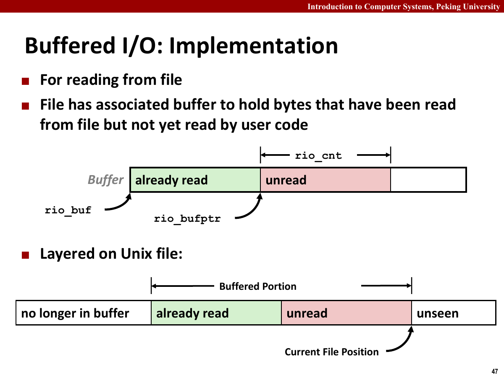
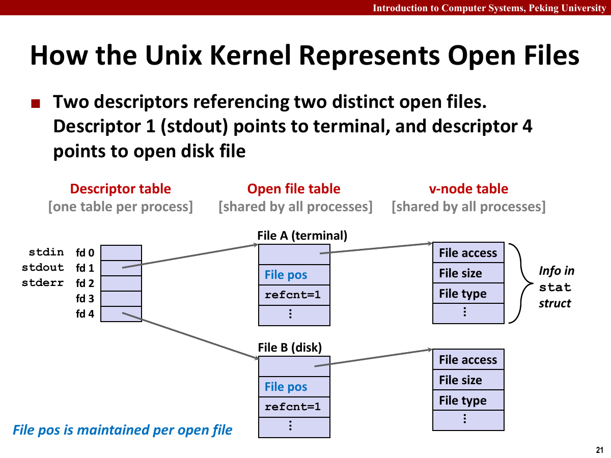
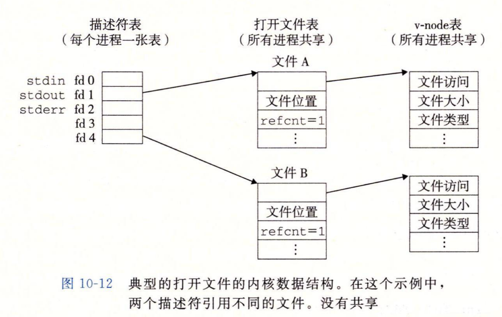
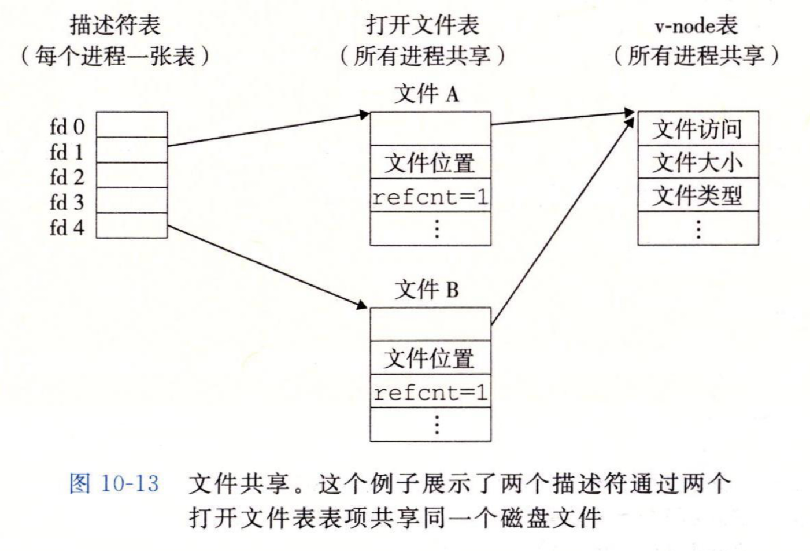
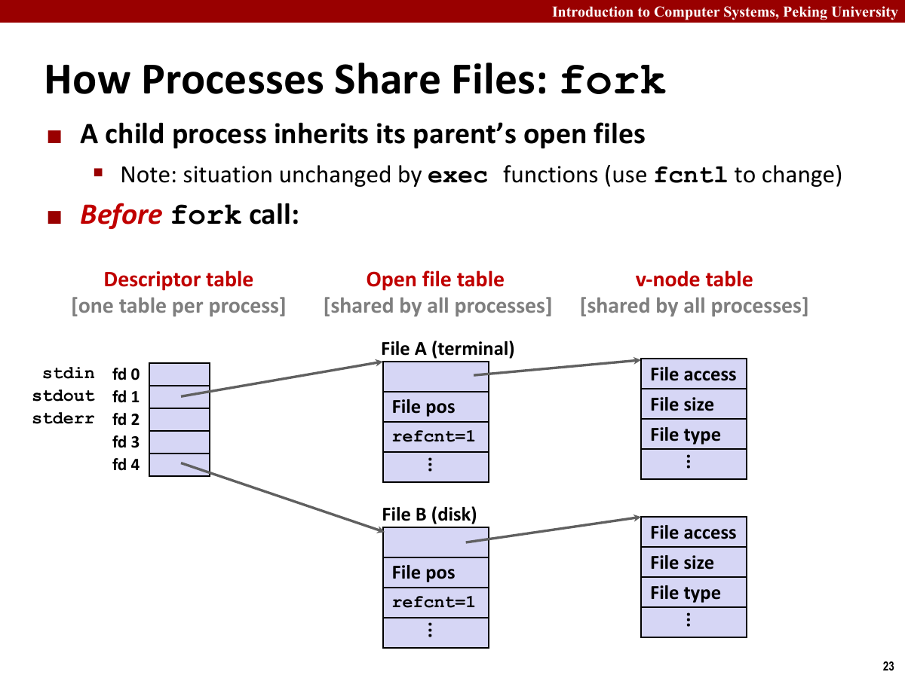
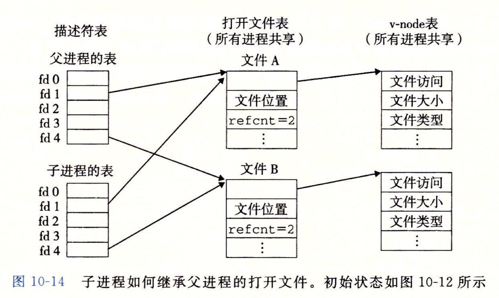
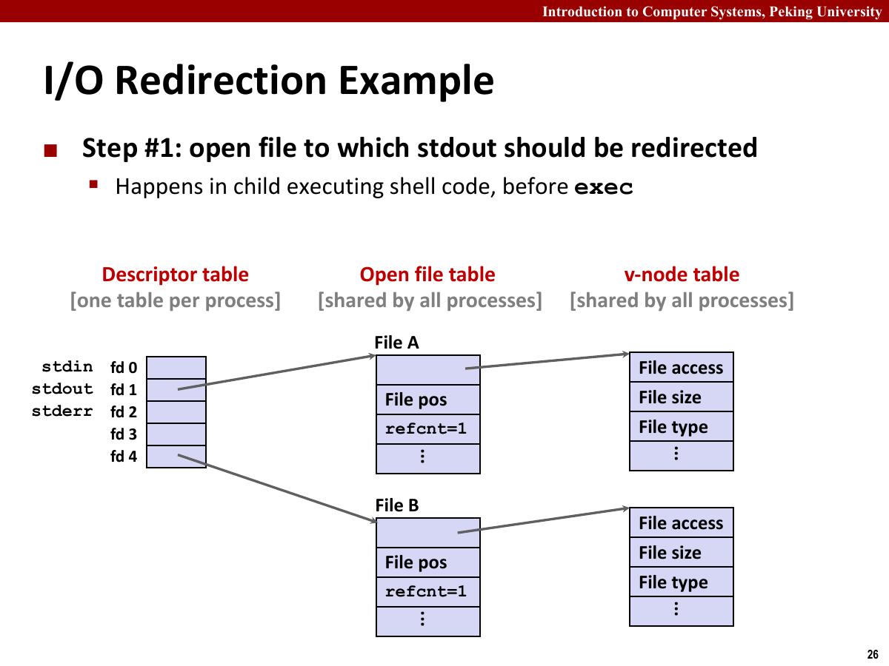
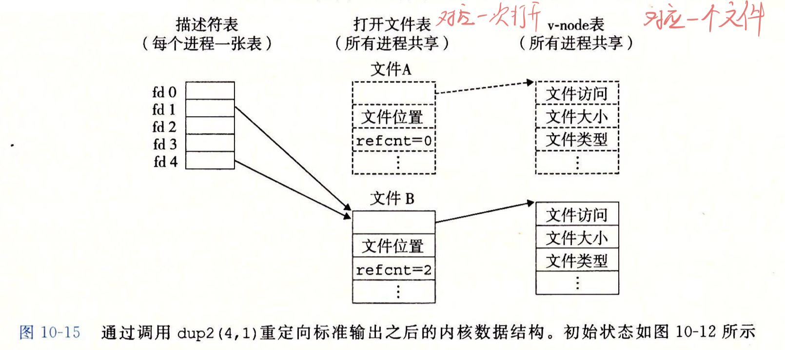
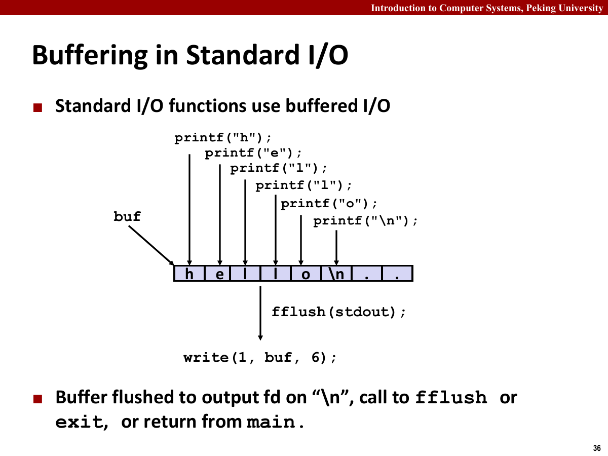

系统级 I/O（System-level I/O）是网络编程和 `Proxy Lab` 的前置知识。Unix 将普通文件、目录、终端和套接字统一抽象为文件，并通过相近的接口读写。

需要区分描述符表、打开文件表、文件位置、短计数（Short Count）和用户态缓冲区。

系统调用不保证一次读满或写满，也可能被信号中断。文件拷贝、Shell 和代理服务器都要检查返回值，并在必要时继续读写。

## Unix I/O 与文件描述符

Unix 的一个重要思想是“一切皆文件”。这里的文件不是只指磁盘上的普通文件，而是统一的字节序列抽象。

常见文件类型包括普通文件、目录、套接字和设备文件。

- 普通文件：包含任意字节序列。
- 目录：包含若干链接，每个链接把文件名映射到文件。
- 套接字：用于跨进程或跨机器通信。
- 设备文件：把硬件设备暴露为文件接口。

目录并不是“装着文件内容的盒子”，而是一组名字到文件对象的映射。路径中的每一级目录负责解析下一个名字，最终定位到文件的 inode。绝对路径从根目录 `/` 开始，当前工作目录则是相对路径的起点。

普通文件、目录和套接字都能用描述符表示，但允许的操作不同。普通文件能够 `lseek`，目录应通过目录流接口遍历，套接字通常只能顺序收发字节。统一接口不代表所有对象都支持完全相同的行为。

普通文件没有固定结构，系统并不知道里面是文本、图片还是二进制数据。对内核而言，它只是一串字节。

进程通过文件描述符（File Descriptor）访问打开文件。文件描述符是一个小整数，属于进程自己的描述符表。

标准输入、标准输出和标准错误分别对应 `0`、`1`、`2`。Shell 通过修改这些描述符的指向实现重定向。

例如把标准输出重定向到文件后，程序内部仍然向 `1` 写数据，但描述符 `1` 已经指向目标文件，而不是终端。

## 打开、关闭与定位

`open` 用于打开文件并返回描述符。几个常用标志需要记住。


- `O_RDONLY`：只读。
- `O_WRONLY`：只写。
- `O_RDWR`：读写。
- `O_CREAT`：文件不存在时创建。
- `O_TRUNC`：打开时截断。
- `O_APPEND`：追加写。

`open` 失败时返回 `-1`，并设置 `errno`。若继续把 `-1` 当作描述符使用，后续错误会掩盖最初的打开失败。

`close` 关闭描述符。描述符数量有限，服务器若持续泄漏连接描述符，最终会耗尽描述符表。

关闭一个描述符不一定释放底层对象。只要还有其他描述符或进程引用同一个打开文件表项，内核就会继续保留它。

一次请求泄漏一个描述符，累计后就可能触发 `EMFILE`，表现为无法继续打开文件或接受连接。正常路径和错误路径都要关闭不再使用的描述符。

资源生命周期应与控制流对应。文件打开后，中途返回和正常结束都要关闭；`dup2` 完成后，也要判断原描述符是否仍需保留。

文件权限也要和打开方式分开看。`open` 中的访问标志决定这次描述符能不能读写，文件本身的权限位决定进程有没有资格这样打开它。创建文件时传入的 mode 还会被进程的 `umask` 过滤，所以代码中写了 `0644`，最终文件权限不一定就是 `0644`。

`lseek` 可以修改打开文件表项中的文件位置。普通文件支持随机访问，因此可以把文件位置移动到任意偏移；管道、终端和套接字通常不支持 `lseek`，因为它们更像一条流，而不是可随机定位的字节数组。

常用打开标志：

| 标志 | 作用 | 常见场景 |
| --- | --- | --- |
| `O_RDONLY` | 只读打开 | 读取输入文件 |
| `O_WRONLY` | 只写打开 | 输出重定向 |
| `O_RDWR` | 读写打开 | 需要原地读写的文件 |
| `O_CREAT` | 文件不存在时创建 | `>` 重定向、日志文件 |
| `O_TRUNC` | 打开时清空旧内容 | 覆盖写 |
| `O_APPEND` | 每次写都追加到末尾 | 日志追加 |

`O_CREAT` 通常要配合 mode 使用。mode 写的是新建文件的权限上限，最终权限还会被 `umask` 去掉一部分。例如代码里传 `0666`，若 `umask` 禁止 group 写和 other 写，创建出来的文件就不会真的全员可写。

`O_APPEND` 和手动 `lseek(fd, 0, SEEK_END)` 再写并不完全等价。追加写由内核保证每次写入前把位置移动到末尾，多个进程同时写日志时更稳；手动 `lseek` 和 `write` 中间可能被其他进程插入。

文件位置属于打开文件表项，而不是描述符数字本身。两个描述符如果共享同一个打开文件表项，`lseek` 改变的位置会被两者共同看见。这个细节在 `dup2`、`fork` 和重定向中都很关键。

目录虽然也属于文件系统对象，但通常不把它当普通字节流直接读。程序应当通过 `opendir`、`readdir` 和 `closedir` 这组接口遍历目录项，而不是假设某个系统上目录文件的二进制布局。

## 读写、短计数与 RIO

RIO 的接口名字不少，实际只处理两件事：无缓冲版本负责把指定字节数读写完整，带缓冲版本负责高效地按行或按块读取。两类函数各有自己的状态，混用时才容易出问题。

`read` 从描述符读取最多 `n` 个字节，返回实际读取字节数。返回 `0` 表示 EOF，返回负数表示错误。

`write` 向描述符写入最多 `n` 个字节，返回实际写入字节数。返回值小于请求值并不一定表示错误，尤其是在管道、终端和套接字中。

读取和写入都可能被信号中断。若 `errno` 为 `EINTR`，通常可以重试。

短计数表示系统调用成功，但实际读写字节数少于请求字节数。

短计数常见于以下情况。

- 读文件时遇到 EOF。
- 从终端按行读取。
- 从网络套接字读取时，对方只发送了一部分数据。
- 向套接字写入时，内核缓冲区暂时只能接收一部分数据。
- 系统调用被信号打断。

读取固定长度数据时需要循环调用 `read`，完整写出一段缓冲区时也需要循环调用 `write`。

以下写法没有处理 `write` 的短计数。

```c
ssize_t nread;
char buf[1024];

while ((nread = read(fd, buf, sizeof(buf))) > 0) {
    write(outfd, buf, nread);
}
```

若 `write(outfd, buf, nread)` 只写出一部分，剩余数据就会丢失。

短计数属于正常行为，在管道、终端和套接字中尤其常见。只用普通文件测试，可能无法覆盖这一情况。

使用 `rio_writen` 后，文件复制代码改为：

```c
ssize_t n;
char buf[MAXBUF];

while ((n = read(infd, buf, sizeof(buf))) > 0) {
    if (rio_writen(outfd, buf, n) != n) {
        unix_error("rio_writen error");
    }
}

if (n < 0) {
    unix_error("read error");
}
```

`rio_writen` 负责完整写出本次读到的数据。读端不要求一次读满固定长度，每次处理 `read` 实际返回的字节数即可。

### 无缓冲 RIO

RIO 的无缓冲函数是对 `read` 和 `write` 的健壮封装。

`rio_readn` 的目标是读取恰好 `n` 个字节，除非遇到 EOF 或错误。它会反复调用 `read`，直到累计读够字节数。

`rio_writen` 的目标是写出恰好 `n` 个字节。它会反复调用 `write`，处理中断和短计数。

无缓冲 RIO 按字节数工作，适合固定长度的二进制数据。

`rio_readn` 需要同时处理短计数、EOF 和 `EINTR`。核心不是反复要求内核“一次读满”，而是记录还差多少字节。

```c
ssize_t rio_readn(int fd, void *usrbuf, size_t n) {
    size_t nleft = n;
    ssize_t nread;
    char *bufp = usrbuf;

    while (nleft > 0) {
        if ((nread = read(fd, bufp, nleft)) < 0) {
            if (errno == EINTR) {
                nread = 0;
            } else {
                return -1;
            }
        } else if (nread == 0) {
            break;
        }

        nleft -= nread;
        bufp += nread;
    }

    return n - nleft;
}
```

若读取过程中遇到 EOF，`rio_readn` 可以返回小于 `n` 的结果；`rio_writen` 则应在成功时写满 `n` 个字节。写端返回 `0` 或负数时不能继续原地循环，否则可能永远没有进展。

无缓冲 RIO 不保存跨调用状态，所以同一描述符上的 `rio_readn` 和 `rio_writen` 可以按协议顺序交替使用。它适合定长结构、文件块和网络响应体，不适合逐字符调用，因为每次都可能进入内核。

### 带缓冲 RIO

带缓冲输入在用户态维护一个缓冲区。每次缓冲区空了，才调用底层 `read` 从内核读入一批数据。



带缓冲 RIO 的关键状态有三个。

- `rio_buf` 保存从内核读到、但用户代码还没完全消费的数据。
- `rio_bufptr` 指向下一次要交给用户的位置。
- `rio_cnt` 记录缓冲区里还剩多少未读字节。

RIO 将这些状态放进一个 `rio_t` 对象。每条输入流都要有自己的 `rio_t`，不能让多个描述符共用同一份计数和缓冲区指针。

```c
typedef struct {
    int rio_fd;
    int rio_cnt;
    char *rio_bufptr;
    char rio_buf[RIO_BUFSIZE];
} rio_t;
```

内部的 `rio_read` 先消费用户态缓冲区。缓冲区为空时，它才调用 `read` 补充数据。

```c
static ssize_t rio_read(rio_t *rp, char *usrbuf, size_t n) {
    while (rp->rio_cnt <= 0) {
        rp->rio_cnt = read(rp->rio_fd, rp->rio_buf,
                           sizeof(rp->rio_buf));
        if (rp->rio_cnt < 0) {
            if (errno != EINTR) {
                return -1;
            }
        } else if (rp->rio_cnt == 0) {
            return 0;
        } else {
            rp->rio_bufptr = rp->rio_buf;
        }
    }

    int cnt = n;
    if (rp->rio_cnt < (int)n) {
        cnt = rp->rio_cnt;
    }
    memcpy(usrbuf, rp->rio_bufptr, cnt);
    rp->rio_bufptr += cnt;
    rp->rio_cnt -= cnt;
    return cnt;
}
```

`rio_readlineb` 在这个内部函数之上逐字符检查换行，但字符大多来自用户态缓冲区，并不会为每个字符执行一次系统调用。`rio_readnb` 则反复复制缓冲区中的字节，直到达到请求长度、遇到 EOF 或发生错误。

带缓冲 RIO 一次从内核读取一批数据，再从用户态缓冲区逐个取字符，减少按行读取时的系统调用次数。

`rio_readlineb` 适合读取文本行，例如 HTTP 请求行和请求头。它会一直读到换行符、达到最大长度或遇到 EOF。

在 `Proxy Lab` 中，读请求行和请求头时通常使用带缓冲 RIO；转发响应体时则常用无缓冲读写，因为响应可能是任意二进制数据。

带缓冲 RIO 和系统级 `read` 不要混着读同一个描述符。带缓冲函数可能已经多读了一些数据存在用户态缓冲区里，后续直接调用 `read` 会绕过这部分缓冲状态，导致数据顺序混乱。

同一个 `rio_t` 上的 `rio_readlineb` 和 `rio_readnb` 可以交替使用，因为它们共享同一份缓冲状态；无缓冲的 `rio_readn` 不知道 `rio_t` 已经预读了多少内容，不能插进同一条输入流中。

循环条件不能把短计数直接视为失败。HTTP 请求头要读到空行，固定长度消息要累计到指定长度，以关闭表示结束的响应体则要一直读到 EOF。

写入也类似。`write` 返回正数但小于请求值时，下一次写入应当从剩余缓冲区继续，而不是从头重写。一个健壮的写循环需要维护当前偏移和剩余长度。

```c
ssize_t left = n;
char *p = buf;

while (left > 0) {
    ssize_t nwritten = write(fd, p, left);
    if (nwritten <= 0) {
        if (errno == EINTR) {
            nwritten = 0;
        } else {
            return -1;
        }
    }
    left -= nwritten;
    p += nwritten;
}
```

每次写入后只推进已经成功写出的部分。RIO 将这段循环封装起来，避免上层代码重复处理偏移和剩余长度。

文本行读取也要注意最大长度。如果一行超过缓冲区大小，行读取函数可能只返回前半段。协议解析代码不能假设读到的一行一定完整，除非接口文档明确保证，或者自己检查了换行符是否出现。

二进制数据和文本行的处理方式要分开。

| 数据形态 | 推荐接口 | 判断结束的方式 |
| --- | --- | --- |
| 固定长度二进制块 | `rio_readn` | 累计字节数达到目标 |
| 直到 EOF 的字节流 | `read` 循环或 `rio_readnb` | 返回 `0` |
| 文本协议头 | `rio_readlineb` | 读到空行或特定结束行 |
| 普通格式化文本 | 标准 I/O | 文件结束或格式解析结束 |

`Proxy Lab` 的请求头适合按行读，因为它的结构就是文本行；响应体不适合按行读，因为它可能是图片或压缩数据。一个代理若把响应体当字符串，很容易在遇到零字节时提前结束。

## 文件元数据与目录

`stat` 和 `fstat` 可以得到文件元数据，常用字段包括：

- `st_mode`：文件类型和权限位。
- `st_size`：普通文件字节数。
- `st_ino`：inode 号。
- `st_mtime`：最后修改时间。

宏 `S_ISREG` 可以判断普通文件，`S_ISDIR` 可以判断目录。

目录流接口包括 `opendir`、`readdir` 和 `closedir`。每个目录项至少包含文件名和 inode 信息。

遍历目录时要记住两点。

- `readdir` 返回的是目录项，不是完整路径。
- 若要进一步 `stat` 某个条目，需要把目录路径和文件名拼起来。

很多递归遍历程序都会漏掉 `.` 和 `..`。如果不跳过它们，递归会重新进入当前目录和父目录，最终要么无限递归，要么走到大量不该走的路径。

文件类型不要只靠文件名后缀判断。Unix 文件系统里，目录、普通文件、符号链接、设备文件都由 inode 元数据描述。`stat` 跟随符号链接，`lstat` 查看符号链接本身。写文件工具时，这个差别会影响递归删除、复制和权限检查。

## 文件共享与重定向

为了理解文件共享，需要区分三张表。

- 描述符表：每个进程一张，描述符指向打开文件表项。
- 打开文件表：内核维护，记录文件位置和状态标志。
- vnode 表：保存文件本身的信息。



文件位置保存在打开文件表项中，而不是 vnode 中。同一个磁盘文件可以对应多份打开状态，每份状态有独立文件偏移；多个描述符也可以指向同一打开文件表项，共享文件偏移。

同一个文件被两次独立 `open` 时，通常会得到两个打开文件表项。两个描述符都指向同一个 vnode，但各自的文件位置不共享。



如果两个描述符指向同一个打开文件表项，它们共享文件位置。`dup` 和 `dup2` 就会制造这种共享。



如果两个进程分别 `open` 同一个文件，它们通常得到不同的打开文件表项，因此文件位置不共享。

`fork` 会复制父进程的描述符表。父子进程的描述符指向相同的打开文件表项，因此它们共享文件位置。这就是为什么父子进程同时读写同一个打开文件时，结果可能互相影响。



`fork` 复制描述符表，但不复制打开文件表项。父子进程仍指向同一批内核对象；这与虚拟内存中的写时复制（Copy-on-write，COW）相似。

共享打开文件表项意味着共享文件偏移。若父进程读了 10 个字节，子进程再从同一个打开文件表项读，起点就是新的偏移。这个行为在管道和网络连接里也会影响程序结构。父子进程如果都持有同一个管道端，某些端没关掉，另一侧可能一直等不到 EOF。



`dup2(oldfd, newfd)` 会让 `newfd` 指向 `oldfd` 所指向的打开文件表项。如果 `newfd` 原本打开，会先被关闭。

`dup2` 修改的是描述符表，不会复制文件内容。调用完成后，`oldfd` 和 `newfd` 指向同一个打开文件表项，因此共享文件位置和状态标志。若两者原本就是同一个描述符，`dup2` 直接返回，不会先把它关闭。

Shell 执行 `ls > out.txt` 时，子进程先打开 `out.txt`，将该描述符复制到标准输出 `1`，再执行 `ls`。`ls` 仍然只向标准输出写数据。



重定向代码可以简化成这样。

```c
int fd = open("out.txt", O_WRONLY | O_CREAT | O_TRUNC, 0644);
dup2(fd, STDOUT_FILENO);
close(fd);
execlp("ls", "ls", NULL);
```

`dup2` 后关闭 `fd` 是安全的，因为标准输出已经指向同一个打开文件表项。如果不关，虽然程序还能跑，但会多占一个描述符。



Shell 通常先 `fork`，再由子进程调用 `dup2` 和 `execve`。这样重定向只影响子进程，父进程保留原来的标准输入输出。

管道也是类似思路。Shell 创建管道后，把前一个命令的标准输出接到管道写端，把后一个命令的标准输入接到管道读端。子进程完成 `dup2` 后，要关闭不再使用的管道端，否则读端可能一直认为还有写者存在，从而读不到 EOF。

建立一条 `cmd1 | cmd2` 管道时，父进程和两个子进程最初都可能持有管道两端。第一个子进程只保留写端并把它接到标准输出，第二个子进程只保留读端并把它接到标准输入，父进程则关闭两端。只要还有任何进程握着写端，读端就不会收到 EOF。

## 标准 I/O 与用户态缓冲

标准 I/O 提供 `FILE *` 抽象，并在用户态做缓冲。它使用方便，但也引入了另一层状态。

使用标准 I/O 时需要注意：

- 不要随意混用 `fread` 和底层 `read` 操作同一描述符。
- 对交互输出要注意刷新缓冲区。
- 网络编程中若协议按行读取，可以使用类似 RIO 的受控缓冲，而不是混用多套接口。

标准 I/O 的缓冲策略主要有三种。

- 全缓冲：缓冲区满了才真正写出，普通磁盘文件常见。
- 行缓冲：遇到换行或缓冲区满时写出，终端输出常见。
- 无缓冲：每次调用都尽量立即写出，标准错误常见。



若 `fork` 前标准 I/O 缓冲区尚未刷新，父子进程都会继承这份用户态缓冲。两边正常退出时，同一段内容可能被重复输出。调用 `fork` 前应按需刷新缓冲区。

以下三段程序假设标准输出只在关闭文件、显式调用 `fflush` 或程序正常结束时刷新，且系统调用均成功。

第一段程序使用标准 I/O。

```c
int main() {
    printf("a");
    fork();
    printf("b");
    fork();
    printf("c");
    return 0;
}
```

一个可能的输出是 `abcabcabcabc`，各进程刷新缓冲区的顺序不确定。第一次 `fork` 前的 `a` 尚未刷新，后面的 `b` 也会在第二次 `fork` 时被复制；最终 4 个进程分别写出自己的缓冲区。

第二段改用系统级 I/O。

```c
int main() {
    write(1, "a", 1);
    fork();
    write(1, "b", 1);
    fork();
    write(1, "c", 1);
    return 0;
}
```

这里 `a` 只输出 1 次，`b` 输出 2 次，`c` 输出 4 次，并且第一个字符一定是 `a`。`write` 已经把字节交给内核，不会让子进程重新写出已经完成的内容。

第三段混用标准 I/O 和系统级 I/O。

```c
int main() {
    printf("a");
    fork();
    write(1, "b", 1);
    fork();
    write(1, "c", 1);
    return 0;
}
```

此时 `a` 输出 4 次，`b` 输出 2 次，`c` 输出 4 次。`a` 留在用户态缓冲区中，被两次 `fork` 复制；`b` 和 `c` 由 `write` 按执行时的进程数直接写出。结论：`fork` 会复制尚未刷新的用户态缓冲区，但不会重复已经由系统调用写出的字节。

标准 I/O 和 RIO 都是在用户态做缓冲，但两者的使用场景不一样。标准 I/O 追求易用，适合普通文件和简单文本处理；RIO 更强调可控性，适合网络程序和实验代码。尤其在 `Proxy Lab` 里，笔者更倾向于用 RIO，因为它的读写语义和短计数处理更贴近实验需求。

如果混用多套缓冲接口，程序看到的“当前位置”可能和内核中的文件位置不同。标准 I/O 或 RIO 可能已经从内核多读了一段数据，只是暂时存在用户态缓冲区中。此时再直接调用底层 `read`，它会从内核文件位置继续读，而不会先消费用户态缓冲区里的内容，结果就会跳过一部分数据。

标准 I/O 和描述符之间可以互相转换。`fileno` 从 `FILE *` 得到描述符，`fdopen` 用已有描述符创建流。底层文件位置和描述符状态可能共享，但用户态缓冲区属于流对象；混用接口前需要刷新并同步状态。

Shell 使用 `dup2` 完成重定向；CGI 或管道模型还可以用它把套接字、管道端接到标准输入输出。

描述符还有 close-on-exec 标志。若一个描述符不希望被 `execve` 后的新程序继承，就应当设置这个标志。否则父进程打开的文件、套接字或管道端可能意外泄漏到子程序里，导致文件删不掉、管道 EOF 不出现、网络连接迟迟不关闭。

系统级 I/O 检查规则：

- 所有系统调用都检查返回值。
- 打开的描述符要在所有路径上关闭。
- 对固定长度数据，读写都要循环。
- 对文本协议，按行读头部，按字节处理正文。
- 不混用多套缓冲接口读取同一个描述符。
- `fork` 前留意用户态缓冲，`fork` 后及时关闭不用的管道端。
- 使用 `dup2` 时分清原描述符、新描述符和打开文件表项。
- 需要跨 `execve` 时，明确哪些描述符应该被继承，哪些应该 close-on-exec。
