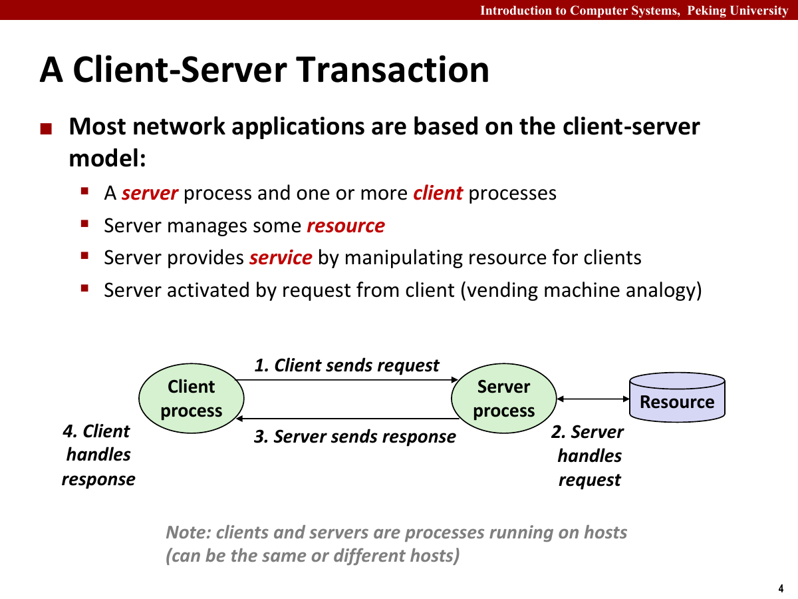
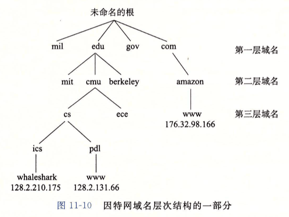
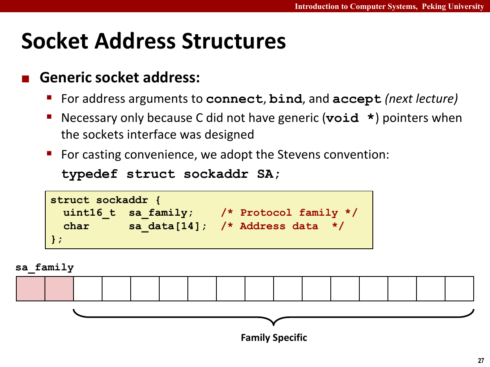
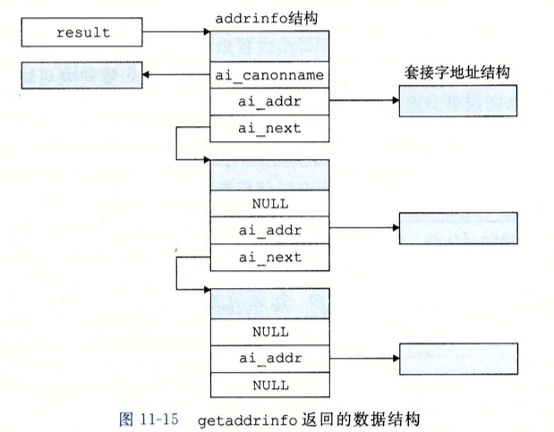
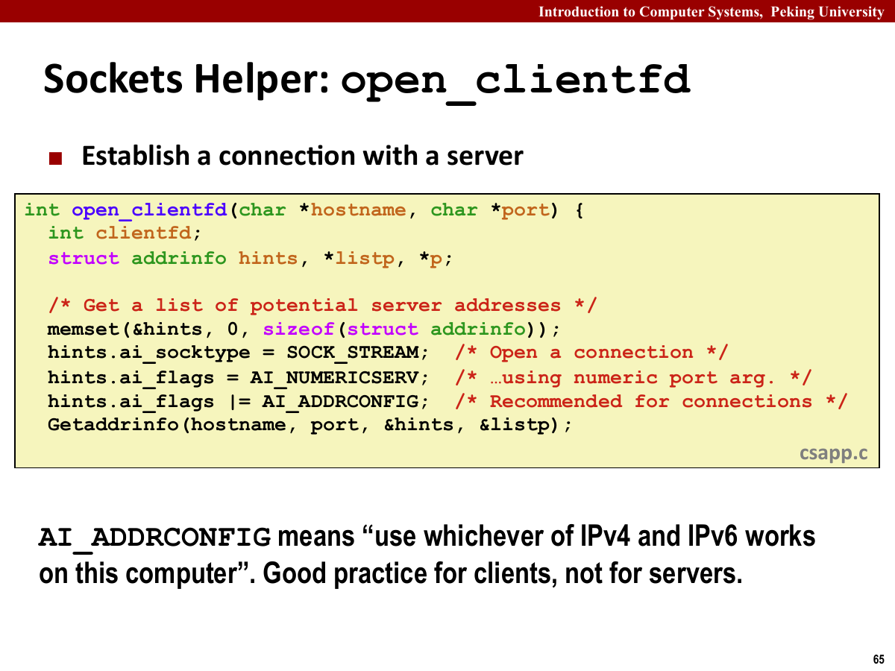
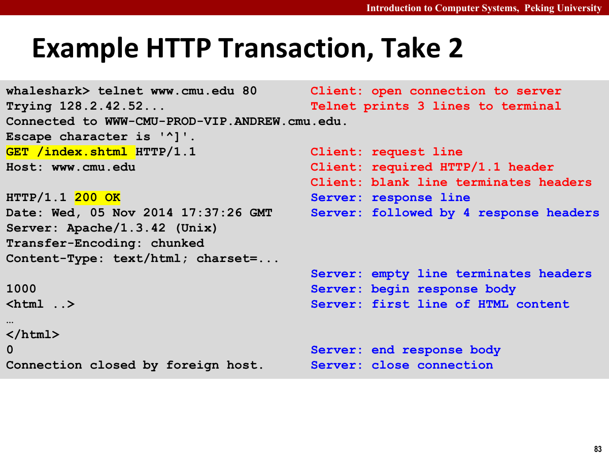

网络编程将系统级 I/O 扩展到不同机器之间。套接字（Socket）也是文件描述符，可以通过系统级 I/O 接口读写。

`Proxy Lab` 需要从客户端套接字读取请求，写入服务器套接字，再将服务器响应写回客户端。实现时要处理协议格式、短计数、并发和缓存。

网络连接可能失败或被远端提前关闭，报文可能分段到达，响应体也可能是二进制数据。代码不能假设一次读写完成全部传输，也不能假设连接始终有效。



## 网络、地址与域名

应用程序通过操作系统提供的套接字接口使用传输层服务，通常不直接处理链路层和物理层。


同一局域网内，主机通过链路层帧通信；跨局域网传输时，路由器根据网络层地址逐跳转发分组。应用程序看到的是套接字中的字节流，内核协议栈负责把这些字节封装成 TCP 段、IP 数据报和链路层帧。

发送端从应用层向下逐层加头部，接收端再逐层拆开。每一层只处理自己的字段：TCP 关心端口和可靠传输，IP 关心主机间路由，链路层负责同一段网络上的交付。网络程序通常从 TCP 和 IP 的边界开始理解，不需要自己拼链路层帧。

CSAPP 中主要涉及以下对象。

- IP 地址：定位网络中的主机接口。
- 端口：定位主机中的通信端点。
- 套接字：应用程序使用的通信端点抽象。
- 连接：由客户端地址、客户端端口、服务器地址、服务器端口和协议共同确定。

传输控制协议（Transmission Control Protocol，TCP）提供可靠、有序的字节流。应用程序写入一串字节，另一端按同样顺序读出字节。至于中间分成多少包、什么时候到达，通常由协议栈处理。

“字节流”意味着 TCP 没有消息边界。一次 `write` 不一定对应对方一次 `read`。如果协议需要按行、按长度或按分隔符解析，应用层必须自己处理边界。

HTTP 规定了请求头的行结构，因此请求头可以按行解析；TCP 本身没有消息边界。响应体是否结束，要由 EOF、`Content-Length` 或分块传输等协议语义判断。

TCP 连接由五元组描述。

| 字段 | 含义 |
| --- | --- |
| 客户端 IP | 发起连接的一端 |
| 客户端端口 | 客户端内核分配的临时端口 |
| 服务器 IP | 被连接的一端 |
| 服务器端口 | 服务监听的固定端口 |
| 协议 | 通常是 TCP |

客户端地址、客户端端口、服务器地址、服务器端口和协议共同区分连接。两个客户端即使都连接服务器的 `80` 端口，只要客户端地址或端口不同，就属于不同连接。

客户端一般由内核分配临时端口，服务器则绑定固定端口供客户端连接。

### IP 地址与字节序

IPv4 地址是 32 位值，通常写成点分十进制。IPv6 地址更长，格式也不同。

程序中不要假设地址一定是 IPv4。更现代的写法是使用 `getaddrinfo`，让系统根据主机名、服务名和协议需求返回合适地址结构。

若只做文本地址与二进制地址之间的转换，可以使用 `inet_pton` 和 `inet_ntop`。前者把点分十进制或 IPv6 文本写入地址结构，后者把地址结构转换回可打印字符串。它们比旧式 `inet_addr` 更容易同时兼容 IPv4 与 IPv6。

网络字节序（Network Byte Order）是大端法。多字节整数在放进网络协议字段前，需要转换为网络字节序；从网络读出后，则转换回主机字节序。

常用转换函数有 `htonl`、`htons`、`ntohl` 和 `ntohs`。

网络协议要求多字节整数采用统一字节序，否则大小端机器会对同一段字节得到不同数值。端口号和 IPv4 地址等字段需要按网络字节序编码。

`getaddrinfo` 会处理地址结构和部分字节序细节。手写 `sockaddr_in` 时，端口需要经过 `htons`，IPv4 地址也要按网络格式填入。实验中可使用 `open_clientfd` 和 `open_listenfd` 封装这些步骤。

### 域名与端口

域名系统（Domain Name System，DNS）把人类可读的域名映射到 IP 地址。一个域名可能对应多个地址，一个地址也可能反查到域名。



从程序角度看，域名解析可能失败，也可能返回多个候选地址。健壮客户端不应该只尝试第一个地址后立刻放弃，而应当根据返回列表逐个尝试。

DNS 映射不是简单的一对一关系。同一域名可以对应多台服务器，用于负载均衡或容灾；多个别名也可以指向同一个规范主机名。解析结果还会被缓存，因此程序不能把某次得到的 IP 永久写死。

端口是 16 位整数。服务器通常绑定到某个固定端口，客户端则由内核分配临时端口。

一些端口有约定含义，例如 HTTP 常用 `80`，HTTPS 常用 `443`；内核使用端口号区分通信端点。

传统 IPv4 程序使用 `sockaddr_in`，其中包含地址族、端口和 IPv4 地址。为了支持不同协议族，很多接口接收通用的 `sockaddr *`。

直接操作地址结构容易引入平台相关代码。CSAPP 的 `open_clientfd` 和 `open_listenfd` 使用 `getaddrinfo` 统一处理这些细节。



`sockaddr` 的设计有一点历史包袱。很多 socket 接口诞生时，C 语言还没有现在这样常用的泛型指针习惯，所以接口统一接收 `struct sockaddr *`。实际使用时，程序通常准备更具体的 `sockaddr_in` 或 `addrinfo` 结果，再强制转换成通用指针传给 `connect`、`bind` 或 `accept`。

地址结构同时涉及 IPv4、IPv6、端口、字节序和地址族。使用 `getaddrinfo` 解析并构造地址，调用者只需要提供主机名、服务名和协议要求。

`getaddrinfo` 根据主机名、服务名和 hint 返回一组地址。客户端逐个尝试连接，服务器逐个尝试绑定。



反向转换可以交给 `getnameinfo`。它把一个 socket 地址结构转回主机名和服务名，在服务器打印客户端来源、调试连接来源时很方便。和旧式的 `gethostbyaddr` 相比，这组接口更适合写协议无关、线程友好的网络程序。

客户端的 hint 通常指定 TCP 字节流套接字；服务器还会设置被动打开选项，使返回地址可用于 `bind`。

网络程序不能假设一次 `read` 读完一整行、远端始终发送合法格式、连接建立后不会中断，或响应体一定是文本。本地小样例通常覆盖不到这些情况。

`getaddrinfo` 中 `hint` 的常用字段：

| 字段 | 常见设置 | 作用 |
| --- | --- | --- |
| `ai_family` | `AF_UNSPEC` | 同时允许 IPv4 和 IPv6 |
| `ai_socktype` | `SOCK_STREAM` | 请求 TCP 字节流套接字 |
| `ai_flags` | `AI_PASSIVE` | 服务器端生成可绑定地址 |
| `ai_protocol` | `0` | 让系统按其他字段选择协议 |

客户端不设置 `AI_PASSIVE`，服务器监听本机地址时通常设置它。返回链表可能包含多个地址，应逐个尝试直到成功。

`getaddrinfo` 的错误码不完全等同于 `errno`，应使用 `gai_strerror`，不能直接交给 `perror`。

## 套接字接口

套接字接口把连接建立与普通文件的“打开”区分开来。客户端通过 `connect` 主动建立连接，服务器通过 `bind`、`listen` 和 `accept` 被动等待连接；建立完成后，两端都使用普通描述符读写。

这一节沿着一次连接来看会清楚很多：服务器先准备监听描述符，客户端发起连接，服务器再为这个客户端得到一个新的已连接描述符。监听描述符一直留着接待下一位客户端，真正传数据的是后者。

| 接口 | 作用 | 返回结果 |
| --- | --- | --- |
| `socket` | 创建尚未连接的套接字 | 新描述符 |
| `connect` | 客户端连接远端地址 | 成功后原描述符变为已连接套接字 |
| `bind` | 把本地地址与端口绑定到套接字 | 仍是原描述符 |
| `listen` | 把套接字转换为监听套接字 | 仍是原描述符 |
| `accept` | 从监听队列取出一个连接 | 新的已连接描述符 |

`socket` 的三个主要参数是地址族、套接字类型和协议。TCP 通常使用 `AF_INET` 或 `AF_INET6`、`SOCK_STREAM` 和协议值 `0`。地址族决定地址结构，套接字类型决定字节流或数据报语义。

### 连接的两端

客户端通常执行以下流程。

1. 调用 `getaddrinfo` 解析服务器名和端口。
2. 对返回的地址列表逐个尝试。
3. 调用 `socket` 创建套接字。
4. 调用 `connect` 发起连接。
5. 连接成功后，使用描述符读写数据。
6. 通信结束后关闭描述符。

`connect` 成功后，套接字描述符可以直接用于 `read` 和 `write`。

客户端创建套接字时一般不需要显式绑定本地端口。内核会自动选择一个临时端口，使连接四元组唯一。

服务器通常执行以下流程。

1. 调用 `getaddrinfo` 获取可绑定地址。
2. 调用 `socket` 创建监听套接字。
3. 设置 `SO_REUSEADDR`，避免服务器重启时端口暂时不可用。
4. 调用 `bind` 绑定端口。
5. 调用 `listen` 开始监听。
6. 在循环中调用 `accept` 接受客户端连接。
7. 用返回的已连接描述符处理请求。
8. 处理完后关闭已连接描述符。



监听描述符和已连接描述符要分清。监听描述符一直留在服务器中接收新连接；已连接描述符只对应某个客户端。

`listen` 后的套接字并不直接传输应用数据。真正用于读写的是 `accept` 返回的描述符。若服务器忘记关闭已连接描述符，连接处理完后资源也不会及时释放。


客户端 `connect` 成功后，服务器的 `accept` 返回已连接描述符。此后两端都可以使用 RIO 或系统级 I/O 函数读写。

`open_listenfd` 和 `open_clientfd` 封装地址解析、套接字创建、绑定和连接。连接失败时仍要区分解析失败、创建失败、绑定失败和连接被拒绝。

`open_clientfd` 的关键不是调用一次 `connect`，而是遍历 `getaddrinfo` 返回的候选地址。某个地址创建或连接失败后，关闭当前描述符，再尝试下一个。

```c
int open_clientfd(const char *hostname, const char *port) {
    int clientfd = -1;
    struct addrinfo hints, *listp, *p;

    memset(&hints, 0, sizeof(hints));
    hints.ai_socktype = SOCK_STREAM;
    hints.ai_flags = AI_NUMERICSERV | AI_ADDRCONFIG;

    if (getaddrinfo(hostname, port, &hints, &listp) != 0) {
        return -2;
    }

    for (p = listp; p != NULL; p = p->ai_next) {
        clientfd = socket(p->ai_family, p->ai_socktype,
                          p->ai_protocol);
        if (clientfd < 0) {
            continue;
        }
        if (connect(clientfd, p->ai_addr, p->ai_addrlen) == 0) {
            break;
        }
        close(clientfd);
    }

    int connected = p != NULL;
    freeaddrinfo(listp);
    return connected ? clientfd : -1;
}
```

服务器端也要遍历候选地址，只是把 `connect` 换成 `bind`。`AI_PASSIVE` 让 `getaddrinfo` 生成适合监听本机地址的结果，`SO_REUSEADDR` 则便于服务器结束后尽快重新绑定端口。

```c
int open_listenfd(const char *port) {
    int listenfd = -1, optval = 1;
    struct addrinfo hints, *listp, *p;

    memset(&hints, 0, sizeof(hints));
    hints.ai_socktype = SOCK_STREAM;
    hints.ai_flags = AI_PASSIVE | AI_ADDRCONFIG | AI_NUMERICSERV;

    if (getaddrinfo(NULL, port, &hints, &listp) != 0) {
        return -2;
    }

    for (p = listp; p != NULL; p = p->ai_next) {
        listenfd = socket(p->ai_family, p->ai_socktype,
                          p->ai_protocol);
        if (listenfd < 0) {
            continue;
        }

        setsockopt(listenfd, SOL_SOCKET, SO_REUSEADDR,
                   &optval, sizeof(optval));
        if (bind(listenfd, p->ai_addr, p->ai_addrlen) == 0) {
            break;
        }
        close(listenfd);
    }

    if (p == NULL) {
        freeaddrinfo(listp);
        return -1;
    }

    freeaddrinfo(listp);
    if (listen(listenfd, LISTENQ) < 0) {
        close(listenfd);
        return -1;
    }
    return listenfd;
}
```

`getaddrinfo` 返回的链表必须由 `freeaddrinfo` 释放。循环中的每次失败也要关闭刚创建的套接字，否则一次连接尝试就可能泄漏多个描述符。

迭代服务器的主循环：

```c
int listenfd = open_listenfd(port);

while (1) {
    int connfd = accept(listenfd, (SA *)&clientaddr, &clientlen);
    doit(connfd);
    close(connfd);
}
```

迭代服务器一次只处理一个客户端，逻辑清楚，但遇到慢客户端时会阻塞后续请求。后续并发章节会讨论基于进程、I/O 多路复用和线程的改法。

`accept` 返回前，TCP 连接已经由内核完成握手。应用程序拿到的是一个可以读写的已连接描述符。之后客户端发送多少数据、何时关闭连接、是否半关闭，都要由应用层协议和程序逻辑处理。

监听描述符通常在服务器整个生命周期内保持打开，连接描述符只对应一个客户端请求或会话，处理完成后应关闭。工作线程继承监听描述符时，错误路径不能误关它。

`listen` 的 `backlog` 也容易被误解。它不是“服务器最多能同时处理多少个客户端”的直接上限，而是和内核为尚未被应用程序 `accept` 的连接维护队列有关。应用程序真正并发处理多少连接，还取决于它是否创建进程、线程，或使用 I/O 多路复用。

`SO_REUSEADDR` 的作用也容易误解。它不是允许两个活跃服务器随意绑定同一个端口，而是缓解服务器重启时端口被旧连接状态占住的问题。调试网络服务时，如果刚关掉程序又马上重启，缺少这个选项就可能遇到地址已被占用。

客户端连接可能在 `getaddrinfo`、`socket` 或 `connect` 阶段失败，`connect` 还可能被拒绝或超时。错误信息应标明失败阶段。

服务器端也有类似的错误分层。

- `getaddrinfo` 失败，说明端口或地址解析阶段有问题。
- `socket` 失败，说明套接字创建失败，可能是资源不足或参数不支持。
- `setsockopt` 失败，说明选项设置失败。
- `bind` 失败，常见原因是端口占用或权限不足。
- `listen` 失败，说明监听队列建立失败。
- `accept` 失败，可能是被信号打断，也可能是更底层的连接错误。

`accept` 被信号中断时可以继续循环，其他错误则根据类型记录或退出。服务器主循环不应把所有 `accept` 错误都视为致命错误。

一次简单的请求响应过程可以按描述符变化来理解。

1. 服务器保留 `listenfd`，阻塞在 `accept`。
2. 客户端的 `connect` 与内核完成握手。
3. `accept` 返回新的 `connfd`，`listenfd` 继续负责后续连接。
4. 客户端和服务器通过各自的已连接描述符交换字节。
5. 任一端关闭写方向后，对端读到 EOF；双方都关闭后，应用层会话结束。

TCP 关闭也不是“一个 `close` 立即让连接消失”。内核还要完成剩余数据发送和连接状态转换。应用程序只需保证自己不再使用描述符，并正确处理对端提前关闭带来的 EOF 或写入错误。

## HTTP 与代理

### 请求与响应

HTTP 请求由请求行、请求头、空行和可选请求体组成。

请求行通常包含方法、URI 和版本。`Proxy Lab` 中主要处理 `GET` 请求。

请求头是若干键值对。`Host`、`User-Agent`、`Connection` 和 `Proxy-Connection` 是代理里经常会碰到的头部。

HTTP/1.0 和 HTTP/1.1 的一个重要差异是持久连接。`Proxy Lab` 中为了降低复杂度，通常会主动把 `Connection` 和 `Proxy-Connection` 改成 `close`，让一次请求响应结束后连接关闭。这样代理只需要读到服务器关闭连接即可结束转发，不必额外维护长连接状态。

解析 HTTP 时尤其要小心行尾、空行和 URI 形式。

- 行尾可能包含 `\r\n`。
- 请求头以空行结束。
- URI 可能是绝对 URI，也可能是相对路径。
- 代理需要从绝对 URI 中拆出主机、端口和路径。

HTTP 响应由状态行、响应头、空行和响应体组成。

状态行包含版本、状态码和状态短语。`200`、`301`、`404` 和 `500` 在调试代理时经常会遇到。

响应体可能是文本，也可能是图片、压缩文件或任意二进制内容。因此转发响应体时不能把它当作 C 字符串处理，必须按字节数读写。



HTTP 的文本头部和二进制正文要分开处理。请求行、状态行和头部字段适合按行读；响应体则不能按字符串处理，也不能用 `strlen` 判断长度。图片、压缩内容和某些二进制文件中都可能出现 `\0`，字符串函数会提前截断。

响应体的结束位置由协议决定，常见情况有三种。

- `Content-Length` 给出精确字节数，代理累计读取到该长度。
- `Transfer-Encoding: chunked` 使用分块编码，每块前有十六进制长度，最后以零长度块结束。
- 服务器关闭连接表示正文结束，HTTP/1.0 中较常见。

实验代理若主动改成 HTTP/1.0 并设置 `Connection: close`，通常只需把响应读到 EOF。若保留 HTTP/1.1 持久连接，就不能把“暂时没有数据”当作正文结束，还要正确处理长度或分块编码。

`Proxy Lab` 中，头部使用 `rio_readlineb` 逐行读取，遇到空行结束；响应体使用 `rio_readnb` 或底层循环按字节转发。由服务器关闭连接表示响应结束时，代理一直读到 EOF；存在 `Content-Length` 时，也可以按长度读取。

Web 服务器可以返回静态内容，也可以生成动态内容。

静态内容来自磁盘文件。服务器读取文件，设置合适响应头，再把文件字节写给客户端。

动态内容通常由程序生成。传统 CGI 模型中，服务器设置环境变量、创建子进程、执行 CGI 程序，并把 CGI 输出作为响应返回。

动态内容由程序根据请求参数生成，不是对磁盘文件的直接读取。

### 代理与缓存

代理位于客户端和目标服务器之间。客户端把请求发给代理，代理再代表客户端访问目标服务器。

代理处理请求的步骤：

1. 读取客户端请求行。
2. 解析 URI，得到目标主机、端口和路径。
3. 重写请求行，向目标服务器发送相对路径。
4. 处理并转发必要请求头。
5. 建立到目标服务器的连接。
6. 从目标服务器读取响应并写回客户端。
7. 关闭相关描述符。

代理向服务器发送的请求行通常应当使用相对路径，而不是客户端发给代理时的绝对 URI。例如客户端发来：

```http
GET http://example.com:80/index.html HTTP/1.1
```

代理转发给目标服务器时，可以改成：

```http
GET /index.html HTTP/1.0
```

在 `Proxy Lab` 中，通常需要固定或重写 `User-Agent`、`Connection` 和 `Proxy-Connection`。这样可以减少持久连接带来的复杂性。

这些字段属于逐跳（Hop-by-hop）连接状态，不应原样穿过代理。代理可以保留其他端到端头部，但要避免同时转发客户端原有的 `Connection`，又追加一份新的 `Connection: close`。

需要特别小心 `Host` 头。若客户端请求中已经有 `Host`，通常应保留或规范化；若没有，则代理需要根据 URI 补上目标主机。

URI 解析通常要拆出三个部分。

- 主机名。
- 端口号，缺省时通常使用 `80`。
- 路径，缺省时使用 `/`。

绝对 URI 可能写成 `http://host/path`，也可能写成 `http://host:port/path`。解析时先去掉协议前缀，再用第一个 `/` 分出主机部分，最后在主机部分中查找 `:` 判断是否指定端口。

将 `Connection` 和 `Proxy-Connection` 设为 `close` 后，代理不必维护持久连接池，也不必判断同一连接上是否还有后续请求。实验阶段可以用这部分性能换取更简单的连接生命周期。

请求解析可拆为以下函数。

- `parse_uri` 负责从 URI 中拆出 `hostname`、`port` 和 `path`。
- `read_requesthdrs` 负责读取客户端头部，并保留或改写必要字段。
- `build_request` 负责拼出发给目标服务器的请求。
- `forward_response` 负责把服务器响应按字节转发给客户端。

目标服务器返回 `400` 时检查请求行和 `Host`；浏览器一直等待时检查连接是否关闭、响应体是否读到 EOF；图片只显示一部分时检查是否把二进制响应当作字符串。

URI 解析可以拿几个样例自测。

| URI | host | port | path |
| --- | --- | --- | --- |
| `http://example.com/` | `example.com` | `80` | `/` |
| `http://example.com:8080/a/b` | `example.com` | `8080` | `/a/b` |
| `http://example.com` | `example.com` | `80` | `/` |

这些样例覆盖缺省路径、缺省端口和显式端口，可用于检查 `/`、`80` 以及 host 中冒号的处理。

代理请求的主流程：

```c
parse_uri(uri, host, port, path);
serverfd = open_clientfd(host, port);
format_request(buf, method, path, host);
rio_writen(serverfd, buf, strlen(buf));

while ((n = rio_readnb(&server_rio, buf, MAXBUF)) > 0) {
    rio_writen(clientfd, buf, n);
}
```

该骨架省略了头部处理和错误路径。请求头是格式化文本，响应体是字节流，二者不能共用字符串处理逻辑。

缓存可以减少重复网络请求。若目标对象已经在缓存中，代理可以直接返回缓存内容。

缓存需要记录以下约束。

- 最大缓存总容量。
- 单个对象最大容量。
- 替换策略。
- 并发访问。

常见替换策略是 LRU，即优先淘汰最久未使用对象。实现时可以给每个缓存块维护时间戳或计数器。

缓存并发访问比较危险。多个线程可能同时读缓存、写缓存或淘汰缓存。读写锁可以允许多个读者并发读取，同时保证写者独占修改。

对象必须完整读完后才能放入缓存。代理可以边转发边写入临时缓冲，并在对象不超过上限时继续暂存；服务器响应完整结束后，再把对象写入缓存。连接中途断开时，丢弃未完成对象。

缓存命中时直接返回对象，不再连接目标服务器；缓存未命中时正常转发。对象超过单对象上限时只转发，不写入缓存。两条路径稳定后再加入 LRU。

在代理缓存中，是否缓存一个对象通常要等完整响应体读完后才能决定。如果对象超过单对象上限，就只转发不缓存；如果对象大小可接受，就可以边转发边暂存，最后放入缓存。这里不能用字符串函数判断长度，因为响应体可能包含零字节。

缓存的 key 也需要规范。最简单的做法是把方法、主机、端口和路径拼成 key。代理转发时即使把绝对 URI 改成相对路径，缓存查询和写入仍要使用同一种规范形式，否则同一对象可能被存成多个条目，或者不同主机上的同名路径被误认为同一条。

线程读取缓存块期间，其他线程不能将该块淘汰或覆盖。全局锁实现简单但并发度低，分块加锁并发度较高但需要维护更多同步状态。

缓存对象包含以下字段。

| 字段 | 作用 |
| --- | --- |
| key | 唯一标识请求对象 |
| object | 保存响应体字节 |
| size | 对象大小 |
| valid | 当前槽位是否有效 |
| stamp | LRU 或访问时间戳 |

固定槽位数组插入对象时，需要寻找空槽或淘汰旧槽。淘汰前必须确认没有线程正在读取旧对象。全局互斥锁会串行化读写；允许多个读者并发时，元数据更新仍需同步。

调试日志可记录目标 host、port、path、缓存命中状态和转发字节数。日志不要长时间占用锁，也不要把响应体作为字符串打印。

网络程序的失败路径很多。目标主机可能不存在，连接可能被拒绝，客户端可能中途断开，服务器可能返回超大对象，也可能返回格式奇怪的数据。

因此网络代码里每个系统调用都应该检查返回值。出现错误时，要关闭已经打开的描述符，避免资源泄漏。

浏览器访问出现随机阻塞时，先检查短计数、描述符关闭和二进制响应转发。

还有一个常见现象是写已经关闭的套接字。远端关闭连接后，本地继续写入可能触发错误，甚至收到 `SIGPIPE`。实际工程里通常要处理写入失败，必要时忽略或屏蔽 `SIGPIPE`，避免单个断开的客户端把整个进程带走。

代理程序应按行读取文本头、按字节转发响应体，循环处理短计数，在所有错误路径关闭描述符，只缓存大小可控的完整对象，并同步共享缓存。

代理检查清单：

- URI 缺省端口是否处理为 `80`。
- URI 缺省路径是否处理为 `/`。
- 请求行转发时是否使用相对路径。
- `Host` 头是否存在且正确。
- `Connection` 和 `Proxy-Connection` 是否明确关闭。
- 是否完整读完客户端请求头的空行。
- 响应体是否按字节转发。
- 所有 `read`、`write`、`connect`、`accept` 的返回值是否检查。
- 客户端或服务器提前断开时，描述符是否仍然关闭。
- 缓存对象是否完整读完后再插入。

检查时还要覆盖真实浏览器访问中的协议边界和资源回收。
