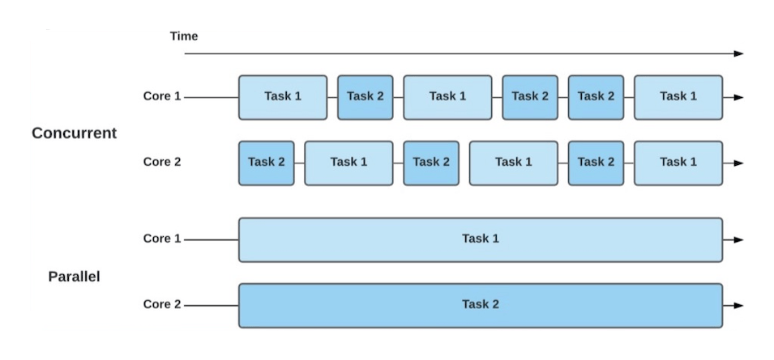
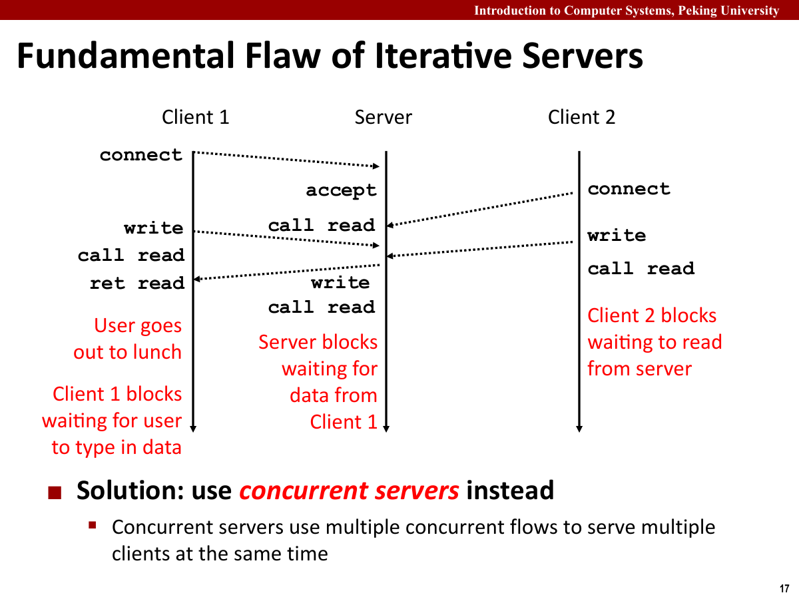
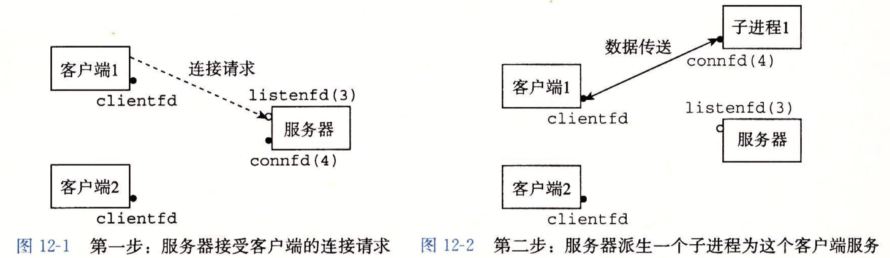
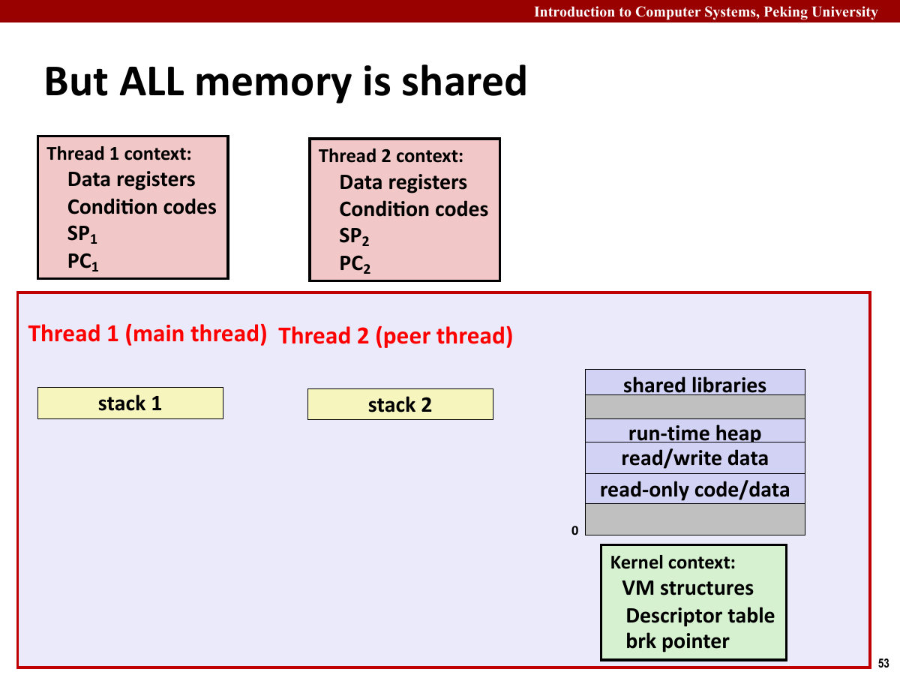
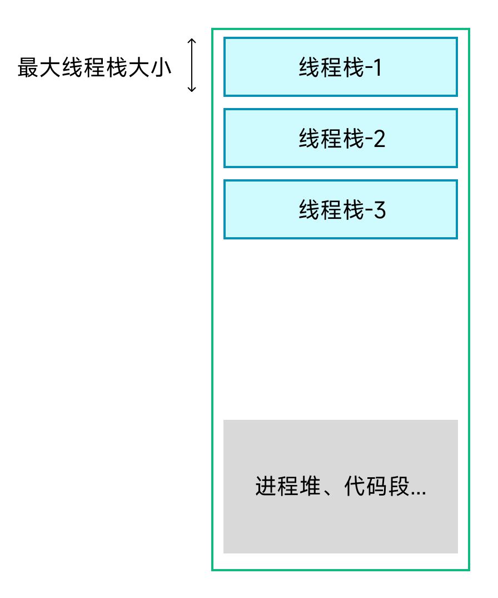
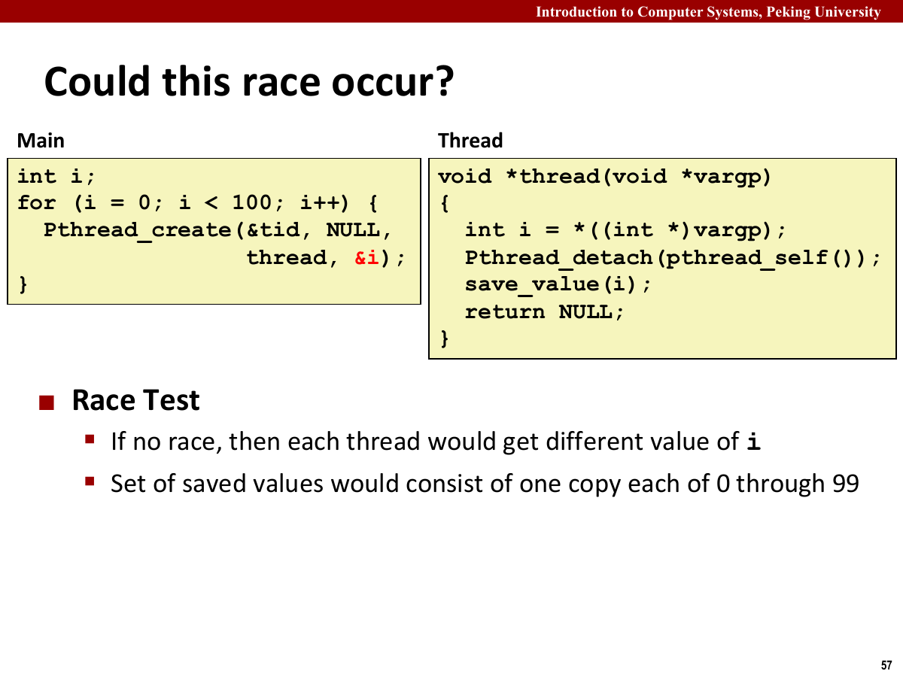
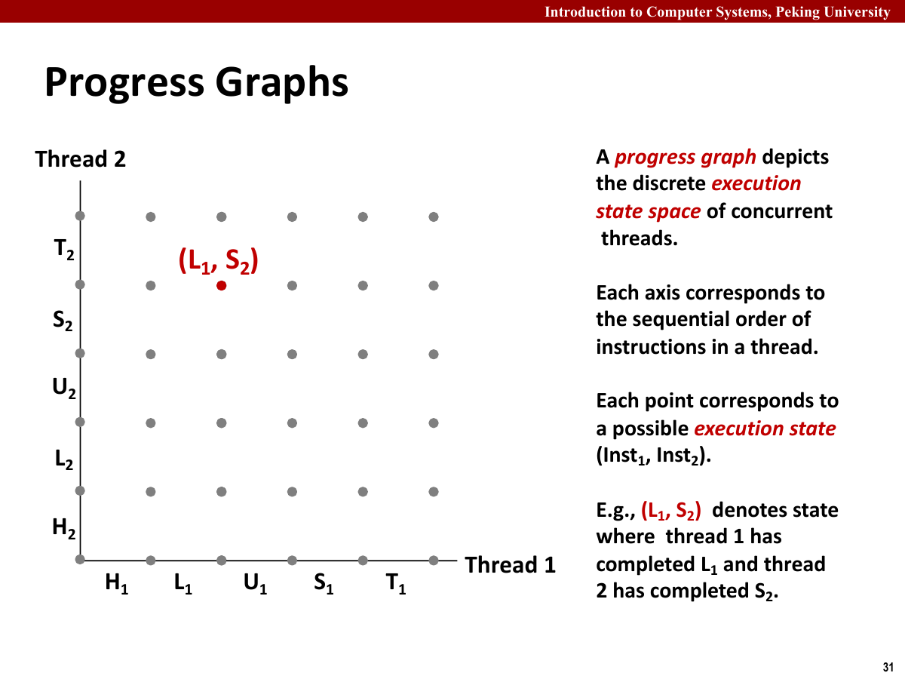
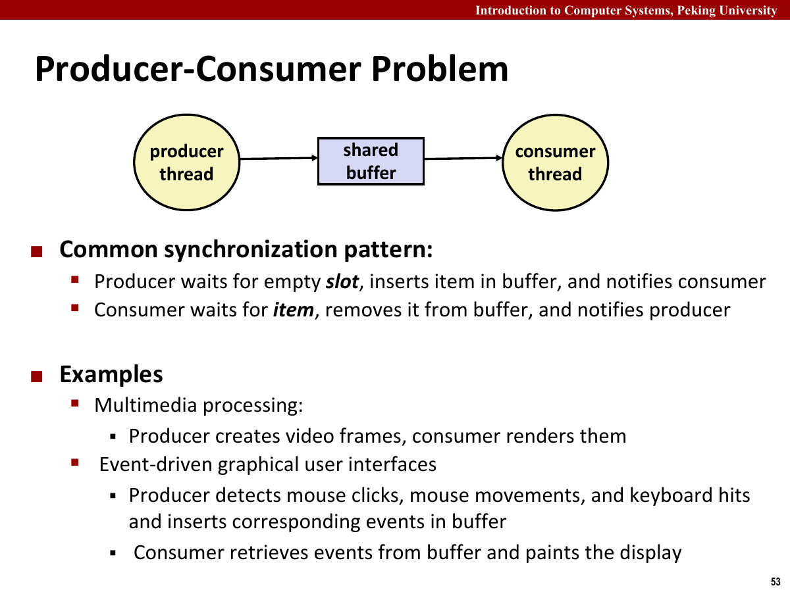
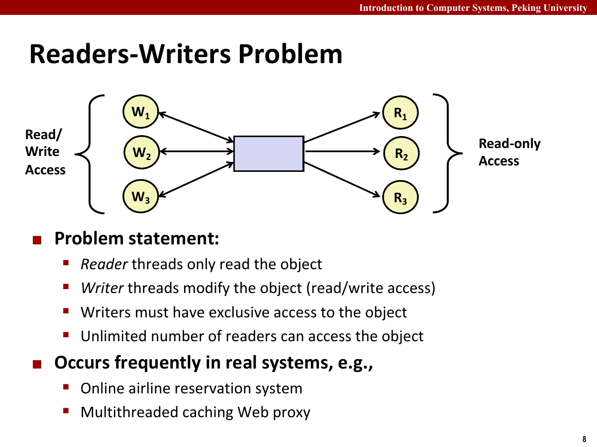
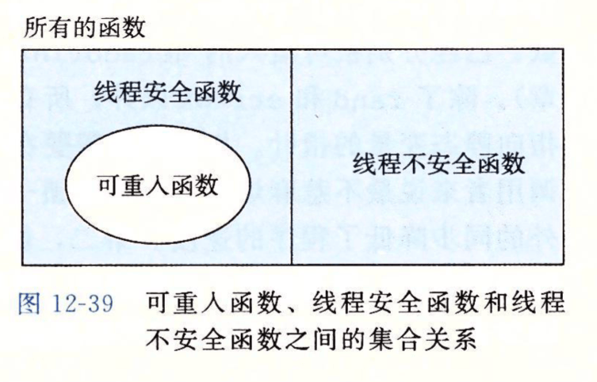

## 并发模型

并发（Concurrency）指多个逻辑控制流在时间上重叠。它们不一定真的在同一时刻运行；只要一个流的开始到结束区间与另一个流重叠，就可以称为并发。

并行（Parallelism）是并发的真子集。并行要求多个流在同一时刻真正运行在不同处理器核心上。



服务器程序需要并发，是因为多个客户端可能同时发来请求。如果服务器一次只处理一个连接，慢客户端会拖住后面的所有客户端。



基于进程的并发服务器会在每次 `accept` 后 `fork` 一个子进程。子进程处理客户端，父进程继续接受新连接。

这种模型的优点是隔离性好。每个子进程有独立地址空间，一个请求出错不容易破坏其他请求。

该模型的代价：

- 创建和销毁进程开销较大。
- 进程间共享状态比较麻烦。
- 父进程需要及时回收子进程，避免僵死进程。

基于进程的并发适合逻辑简单、隔离性优先的场景。



I/O 多路复用（I/O Multiplexing）让一个进程同时监听多个描述符。程序把所有关心的描述符交给内核，内核在其中任意一个就绪时返回。

`select` 的基本思想是维护一个描述符集合。每次调用时，内核检查哪些描述符可读或可写，然后程序逐个处理就绪事件。

这种模型通常采用事件驱动写法。程序不为每个客户端创建独立执行流，而是保存每个连接的状态，在事件到来时推进它。

优点是开销小、共享状态简单；缺点是控制流不如线程直观，单个事件处理函数不能阻塞太久，否则会拖住整个服务器。

线程（Thread）共享同一进程地址空间，但有各自的栈、寄存器和程序计数器。

线程模型比事件模型更接近顺序程序。每个线程可以像处理单个客户端一样写逻辑，但多个线程之间又能共享缓存、全局配置和堆对象。

缺点是共享会带来数据竞争。只要多个线程同时访问同一变量，并且至少一个线程会写，就需要考虑同步。



线程的“轻量”主要来自共享。多个线程共享代码段、全局数据、堆、打开文件表相关状态和地址空间结构，但每个线程有自己的寄存器上下文和栈。共享让线程间通信很方便，也让错误传播得很快。一个线程写坏堆结构，整个进程都会受影响。

图中每个线程都有自己的栈，但这并不意味着栈变量绝对安全。如果某个线程把自己栈变量的地址传给另一个线程，那么这个变量就被跨线程访问了。判断共享对象时，不能只看变量存储在哪里，还要看有没有多个线程能拿到同一个地址。



三种模型的对比：

| 模型 | 优点 | 代价 |
| --- | --- | --- |
| 进程 | 隔离性强，单个请求崩溃影响较小 | 创建开销大，共享状态麻烦 |
| I/O 多路复用 | 单进程处理多个连接，共享状态简单 | 控制流复杂，不能长时间阻塞 |
| 线程 | 编程模型接近顺序代码，共享方便 | 需要同步，容易出现数据竞争 |

进程模型隔离性强，但共享状态和进程回收较麻烦；事件模型开销较小，但需要显式维护每个连接的状态；线程模型便于复用顺序处理逻辑，但共享数据必须同步。

实验先实现“一个连接一个线程”。每个请求仍按顺序逻辑处理，但缓存、计数器和日志结构等共享数据都需要同步。

## 基于进程与 I/O 多路复用

### 基于进程的服务器

基于进程的服务器通常是父进程只负责接受连接，子进程处理请求。

```c
while (1) {
    connfd = accept(listenfd, ...);
    if (fork() == 0) {
        close(listenfd);
        doit(connfd);
        close(connfd);
        exit(0);
    }
    close(connfd);
}
```

`fork` 后，父子进程的描述符表都指向同一批内核打开文件表项。子进程不再接受新连接，所以要关闭自己的 `listenfd`；父进程不处理当前请求，所以要关闭自己的 `connfd`。这里只是减少引用计数，不会提前关闭另一进程仍在使用的套接字。

如果父进程忘记关闭 `connfd`，子进程结束后连接仍可能保留一个引用，对端便迟迟读不到 EOF。若子进程忘记关闭 `listenfd`，监听套接字也会被不必要地继承。

子进程退出后还需要由父进程回收。服务器通常安装 `SIGCHLD` 处理程序，并循环调用非阻塞 `waitpid`，因为同一次信号到达可能对应多个已经退出的子进程。

```c
void sigchld_handler(int sig) {
    int olderrno = errno;
    while (waitpid(-1, NULL, WNOHANG) > 0) {
    }
    errno = olderrno;
}
```

进程模型的地址空间彼此隔离。父进程在 `fork` 后修改普通全局变量，子进程看不到变化；若要共享缓存，需要共享内存、管道或其他进程间通信机制。这也是多进程代理比多线程代理更难共享对象缓存的原因。

### I/O 多路复用

基于事件的服务器会把多个描述符放进集合里，谁就绪就处理谁。

```c
while (1) {
    ready_set = read_set;
    select(maxfd + 1, &ready_set, NULL, NULL, NULL);
    handle_ready_descriptors(&ready_set);
}
```

`select` 接收待读、待写和异常描述符集合，并在至少一个描述符就绪、超时或被信号中断时返回。第一个参数不是描述符数量，而是最大描述符加一。

```c
int select(int n, fd_set *readfds, fd_set *writefds, fd_set *exceptfds, struct timeval *timeout);
```

描述符集合由几个宏维护。

- `FD_ZERO` 清空集合。
- `FD_SET` 把描述符加入集合。
- `FD_CLR` 从集合删除描述符。
- `FD_ISSET` 判断描述符是否处于就绪集合中。

`select` 会原地修改传入集合，只保留本次已经就绪的描述符。因此服务器需要长期保存 `read_set`，每轮调用前复制到 `ready_set`，不能直接把主集合交给下一轮。

```c
fd_set read_set, ready_set;
FD_ZERO(&read_set);
FD_SET(listenfd, &read_set);
int maxfd = listenfd;

while (1) {
    ready_set = read_set;
    int nready = select(maxfd + 1, &ready_set, NULL, NULL, NULL);

    if (FD_ISSET(listenfd, &ready_set)) {
        int connfd = accept(listenfd, NULL, NULL);
        FD_SET(connfd, &read_set);
        if (connfd > maxfd) {
            maxfd = connfd;
        }
        nready--;
    }

    for (int fd = 0; fd <= maxfd && nready > 0; fd++) {
        if (fd != listenfd && FD_ISSET(fd, &ready_set)) {
            service_client(fd);
            nready--;
        }
    }
}
```

监听描述符就绪表示有新连接可接受，已连接描述符就绪表示读取不会阻塞。读操作返回 `0` 时，对端已经关闭连接，服务器应从 `read_set` 删除该描述符并关闭它。

事件模型只有一条控制流，普通全局状态不需要线程锁；但每个客户端的解析进度要单独保存。若一个 HTTP 请求头只到了一半，服务器不能阻塞等待剩余部分，而要记住当前缓冲区，等该描述符再次就绪后继续解析。

`select` 的限制也比较明显：集合大小通常受 `FD_SETSIZE` 限制，每轮还要线性扫描描述符。Linux 上大规模服务器更常用 `epoll`，但课程里的 `select` 足以说明“保存连接状态、按就绪事件推进”的事件驱动模型。

基于线程的服务器会给每个连接创建线程，或者把连接放进线程池任务队列。

```c
while (1) {
    int *connfdp = malloc(sizeof(int));
    *connfdp = accept(listenfd, ...);
    pthread_create(&tid, NULL, thread, connfdp);
}
```

进程模型要回收子进程，事件模型不能阻塞在单个连接上，线程模型则要同步共享状态。

## 线程模型与共享状态

`pthread_create` 创建线程。它需要线程 ID 地址、属性、线程例程和参数。

线程例程形如 `void *routine(void *arg)`。若需要传多个参数，通常把参数打包进结构体，再把结构体指针传入。

`pthread_join` 等待可结合线程结束，并回收资源。`pthread_detach` 把线程变为分离状态，线程结束后自动回收资源。

新线程与创建它的线程是对等关系，不像进程那样形成严格的父子层次。任意线程调用 `exit` 都会结束整个进程；线程例程 `return` 或调用 `pthread_exit` 只结束当前线程。

线程创建后有两种资源回收方式。

- 可结合线程（Joinable Thread）：由其他线程调用 `pthread_join` 等待并回收。
- 分离线程（Detached Thread）：结束后由系统自动回收，不能再 `join`。

两种方式必须选一种。长期运行的服务器如果既不 `join` 又不 `detach`，已经结束的线程仍会保留部分资源，持续积累后同样会耗尽系统资源。

服务器中常见做法是创建分离线程处理连接，避免主线程逐个 `join`。

线程函数通常一开始就取出参数、分离线程并处理连接。

```c
void *thread(void *vargp) {
    int connfd = *((int *)vargp);
    free(vargp);

    pthread_detach(pthread_self());
    doit(connfd);
    close(connfd);
    return NULL;
}
```

将 `connfd` 放在堆上，而不是直接传循环变量地址，可以避免多个线程引用同一个变量位置。



如果主线程在循环里把 `&i` 传给每个线程，那么所有线程收到的都是同一个地址。线程真正开始运行时，主线程可能已经把 `i` 改成了下一个值，甚至循环都结束了。于是每个线程读到的值取决于调度顺序。

该错误依赖调度顺序，不一定每次复现。每个线程应使用独立参数对象，在线程开始时将参数复制到局部变量，再释放参数对象。

传递线程参数有三种常见方式。

- 在堆上分配参数对象，由工作线程读取并释放，生命周期最清楚。
- 传递某个长期存在对象的地址，但调用者必须保证线程结束前该对象不会失效或被错误覆盖。
- 把足够小的整数经 `intptr_t` 转换后放进 `void *`，适合线程编号等值，不适合任意指针运算。

不能把循环体内短命局部变量的地址交给多个线程，也不能在线程仍可能访问参数时由创建者提前释放。

判断变量是否共享，取决于多个线程能否引用同一内存位置，而不只取决于它是不是全局变量。

- 全局变量天然可能被所有线程共享。
- 堆对象如果指针传给多个线程，也会被共享。
- 栈变量通常属于某个线程，但如果把地址传给其他线程，也会变成共享对象。

所以线程函数里不能随手把循环变量地址传给新线程。父线程循环继续后，子线程看到的可能已经是另一个值。

`cnt++` 在 C 代码里是一句，但机器层面通常包含读取、加一、写回三步。

若两个线程同时执行 `cnt++`，可能会这样交错。

1. 线程 A 读取 `cnt`，得到旧值。
2. 线程 B 读取 `cnt`，也得到旧值。
3. 线程 A 写回旧值加一。
4. 线程 B 写回旧值加一。

两个线程各执行一次加法，结果却只增加一次，形成丢失更新。

`volatile` 只限制编译器对访问的优化，不保证复合操作具有原子性，也不提供互斥。两个线程同时执行 `volatile int cnt` 的 `cnt++` 仍会丢失更新，需要使用互斥锁、信号量或原子操作同步。

进度图用于表示指令交错。



图中横轴是线程 1 的执行进度，纵轴是线程 2 的执行进度。每个点表示两个线程各自执行到某条指令之后的状态。程序真实运行时，会沿着一条从左下到右上的轨迹前进。每向右走一步，表示线程 1 执行了一步；每向上走一步，表示线程 2 执行了一步。

进度图中的部分轨迹会穿过不安全区域。互斥锁（Mutex）限制合法轨迹，使两个线程不能同时进入临界区（Critical Section）。

把 `cnt++` 拆成加载、修改、写回后，两条线程轨迹中只有部分顺序得到正确结果。临界区不是“某一行 C 代码”，而是一组不能被其他线程交错插入的操作。锁要覆盖整个读改写序列，只保护最后一次写回仍然会丢失更新。

线程共享全局变量、堆和打开文件状态。缓存与全局配置可以直接共享，但每个可变对象都要指定同步方式。

若主线程在循环中反复使用同一个局部变量保存 `connfd`，并把它的地址传给工作线程，所有线程都会引用同一地址。线程开始执行前，该位置可能已经被后续循环写入新的连接描述符。

每个连接可单独在堆上分配一个 `int`，写入连接描述符后再把指针传给线程。工作线程取出值并释放内存，参数便不再依赖主线程循环变量的生命周期。

可结合线程需要由 `pthread_join` 回收；分离线程结束后自动回收，也不能再次 join。服务器为每个请求创建线程时，通常在线程开始处调用 `pthread_detach`。

共享变量是否安全，取决于访问模式。多个线程只读同一对象通常没问题；一个线程写、另一个线程读，就需要同步；多个线程都写，更需要同步。这里的“读写”也包括结构内部状态变化，例如链表插入、缓存 LRU 时间戳更新、引用计数递增。

临界区只包含共享状态的读写。局部计算放在加锁前，耗时 I/O 放在解锁后，同时不能遗漏同一不变量涉及的其他字段。

代理缓存命中时若更新 LRU 时间戳，该路径就包含写操作。可以用写锁保护整个命中过程，也可以设计不修改共享元数据的读路径；后者并发度较高，但实现更复杂。

共享变量检查项：

- 这个对象会不会被多个线程拿到地址。
- 有没有线程会写它。
- 写操作是不是由多条机器指令组成。
- 读操作是否依赖它和其他字段之间的不变量。
- 是否存在错误路径提前返回，绕开了解锁逻辑。

例如缓存槽位里有 `valid`、`key`、`object` 和 `size`。读者不能只保护 `object`，却不保护 `valid` 和 `size`。否则另一个线程可能正在替换槽位，读者看到的是新旧字段混合出来的状态。

锁的粒度取决于不变量的范围。缓存总大小需要全局保护，单个块的内容可以使用块级锁；初版可先使用粗粒度锁，再按性能需要拆分。

## 同步机制

信号量（Semaphore）是带整数值的同步变量。`P` 操作会尝试将信号量减一；若值不可用，线程阻塞。`V` 操作会将信号量加一，并唤醒等待线程。

信号量的值与检查必须原子完成。若两个线程都先看到值为 `1`，再各自减一，互斥就已经失效。操作系统提供的 `sem_wait` 和 `sem_post` 会在内部保证这一步不可分割。

```c
sem_t mutex;
sem_init(&mutex, 0, 1);

sem_wait(&mutex);
/* critical section */
sem_post(&mutex);
```

`sem_init` 的第二个参数为 `0` 时，信号量在线程之间共享；跨进程共享还需要把信号量放进共享内存，并按平台要求初始化。初始化值表示起始资源数量，不能机械地全部写成 `1`。

二元信号量可以实现互斥锁。进入临界区前 `P`，离开临界区后 `V`。

计数信号量可以表示资源数量。例如有界缓冲区中的空槽数和已有项目数，都适合用计数信号量表示。

互斥和调度使用信号量的方式不同。

- 互斥信号量初值通常为 `1`，同一时刻只允许一个线程进入临界区。
- 资源信号量初值是当前可用资源数，例如长度为 $N$ 的空缓冲区，其 `slots` 初值应设为 $N$ 而不是零。
- 通知信号量初值通常为 `0`，等待者先阻塞，事件发生后由另一个线程执行 `V`。

互斥锁用于保护临界区，同一时刻只能由一个线程持有。

使用互斥锁时要注意锁的范围。范围太小保护不了共享状态，范围太大又会降低并发度。

一个常见习惯是：锁只保护共享数据结构本身，不把耗时 I/O 放在锁里。否则一个慢客户端可能让其他线程都卡在锁外。

条件变量（Condition Variable）用于等待某个条件成立。它总是和互斥锁配合使用。

等待条件时，线程会释放互斥锁并睡眠；被唤醒后重新获取互斥锁，再检查条件是否成立。

检查条件时通常使用 `while` 而不是 `if`。原因是线程可能被虚假唤醒，也可能被唤醒后条件已经被其他线程改变。

条件变量等待的是共享条件成立，而不是某次通知本身。等待代码通常写成：

```c
pthread_mutex_lock(&mutex);
while (!condition) {
    pthread_cond_wait(&cond, &mutex);
}
use_shared_state();
pthread_mutex_unlock(&mutex);
```

`pthread_cond_wait` 会在睡眠前原子地释放互斥锁，并在返回前重新拿到互斥锁。若不是这样，线程可能在检查条件和进入睡眠之间错过通知。使用 `while` 是为了醒来后重新确认共享条件，而不是盲目相信一次唤醒。

### 生产者与消费者

有界缓冲区是生产者消费者问题的核心。缓冲区既不能在满时继续写，也不能在空时继续读。



有界缓冲区需要三个同步对象。

- `mutex` 保护缓冲区内部状态。
- `slots` 记录空槽数量。
- `items` 记录已有项目数量。

生产者先等待空槽，再加锁写入项目，最后释放已有项目数量。消费者先等待已有项目，再加锁取出项目，最后释放空槽数量。

三个同步对象分别处理结构互斥和资源计数。

- 缓冲区结构本身不能被多个线程同时改，所以需要 `mutex`。
- 缓冲区不能空取、不能满放，所以需要 `items` 和 `slots`。

互斥锁只保护缓冲区结构，不能表示空槽或项目数量；计数信号量只表示资源数量，不能阻止多个线程同时修改环形队列下标。

线程池服务器可以使用这个模型。主线程只负责接受连接，把连接描述符放进缓冲区；工作线程不断从缓冲区取任务并处理。

环形缓冲区还要维护读下标和写下标。`mutex` 保护下标与槽位内容，`slots` 和 `items` 则保证操作发生时确实存在可写或可读的槽位。三者缺少任何一个，都会出现覆盖未消费数据、读取空槽或并发修改下标的问题。

线程池预先创建固定数量的工作线程，主线程只把任务放入有界缓冲区。任务过多时，主线程阻塞等待空槽，避免连接高峰时无限创建线程。

线程池代理分为三层。

- 主线程：`accept` 新连接，把 `connfd` 放入任务队列。
- 工作线程：从队列中取 `connfd`，调用 `doit` 处理请求。
- 缓存模块：被多个工作线程共享，需要互斥或读写锁保护。

主线程不解析 HTTP，工作线程不操作监听描述符，缓存模块不负责关闭连接。

生产者消费者模型里，两个方向的资源计数要分开写。

```c
/* producer */
P(&slots);
P(&mutex);
insert_item(item);
V(&mutex);
V(&items);

/* consumer */
P(&items);
P(&mutex);
item = remove_item();
V(&mutex);
V(&slots);
```

注意 `slots/items` 和 `mutex` 的顺序。先等待资源，再进入临界区；否则线程可能持有锁等待资源，导致其他线程无法改变资源数量。

双缓冲流水线例题：线程 `PA` 从磁盘读记录放入 `Buff1`，`PB` 从 `Buff1` 取记录并放入 `Buff2`，`PC` 从 `Buff2` 取记录打印。若 `Buff1` 能放 4 条记录，`Buff2` 能放 8 条记录，需要设置这些信号量。

| 信号量 | 初值 | 含义 |
| --- | --- | --- |
| `empty1` | 4 | `Buff1` 的空槽数 |
| `full1` | 0 | `Buff1` 中已有记录数 |
| `mutex1` | 1 | 保护 `Buff1` 的插入和删除 |
| `empty2` | 8 | `Buff2` 的空槽数 |
| `full2` | 0 | `Buff2` 中已有记录数 |
| `mutex2` | 1 | 保护 `Buff2` 的插入和删除 |

代码骨架：

```c
PA() {
    while (1) {
        /* 从磁盘读入一个记录 */
        P(&empty1);
        P(&mutex1);
        /* 将记录放入 Buff1 */
        V(&mutex1);
        V(&full1);
    }
}

PB() {
    while (1) {
        P(&full1);
        P(&mutex1);
        /* 从 Buff1 中取出一个记录 */
        V(&mutex1);
        V(&empty1);

        P(&empty2);
        P(&mutex2);
        /* 将记录放入 Buff2 */
        V(&mutex2);
        V(&full2);
    }
}

PC() {
    while (1) {
        P(&full2);
        P(&mutex2);
        /* 从 Buff2 中取出一个记录 */
        V(&mutex2);
        V(&empty2);
        /* 打印 */
    }
}
```

`empty/full` 控制资源数量，`mutex` 保护缓冲区内部结构。`PB` 既是 `Buff1` 的消费者，也是 `Buff2` 的生产者，因此先释放 `Buff1` 的空槽，再申请 `Buff2` 的空槽。

### 读者与写者

读者—写者问题（Readers-Writers Problem）适合读多写少的数据结构。多个读者可以同时访问，写者必须独占访问。



读者优先实现简单，但如果读者持续到来，写者可能长期等待。写者优先可以避免写者饥饿，但可能降低读吞吐。

纯读者优先可能导致写者饥饿，纯写者优先则可能降低读吞吐。FIFO 风格的读写锁按到达顺序排列等待者，兼顾两类线程的公平性。

缓存读取属于读者操作，插入、淘汰和更新属于写者操作，`Proxy Lab` 的多线程缓存可以使用读写者模型。

读者只有在不修改共享状态时才能并发。若缓存命中会更新 LRU 时间戳，该操作必须使用写锁，或者改写替换策略，使读路径不修改共享数据。

读写者问题在代理缓存里很具体。多个线程同时命中缓存并返回对象时，它们只读对象内容，可以并发；某个线程要插入新对象或淘汰旧对象时，就必须阻止其他线程读到半更新状态。

LRU 更新会使缓存命中不再是纯读操作。早期版本使用一把互斥锁保护整个缓存；需要提高并发度时，再分离对象读取和元数据更新。

加锁和解锁必须在所有控制路径上成对出现。中途 `return` 前要释放锁，调用长时间阻塞的函数前也要检查当前持有的锁。

条件变量用于等待共享谓词成立，不记录历史通知。线程必须在互斥锁保护下检查谓词，否则可能错过状态变化并永久等待。

生产者消费者模型里，`slots` 和 `items` 是两个不同方向的资源计数。生产者消耗空槽、产生项目；消费者消耗项目、产生空槽。把这两个信号量写反，程序可能一开始就阻塞，也可能在压力稍大时才暴露。

如果用信号量实现有界缓冲区，顺序也不能随意交换。生产者应先等空槽，再拿互斥锁；消费者应先等项目，再拿互斥锁。若先拿互斥锁再等资源，一个线程可能拿着锁睡眠，其他线程无法进入临界区改变资源数量，程序就卡住了。

这类错误依赖线程交错。测试应覆盖多个客户端并发请求、重复请求和大对象请求，不能只用一次 `curl` 验证。

第一类读者写者问题中，第一个读者负责阻塞写者，最后一个读者负责释放写者，中间读者只维护读者计数。

```c
P(&mutex);
readcnt++;
if (readcnt == 1) {
    P(&w);
}
V(&mutex);

/* read */

P(&mutex);
readcnt--;
if (readcnt == 0) {
    V(&w);
}
V(&mutex);
```

这里 `mutex` 保护的是 `readcnt`，`w` 保护的是被读写的共享对象。两个信号量保护的东西不同，所以不能随便合并。若读路径还要修改 LRU 之类的元数据，那么这段读者逻辑就需要重新审视。

## 线程安全、可重入与死锁

线程安全函数（Thread-safe Function）可以被多个线程并发调用而不出错。可重入函数（Reentrant Function）更强，它不依赖任何共享可变状态，也不调用不可重入函数。



函数可以通过内部加锁实现线程安全，但仍可能不可重入。可重入函数不依赖静态缓冲区、全局状态或隐藏的共享对象。

函数不可重入的常见原因：

- 使用静态局部变量。
- 返回指向静态缓冲区的指针。
- 修改全局状态。
- 调用其他不可重入函数。

解决方式包括加锁、让调用者传入缓冲区、使用线程局部存储，或改写为纯函数式接口。

加锁只能把共享访问串行化，不会自动让返回静态缓冲区的接口变得可重入。例如函数内部用锁保护一块静态数组，调用结束后锁已经释放；另一个线程再次调用时仍能覆盖前一次返回的内容。把缓冲区交给调用者管理才真正去掉了共享状态。

线程不安全函数分为四类。

- 不保护共享变量的函数。多个线程同时改同一个全局变量，会直接竞争。
- 跨调用保存状态的函数。即使内部加锁，本次返回值也可能依赖其他线程在两次调用之间做了什么。
- 返回静态缓冲区指针的函数。另一个线程再次调用同一函数后，前一个线程手里的结果可能被覆盖。
- 调用其他线程不安全函数的函数。外层看起来没有共享状态，但内部依赖不安全接口。

许多库函数提供带 `_r` 后缀的版本，要求调用者传入缓冲区，将原本隐藏在函数内部的静态状态交给调用者管理。

死锁（Deadlock）通常需要四个条件：互斥、占有并等待、不可抢占、循环等待。

程序里最常见的是锁顺序不一致。例如线程 A 先拿锁 1 再拿锁 2，线程 B 先拿锁 2 再拿锁 1，就可能互相等待。

预防死锁的直接方法是规定全局锁顺序。所有线程都按同一顺序获取多个锁，循环等待就无法形成。

多把锁需要规定统一获取顺序。例如缓存同时有全局锁和块锁时，可以规定先取全局锁、再取块锁，并按相反顺序释放。

不要在持锁状态下执行可能长期阻塞的网络 I/O。即使没有形成严格死锁，一个慢客户端也可能长时间占着缓存锁，使其他线程全部等待。通常先在锁内复制必要数据或更新元数据，再释放锁完成发送。

死锁和数据竞争都依赖调度顺序，不一定稳定复现。检查时要核对锁顺序和共享状态的不变量，不能只依赖单次运行结果。

死锁、活锁和饥饿也要区分。

- 死锁是大家互相等待，谁也走不了。
- 活锁（Livelock）是线程一直在动作，但没有推进有用状态。
- 饥饿（Starvation）是某个线程长期拿不到资源，其他线程却仍然能继续运行。

死锁通常检查锁顺序，活锁检查退让与重试逻辑，饥饿检查调度公平性和读写锁偏向。

增加 `printf` 可能改变调度顺序，使并发 Bug 暂时消失。

并发程序在设计阶段需要记录：

- 哪些状态是共享的。
- 每个共享状态由哪把锁保护。
- 锁的获取顺序是什么。
- 线程何时创建、何时结束、由谁回收。
- 出错路径是否释放锁和关闭描述符。

`Proxy Lab` 的实现顺序是迭代代理、线程处理连接、缓存与读写锁，避免同时调试多个共享状态。

调试时应明确不变量，例如缓存总大小不超过上限、空闲链表不出现环、队列元素数量等于生产数量减去消费数量。锁用于保护这些不变量。

`printf` 本身可能带锁，输出还会改变线程调度，因此日志只能辅助观察。检查正确性仍要依靠不变量、断言和高并发压力测试。

难以复现并发 Bug 时，可以在关键路径临时加入短暂 sleep、提高线程数并重复请求，以增加调度扰动；定位完成后应删除这些 sleep。

每份共享状态都应有明确的所有者和同步方式。
