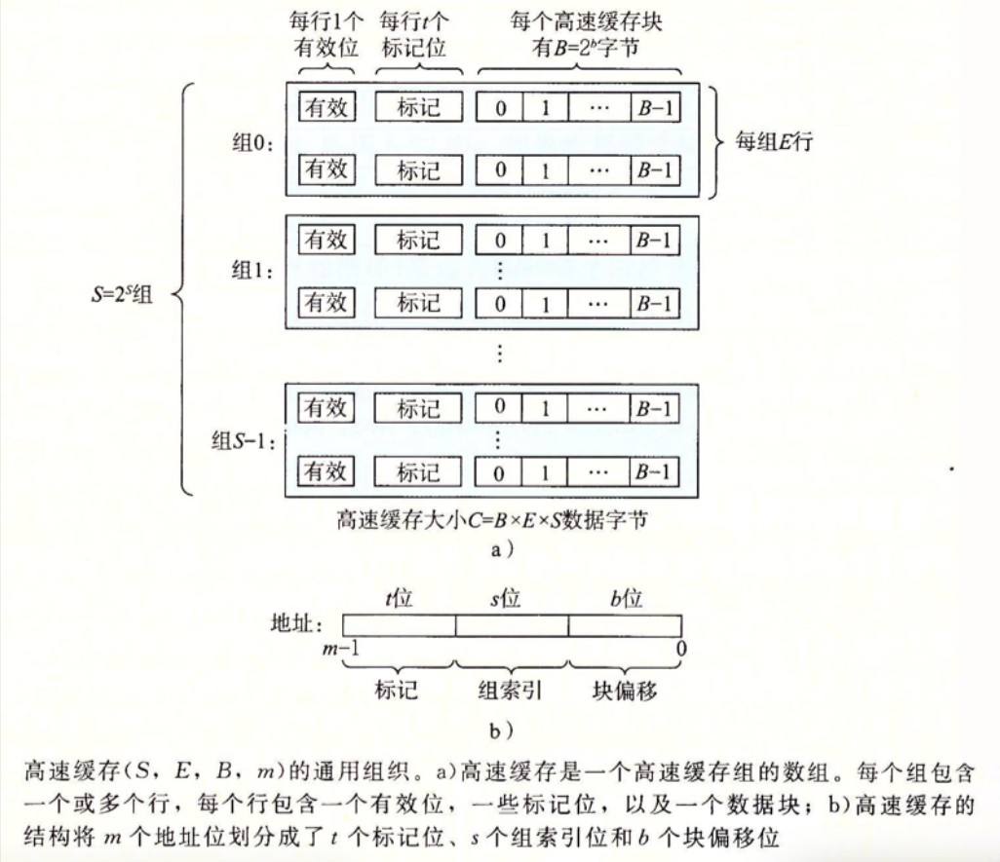
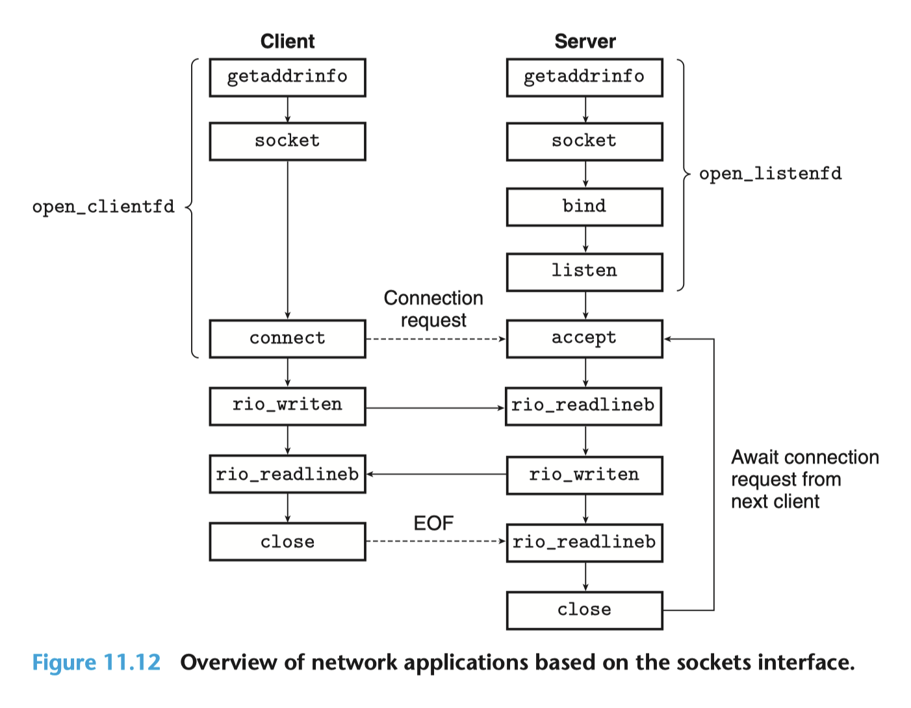
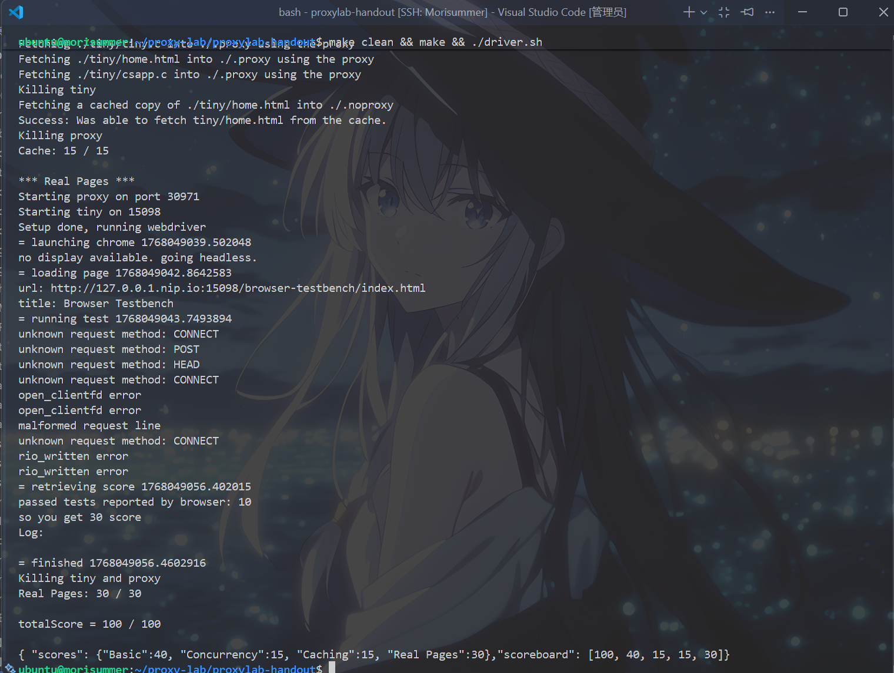

# 从零开始的Proxy Lab

> [!CAUTION]
> 
> **本笔记仅供参考，请勿抄袭。**

## 声明
本笔记的写作初衷在于，笔者在做Proxy Lab的时候受到Arthals学长很大启发，同时25Fall的计算机系统导论课程改制增加了10分的Lab测试（虽然往年的期中期末中也会有一两道Lab相关选择题，但分值不大）。故将心路历程写成此笔记，以便复习，并供后续选课同学参考。

update：此文写成于笔者期末季之后，关于lab测试和期末考试笔者并不想谈太多，毕竟笔者的性格就是或许一时可能上头，但是冷静下来感觉还是自己太菜以及各种各种的自身原因导致的结果。或许写这些笔记的初衷还是分享心得，以及结交同好？复习以及理解什么都是次要的，也许有人受此启发，也许没有，还是充当一下小小的自我感动罢了。更深层的感悟可以见``后记``一节，会同步发布至北大树洞。

## Proxy Lab简要介绍
Proxy Lab是北京大学《计算机系统导论》课程的第八个，也是最后一个Lab，对应教材第六章《存储器体系结构》，第十章《系统级I/O》，第十一章《网络编程》，第十二章《并发编程》。该Lab旨在增强同学们对网络服务器和并发编程的理解。

在``Proxy Lab``中，需要编写一个具备缓存功能的简单HTTP代理服务器，逐步完善三个功能，共分为三个Part。在``Part A``中，需要搭建服务器的基础功能，如接受客户端连接、读取并解析请求、转发请求到服务器、读取服务器响应并转发给客户端等。在``Part B``中，需要加入并发编程，使代理服务器能处理多个并发连接。在``Part C``中，需要为代理服务器增加缓存功能，存储最近访问的Web内容。其中，``Part A``的占比为``40pts``，``Part B``的占比为``15pts``，``Part C``的占比为``15pts``。此外，还有``30pts``的真实页面测试，通过浏览器进行测试，一共10个测试用例，每个3分。

临近期末季，这个Lab有一部分同学都是用AI直接Vibe出来的，至少笔者身边统计学是这样。不过尚未意识到危机的笔者还是把它写完了，所以来讲讲思路吧。

值得一提的是，这个Lab相比CMU的原版Lab，PKU助教团队增添了真实页面测试这一节，其它部分似乎与原版相同，如有误烦请指正。此Lab的难度为中高，笔者耗时约为 $9 \sim 11$ 小时。

## 在动手之前
### 代码风格要求
即使这个Lab似乎没有代码风格的要求，但是作为工程类项目，代码风格还是非常重要的，具体可以查看[elainafan-从零开始的Cache Lab]()中``代码风格要求``这一节，供参考。

### Writeup的Tips
首先，可以使用实验材料目录中的``csapp.c``和``csapp.h``文件，它们提供了各类错误处理包装函数和辅助函数，同时提供了RIO（健壮I/O包），应该使用``健壮I/O函数``而非原生I/O函数（如read、write等等），亦可以自行实现健壮I/O函数。

模块化设计是重要的考量因素，将实现的各个模块拆分到不同文件中是被鼓励的，例如``缓存功能``应该尽可能与代理服务器的其他部分``解耦``，常见的做法是将缓存相关实现单独放在``cache.c``和``cache.h``文件中。

本实验允许自行添加源文件，因此需要自行编写``Makefile``文件，整个项目编译时需要``无警告``，同时需要为最终提交确定合适的编译选项集。

自动评分工具存在一个漏洞，可能导致真实页面测试超时，因此本地测试得分可能与AutoLab评测得分不同，不过在25Fall中助教团队修复了这个问题。

最终提交的程序需要能够妥善处理各类错误，甚至是``格式错误``或者``恶意输入``，同时还包含其他要求，例如需要避免段错误、无内存泄漏以及文件描述符泄漏等。

尤其需要注意的一点是，因为服务器是长期运行的，因此需要思考长期运行可能导致的隐蔽错误。这里其实是在暗示，由于并发编程中线程存在竞争问题，因此需要合理配置锁和信号量来解决线程的竞争。

代理服务器需要处理``SIGPIPE``信号，当进程持有已断开的套接字句柄时，内核可能会向其发送SIGPIPE信号，默认情况下进程会终止，但是代理服务器不应终止。

从提前关闭的套接字读取数据时，read函数可能返回-1，且设置errno为``ECONNRESET``，代理服务器不应终止，向已提前关闭的套接字写入数据时也是一样。

Web上的内容大多数为二进制数据，在选择和使用网络I/O和缓存相关函数时，需要考虑二进制数据的处理，例如使用``memcpy``而非``strcpy``。

### 环境配置
根据``writeup``，需要执行以下命令安装相应依赖：

```bash
sudo apt update
sudo apt install net-tools curl
sudo apt install python3-selenium chromium-chromedriver
sudo snap install chromium
```

### 如何测试
首先，由上文可以得知，实现的是代理服务器，也就是在客户端和服务端之间转发信息等等的服务器。

如果要进行测试，就需要启动一个真实服务器，模拟传输的过程，实验材料提供了名为``tiny``的微型服务器，这个服务器也被用于进行真实页面测试。

要启动``tiny``服务器，可以执行以下命令：

```bash
# 编译，不更改工作目录
(cd ./tiny && make clean && make)
# 默认前台运行，推荐使用此法+新建终端方便查看日志
cd ./tiny && ./tiny 7778 # 这里的端口可以自行修改
# 直接后台运行
cd ./tiny && ./tiny 7778 & cd .. # 这里少了一个&是正确做法，不必担心
```

随后，可以新启动一个终端来启动代理服务器：

```bash
# 编译 & 执行
make clean && make && ./proxy 7777 & # 端口可以自行修改
```

接着，可以使用``curl``工具向任意服务器发送HTTP请求，示例如下：

```bash
# 访问 tiny 服务器
curl -v --proxy http://localhost:7777 http://localhost:7778/
# 访问百度，假定你的代理服务器可以访问外网、不支持 HTTPS
curl -v --proxy http://localhost:7777 http://www.baidu.com/
```

同时，还可以使用``netcat``工具手动测试代理服务器，或者作为服务器运行。

```bash
nc 127.0.0.1 12345
GET http://www.cmu.edu/hub/index.html HTTP/1.0
HTTP/1.1 200 OK
# 手动测试代理服务器
nc -l 12345 # 将netcat作为服务器监听12345端口
```

最后，如果在远程机器上运行，需要获取真实页面测试的图形化调试信息，可以通过``端口转发``机制转发到本地：

```bash
cd tiny && ./tiny <remote_tiny_port> &
cd ..
./proxy <remote_proxy_port> &
./webdriver_test.py <remote_proxy_port> <remote_tiny_port> # 这段在远程机器上执行

ssh <username>@<hostname> \
-L 127.0.0.1:<local_tiny_port>:127.0.0.1:<remote_tiny_port> \
-L 127.0.0.1:<local_proxy_port>:127.0.0.1:<remote_proxy_port> # 这段在本地机器上执行
```

接着再在本地机器上配置代理，并访问``http://127.0.0.1.nip.io:<remote_tiny_port>/browser-testbench/index.html``即可查看测试结果。

笔者注：Arthals的踩坑记中提到了VS Code的端口转发功能，笔者并非使用，有兴趣的可以前往他的博文查看，见``参考资料``一节。

最后，使用``make clean && make && ./driver.sh``命令进行测试。

### 缓存回顾
如果还没开始期末复习的同学，做到这里可能已经忘记了这是啥，见下图。



也就是，使用地址的``索引位``找到对应的组，然后根据``标记位``找到对应组内``标记位相同并且有效位有效``的行，再根据偏移位得到对应的信息。

在这个过程中，可能发生冷不命中（所在组中行的有效位全为零）以及冲突不命中（所在组已经满了，但是找不到相同的标记位对应的行），此处不考虑容量不命中的情况。

遇到冲突不命中，可以采用随机替换、最近最少使用(LRU)、最不常使用(LFU)的替换策略，根据``writeup``，需要采用``LFU``的替换策略。

### 网络编程回顾
为什么首先回顾的是网络编程而非系统级I/O？因为在这个Lab中，系统级I/O和并发编程都是用于构建网络编程中服务器的工具，因此先有个框架是非常重要的。

下图是常见服务端和客户端通信的流程，也是完成这个Lab的基础：



也就是，对于客户端而言：
- 先调用``getaddrinfo``获取``服务端``的网络连接信息。
- 随后使用``socket``创建一个套接字，这里只填入了``对方的协议类型``等基础信息，没有填写端口等，此时套接字是``不可用的``。
- 接着，调用``connect``建立连接并填入服务端信息，若能正常建立，则套接字``变为可用``。
- 随后，使用``rio_writen``和``rio_readlineb``来发送和接收数据。
- 最后，调用``close``关闭套接字，终止连接，释放描述符使其可被重用。

而对于服务端而言：
- 先调用``getaddrinfo``获取``自己的``网络连接信息。
- 使用``socket``创建一个套接字，用于``监听``客户端的连接请求，此时套接字``不可用``。
- 调用``bind``将套接字``绑定到``获取到的地址信息上，声明对某个端口的占用，此时套接字``可使用``。
- 调用``listen``将其转化为``监听套接字``，于是可以监听客户端的连接请求。
- 调用``accept``从阻塞的监听序列中取出一个套接字，同时``创建一个新的套接字``，这个套接字用于真正的连接行为。
- 调用``rio_readlineb``和``rio_writen``来发送和接收数据。
- 当客户端使用``close``关闭自己创建的套接字时，服务端调用``close``关闭``accept``创建的套接字。

下面是关于上述函数具体签名的介绍：

``int getaddrinfo(const char* host, const char* service, const struct addrinfo *hints, struct addrinfo **result)``：获取相关信息，若成功则返回0，若出错则返回非零的错误代码。其中，``host``表示需要解析的主机，``service``表示需要连接的服务或端口，``hints``表示过滤条件，由相关字段组成，``result``用于返回指向``addrinfo``结构链表的指针。

``int socket(int domain, int type, int protocol)``：创建一个套接字，若成功则返回非负描述符，若出错则返回-1，其中``domain``是协议族，``type``是套接字类型，``protocol``是具体协议，这些都可以通过``getaddrinfo``获取。

``int connect(int clientfd, const struct sockaddr* addr, socklen_t addrlen)``：客户端通过调用``connect``函数建立与服务端的连接，若成功则返回0，若出错则返回-1。其中，``clientfd``为客户端创建的套接字，``addr``为服务端信息，从``getaddrinfo``中得到，``addrlen``为地址长度。

``int bind(int sockfd, const struct sockaddr* addr, socklen_t addrlen)``：服务端通过调用``bind``将套接字绑定到端口，若成功则返回0，若出错则返回-1。``sockfd``为``socket``创建的套接字，``addr``为本地地址，``addrlen``为地址长度。

``int listen(int sockfd, int backlog)``：服务端通过调用``listen``将套接字转化为监听套接字，若成功则返回0，若出错则返回-1。其中，``sockfd``为已经绑定的套接字，而``backlog``为队列中要排队的未完成的连接请求的数量。

``int accept(int listenfd, struct sockaddr* addr, socklen_t *addrlen)``：服务端通过调用``accept``从监听队列中取出一个已建立的连接，并创建新的socket，若成功则为非负描述符，若出错则返回-1。其中，``listenfd``为监听套接字，``addr``用于填入客户端的地址信息，``addrlen``用于返回完整地址长度。

同时，便于编写，还有以下封装好的函数：

``int open_clientfd(char *hostname, char *port)``：建立与主机``hostname``、端口号``port``的服务端的连接，若成功则返回非负描述符，若出错则返回``-1``，相当于上文中``getaddrinfo+socket+connect``的封装。

``int open_listenfd(char *port)``：创建一个``监听套接字``，它绑定在端口``port``上，若成功则返回非负描述符，若出错则返回-1，相当于上文中``getaddrinfo+socket+bind+listen``的封装。

接着，从书上获取到，一个HTTP请求由一个请求行、零个或多个请求头，以及一个空的文本行来终止报头列表，同时每行都以``\r\n``结尾，具体可以见下文``开始动手``一节中结合``writeup``的讲解。

### 系统级I/O回顾
上文中，提到需要使用健壮的I/O(RIO)函数进行输入输出，而健壮性的来源就是它们能自动处理不足值。此处对这几个函数进行回顾：

``ssize_t rio_readn(int fd, void* usrbuf, size_t n)``：无缓冲区，从描述符fd的当前文件位置传送``最多n个字节``到内存位置``usrbuf``，若成功则返回传送的字节数，若遇到``EOF``则返回0，出错则返回-1。

``ssize_t rio_writen(int fd, void* usrbuf, size_t n)``：无缓冲区，从描述符fd的当前文件位置写入从``usrbuf``获取的``最多n个字节``，若成功则返回传送的字节数，若出错则返回-1。

``void rio_readinitb(rio_t *rp, int fd)``：初始化``rio_t``结构体，使它能够带缓冲地读取数据，绑定到文件描述符fd，无返回。

``ssize_t rio_readlineb(rio_t *rp, void* usrbuf, size_t maxlen)``：带缓冲区，从``RIO缓冲结构``rp中读取一行数据到``usrbuf``，字节数最多为``maxlen-1``，防止溢出，成功时返回实际读取的字节数，若遇到``EOF``则返回0，若出错则返回-1。

``ssize_t rio_readnb(rio_t *rp, void* usrbuf, size_t n)``：带缓冲区，从``RIO缓冲结构``rp中读取``最多n个字节``到``usrbuf``，成功时返回实际读取的字节数，若遇到``EOF``则返回0，若出错则返回-1。

``ssize_t rio_read(rio_t *rp, char *usrbuf, size_t n)``：带缓冲区，从``rio_t``的内部缓冲区读取数据，如果缓冲区没有数据，调用系统调用``read``填充缓冲区，成功时返回实际读取的字节数，若遇到``EOF``则返回0，若出错则返回-1。

无缓冲区和带缓冲区函数的区别就在于这个函数是否具有自带的缓冲区，而与用户给出的``usrbuf``无关。带缓冲区函数的明显优势在于``减少系统调用的次数``，能加快运行速度，但是尤其要注意的是，不要在同一个文件描述符上混用带缓冲和不带缓冲的I/O函数。

### 并发编程回顾
根据课本，有三种并发编程的方式，即基于进程的并发编程、基于I/O多路复用的并发编程，和基于线程的并发编程，根据``writeup``，需要使用基于线程的并发编程。

下面回顾线程的相关函数。

``pthread_create(pthread_t *tid, pthread_attr_t *attr, func *f, void *arg)``：若成功则返回0，若出错则为非零，``tid``用于保存新创建线程的ID，``attr``用于改变新创建例程的默认属性，一般采用``NULL``，``f``是线程需要执行的函数，``arg``是传给线程函数的参数。

其中，线程函数的函数签名必须为``void *f(void *arg);``

``void pthread_exit(void* thread_return);``：从不返回显式终止当前进程，若主线程调用，会等待其它对等线程终止后终止自身以及整个进程，返回值为``thread_return``。

``int pthread_cancel(pthread_t tid)``：终止线程ID为``tid``的对等线程，若成功则返回0，若出错则返回非零。

``int pthread_join(pthread_t tid, void **thread_return);``：阻塞直到线程ID为``tid``的线程终止，将线程例程返回的通用``void*``指针赋值到``thread_return``指向的位置，然后回收已终止线程占用的所有内存资源。若成功则返回0，若出错则返回非零。

``int pthread_detach(pthread_t tid);``：分离线程ID为``tid``的线程，使其由可结合线程变为分离线程。线程被创建时均为可结合的，即其可被其他线程收回和杀死，系统不会自动回收其内存资源，需要通过其他线程回收。分离线程则不能被其他线程回收和杀死，终止时系统自动释放它的内存资源。该函数若成功则返回0，若出错则返回非零，常用``pthread_detach(pthread_self());``来分离自身。

``int pthread_once(pthread_once_t *once_control, void(*init_routine)(void));``：初始化与线程例程相关的状态，总是返回0。

随后，由于这个Lab涉及缓存的相关知识，而缓存是一种全局数据结构，同时实现的代理服务器是线程并发的，对它的读和写类似课本中``第一类读者-写者``问题。

也就是，当存在读者访问全局数据结构时，必须阻塞写者使其无法进入，而其他读者可以进入；而当某个写者在访问全局数据结构时，必须阻塞其他所有读者和写者，使其无法进入，这就需要使用信号量实现互斥锁来进行调度和维护。

请看以下代码：

```c
// reader-priority.c - 第一类读者-写者问题的解答，读者优先级高于写者
/* 全局变量 */
int readcnt; /* 共享变量，记录当前正在读取的读者数量 */
sem_t mutex, w; /* 两个信号量，分别用于互斥访问 readcnt 和写者优先级 */

void reader(void) {
    while (1) {
        P(&mutex);
        readcnt++;
        if (readcnt == 1)
            P(&w); /* 阻塞写者 */
        V(&mutex);

        /* 读取数据 */

        P(&mutex);
        readcnt--;
        if (readcnt == 0)
            V(&w); /* 释放写者 */
        V(&mutex);
    }
}

void writer(void) {
    while (1) {
        P(&w); /* 阻塞读者和写者 */
        /* 写入数据 */
        V(&w); /* 释放读者和写者 */
    }
}
```

其中，``mutex``是一个信号量，这个信号量是为了保证``readcnt``不被竞态修改而产生的。

因为``readcnt++``这个语句实际上是通过``从内存读，再加一，再写入内存``得到的，如果有多个线程同时操作，那么顺序会被打乱，发生竞争，因此需要保证``readcnt++``这个操作同时只有一个线程操作，因此使用``mutex``锁保护它。

同时，还需要保证写者比读者的优先级强，即需要使用``W``这个信号量保证读者``readcnt``大于0时，没有写者能够进入。

请看上面代码，当第一个读者进入时，使用``P(&w)``为写者加锁，因此此时写者全部被隔离在外，当最后一个读者出来时才使用``V(&w)``为写者解锁。而在``writer``函数中，写者使用``P(&w)``阻塞自身之外的所有读者写者，写操作进行完后再使用``V(&w)``为其解锁。

### 字符串相关回顾
事实上，这个Lab涉及大量的字符串处理，而平时写算法题时都是用C++的string类实现的，因此有必要回顾一下C语言的字符串处理。

众所周知，C语言中字符串都以``char[]``或者``char*``的形式存储，结尾都是``\0``，请看下列函数：

``int strcmp(const char *s1, const char *s2)``：用于比较两个字符串是否相等，大小写敏感，若相等则返回0，否则返回非零。

``int strcasecmp(const char *s1, const char *s2)``：用于比较两个字符串是否相等，大小写不敏感，若相等则返回0，否则返回非零。

``int strncmp(const char *s1, const char *s2, size_t n);``：用于比较两个字符串的前n个字符是否相等，大小写敏感，若相等则返回0，否则返回非零。

``int strncasecmp(const char *s1,const char *s2, size_t n)``：用于比较两个字符串的前n个字符是否相等，大小写不敏感，若相等则返回0，否则返回非零。

``char *strchr(const char *s, int c)``：用于检索字符串中是否存在字符c，存在则返回第一次出现位置指针，否则返回``NULL``。

``char *strcpy(char *dest, const char *src)``：将字符串``src``复制到``dest``指向的内存中，返回``dest``。

``char *strncpy(char *dest, const char *src, size_t n)``：将字符串``src``的前n个字符复制到``dest``指向的内存中，返回``dest``。

``char *strcat(char *dest, const char *src)``：将字符串``src``连接到``dest``的末尾，返回``dest``。

``int sscanf(const char *str, const char *format, ...)``：从字符串中读取格式化输入，存储到后面的参数中，返回成功读取的参数个数。

``int sprintf(char *str, const char* format, ...)``：见格式化输出写入字符串``str``中，返回写入的字符个数。

### 课本相关知识
- 6.4 高速缓存存储器
- 11.6 Tiny Web服务器
- 12.3 基于线程的并发编程
- 12.3.8 基于线程的并发服务器
- 12.5.4 利用信号量来调度共享资源
- 12.5.5 基于预线程化的并发服务器

## 开始动手！
运行``tar -xvf proxylab-handout.tar``命令，解压文件。

随后发现，``proxy.c``文件中只有``最大缓存容量``和``最大对象缓存大小``两个宏，因此需要参考``writeup``完善接下来的功能。

当然，首先导入``csapp.h``跟``cache.h``（如``其它writeup的Tips``一节中所述），当然是没问题的。

注意，此处将``Part A``和``Part B``进行同时实现，以免后续再改的时间成本（你看笔者的Malloc Lab不也是直接写分离空闲链表的吗）。

### 类型封装
根据``writeup``，需要处理``GET``请求的``URL``。对于每个GET请求，它的请求行格式大致如下：

```bash
GET http://www.example.com:8080/foo/bar.html?x=1 HTTP/1.1
```

也就是，``GET``后面这一段是完整的URL，由主机名、端口以及路径组成，后续为``HTTP``版本，根据``writeup``，需要将客户端发送的``HTTP/1.1``手动转为``HTTP/1.0``后转发，因此可以将原先的丢弃后添加。

为了相对方便，需要将URL封装为相应的结构体，如下：

```c
typedef struct _URL
{
    string hostname; // 要连接的服务器
    string port; // TCP端口（默认80）
    string path; // GET请求里的路径
} URL;
```

同时，为了防止写多个``char[MAXLINE]``，不妨将其别名设为``string``，以便书写方便（笔者注：MAXLINE作为宏被定义于``csapp.h``中，大小为8192）。

```c
typedef char string[MAXLINE];
```

### 主线程函数
首先参考课本12.5.5一节，查看以下代码：

```c
#include "csapp.h"
#include "sbuf.h"
#define NTHREADS 4
#define SBUFSIZE 16

void echo_cnt(int connfd);
void *thread(void *vargp);

sbuf_t sbuf; /* Shared buffer of connected descriptors */

int main(int argc, char **argv)
{
    int i, listenfd, connfd;
    socklen_t clientlen;
    struct sockaddr_storage clientaddr;
    pthread_t tid;

    if (argc != 2) {
        fprintf(stderr, "usage: %s <port>\n", argv[0]);
        exit(0);
    }
    listenfd = Open_listenfd(argv[1]);

    sbuf_init(&sbuf, SBUFSIZE);
    for (i = 0; i < NTHREADS; i++) /* Create worker threads */
        Pthread_create(&tid, NULL, thread, NULL);

    while (1) {
        clientlen = sizeof(struct sockaddr_storage);
        connfd = Accept(listenfd, (SA *)&clientaddr, &clientlen);
        sbuf_insert(&sbuf, connfd); /* Insert connfd in buffer */
    }
}

void *thread(void *vargp)
{
    Pthread_detach(pthread_self());
    while (1) {
        int connfd = sbuf_remove(&sbuf); /* Remove connfd from buffer */
        echo_cnt(connfd);                /* Service client */
        Close(connfd);
    }
}
```

可以看到，这里似乎用了一个类似生产者-消费者问题的模型来实现服务器，在这个Lab中虽然无需采用这种方法，但是也需要在遵循相同的思想，即对于每个连接，需要使用``一个线程``进行``一个连接``的处理。

同时，也可以从上述得出主线程函数大概的结构，结合``writeup``和前文所述大致可以添加以下细节：

首先，应该加上``忽略SIGPIPE信号``这个细节，由于先前对``signal``函数的使用都是附加信号处理程序，此处很可能忘了可以使用``SIG_IGN``宏来忽略其默认行为。

接着，还需要初始化相应的缓存，以便后续进行替换等等各种策略。

然后，创建监听套接字，并循环接收请求，每次分配一个文件描述符给``accept``新创建的套接字，并使用``pthread_create``新建一个线程对这个连接进行处理。

但是，此处和书上不同的细节是，文件描述符为什么先采用``malloc``声明动态内存空间，再对指向的空间赋值呢？是因为``pthread_create``函数每次接收的是一个``int*``指针，如果先声明``int connfd``，再这样调用``pthread_create(&tid, NULL, thread, &connfd)``，则所有线程共享一个``connfd``的内存空间，其很可能在调用之前就被修改，导致对等线程拿到一个错误的``connfd``值，因此需要单独分配一个地址空间进行存放。

最后，关闭监听套接字，并打印出所需的地址，结束。

根据以上思路，得到以下代码：

```c
int main(int argc, char **argv)
{
    /* 避免对已关闭 socket 写入导致进程被 SIGPIPE 终止。 */
    Signal(SIGPIPE, SIG_IGN);
    int listenfd, *connfd;
    string hostname, port;
    socklen_t clientlen;
    struct sockaddr_storage clientaddr;
    pthread_t tid;

    if (argc != 2)
    {
        fprintf(stderr, "usage: %s <port>\n", argv[0]);
        exit(1);
    }

    /* 在 query/add 之前必须初始化缓存一次。 */
    if (init() < 0)
    {
        fprintf(stderr, "cache init failed\n");
        exit(1);
    }

    listenfd = Open_listenfd(argv[1]);
    clientlen = sizeof(clientaddr);

    while (1)
    {
        connfd = (int *)malloc(sizeof(int));
        *connfd = accept(listenfd, (SA *)&clientaddr, &clientlen);
        if (*connfd < 0)
        {
            fprintf(stderr, "accept error: %s\n", strerror(errno));
            continue;
        }
        if (getnameinfo((SA *)&clientaddr, clientlen, hostname, MAXLINE, port, MAXLINE, 0) < 0)
        {
            fprintf(stderr, "getnameinfo error: %s\n", strerror(errno));
            continue;
        }
        Pthread_create(&tid, NULL, thread, connfd);
    }
    close(listenfd);
    printf("%s", user_agent_hdr);
    return 0;
}
```

### 对等线程的线程例程
从上文可知，每个对等线程负责处理一个连接的事务。

根据``writeup``，首先需要将各个线程分离，即启动例程的第一行代码应该如下所示：``pthread_detach(pthread_self())``。

然后，需要取出上文所述的``connfd``，并用其初始化RIO缓冲，便于后续``rio_readlineb``等函数的调用。同时，注意到此处之后``connfd``对应的内存地址已经没用了，因此尽早将其释放是一个好的选择。

接着，就可以开始进行``GET``请求的解析了，先读取第一行得到请求行，并将它解析得到``请求方法(此处为GET)``、``URL``、``HTTP版本``三部分，并将``URL``丢给下一步的处理，即``do_get``，它用于接受一车的请求头，并将其转化为新的请求发送给真实服务器。

最后，等到``do_get``处理完所有的请求行和请求头后，关闭文件描述符``connfd``。

根据以上思路，写出以下代码：

```c
static void *thread(void *vargp)
{
    /* 分离线程：线程退出后由系统自动回收资源。 */
    if (pthread_detach(pthread_self()) < 0)
    {
        fprintf(stderr, "pthread_detach error: %s\n", strerror(errno));
        return (void *)-1;
    }
    int connfd = *((int *)vargp);
    string buf, method, url, version;
    rio_t rio;
    rio_readinitb(&rio, connfd);
    free(vargp);

    /* 读取请求行："METHOD URL VERSION\r\n" */
    if (rio_readlineb(&rio, buf, MAXLINE) <= 0)
    {
        fprintf(stderr, "fail to read request line\n");
        return (void *)-1;
    }
    if (sscanf(buf, "%s%s%s", method, url, version) != 3)
    {
        fprintf(stderr, "malformed request line\n");
        return (void *)-1;
    }
    /* 本实验代理主要要求支持 GET。 */
    if (!strcasecmp(method, "GET"))
        do_get(&rio, url);
    else
        fprintf(stderr, "unknown request method: %s\n", method);
    close(connfd);
    return NULL;
}
```

### 处理GET请求
首先，需要注意的是，由于需要实现缓存机制，同时注意到对``相同URL``的访问，其实可以被缓存，因为其对应的内容都一样，无需再管剩下的请求头（因为``writeup``中对请求头的格式早有要求）。所以，先尝试从缓存中找出``相同URL``对应的内容，而此处``URL``的作用就类似缓存中的``标记位``（为什么不是索引位？因为此处完全可以因为简化将其视为``全相联缓存``，即只有一个组），若找到则直接转发给客户端，转发逻辑在缓存函数中实现，便于模块化设计。

注意，如果找到了``URL``对应的缓存内容也要将剩下的请求头读完，这在算法竞赛中也是一个常见错误，此处采用``drain_request_headers``函数进行实现（也就是循环读入），注意``GET``请求最后是一个空行，即``\r\n``。

接着，由于上文得到的``URL``还只是一个字符串，需要将其解析为真正的``url``类，即主机名称、端口、路径三部分，此处采用``parse_url``函数进行实现。

随后，开始处理一车的请求头，通过``parse_header``函数来生成一个规范的，发送给真实服务器的请求头。

然后，创建新套接字，与真实服务器建立连接，并将刚才生成的内容通过连接写到真实服务器，进行转发。

同时，采用写回策略，尝试将真实服务器响应回传给客户端时进行缓存，注意根据``writeup``，需要检查``缓存的内容``是否``超过最大对象缓存大小``，若超过则直接不缓存，否则进行缓存。当然总大小必须得等循环结束后再决定，而回传给客户端则可以边接收边回传。

最后，关闭创建的与真实服务器连接的套接字，并返回。

根据以上思路，写出以下代码：

```c
static void do_get(rio_t *client, string url)
{
    string buf;
    ssize_t n = 0;
    int tot = 0;
    /* 若命中缓存，直接返回。 */
    if (query(client, url))
    {
        drain_request_headers(client);
        return;
    }
    URL _url;
    /* 解析绝对 URL（期望格式 http://host[:port]/path）。 */
    if (parse_url(url, &_url) < 0)
    {
        fprintf(stderr, "Parse url error\n");
        return;
    }
    string header;
    header[0] = '\0';

    /* 构建转发给源站的请求头。 */
    parse_header(client, header, _url.hostname);

    /* 与源站建立连接。 */
    int serverfd = open_clientfd(_url.hostname, _url.port);
    if (serverfd < 0)
    {
        fprintf(stderr, "open_clientfd error\n");
        return;
    }
    rio_t server_rio;
    rio_readinitb(&server_rio, serverfd);

    /* 转发请求行与请求头。 */
    snprintf(buf, MAXLINE, "GET %s HTTP/1.0\r\n", _url.path);
    rio_writen(serverfd, buf, strlen(buf));
    rio_writen(serverfd, header, strlen(header));

    /* 将源站响应流式写回；若对象足够小则同时缓冲用于缓存。 */
    char cache[MAX_OBJECT_SIZE];
    while ((n = rio_readnb(&server_rio, buf, MAXLINE)))
    {
        if (n == -1)
        {
            fprintf(stderr, "rio_readlineb error\n");
            close(serverfd);
            return;
        }
        if (tot + n > MAX_OBJECT_SIZE)
            tot = -1;
        if (tot != -1)
        {
            memcpy(cache + tot, buf, n);
            tot += n;
        }
        if (rio_writen(client->rio_fd, buf, n) != n)
        {
            fprintf(stderr, "rio_written error\n");
            close(serverfd);
            return;
        }
    }
    if (tot != -1)
        add(url, cache, tot);
    close(serverfd);
    return;
}
```

### 命中缓存后确保读入
如上文所述，采用``drain_request_headers``函数，进行循环读入确保所有请求头都被读入了。

写成代码如下：

```c
static void drain_request_headers(rio_t *client)
{
    /*
     * 命中缓存时也要把客户端剩余请求头读完再关闭连接，
     * 否则客户端可能还在发送头部就遇到提前关闭。
     */
    char buf[MAXLINE];
    while (Rio_readlineb(client, buf, MAXLINE) > 0)
    {
        if (!strcmp(buf, "\r\n"))
            break;
    }
}
```

### 处理请求行
如上文所述，采用``parse_url``函数将字符串``URL``转化为``URL``类对象。

这里也就是简单的字符串处理，但是需要注意的是，一个``URL``可能``不存在端口``，但是必然存在``主机名称``和``路径``。

同时，为了尽量减少内存浪费，此处采用的是在原``url``字符串上进行`就地切割``的策略，即处理``host``的时候，将``host``和``path/port``之间的分割变为字符串的结束符``/0``使其可被切割，需要注意实际的``还原与处理``细节，一个好的办法是用草稿纸模拟，~~就像做某些贪心/构造题一样~~。

另外，如果URL没有提供端口的话，则设置为HTTP的``默认端口``，即80。

根据以上思路，写出代码如下：

```c
static int parse_url(string url, URL *parsed)
{
    /*
     * parse_url - 将绝对 URL 拆分为 hostname / port / path。
     *
     * 注意：
     * - 该函数会临时修改输入 url 字符串：在解析过程中插入 '\0' 作为分隔符。
     * - 若 URL 中没有端口，则默认端口为 80。
     */
    char *host, *port, *path;
    const int n = strlen("http://");
    if (strncmp(url, "http://", n))
        return -1;
    host = url + n;
    port = strchr(url + n, ':');
    path = strchr(url + n, '/');
    if (!path)
        return -1;
    if (!port)
    {
        *path = '\0';
        strcpy(parsed->hostname, host);
        strcpy(parsed->port, "80");
        *path = '/';
        strcpy(parsed->path, path);
    }
    else
    {
        *port = '\0';
        strcpy(parsed->hostname, host);
        *port = ':';
        *path = '\0';
        strcpy(parsed->port, port + 1);
        *path = '/';
        strcpy(parsed->path, path);
    }
    return 0;
}
```

### 解析请求头
如上文所述，采用``parse_header``函数进行实现。

根据``writeup``，必须发送``Host``头，用于指定代理服务器要访问的真实服务器主机名，必须发送``User-Agent``头，用于标识客户端，必须发送``Connection``头和``Proxy-Connection``头，用于指定首次请求/交互完成后，连接是否处于活跃状态，此处根据``writeup``应该将其设为``close``，它们的具体示例如下：

```bash
Host: www.cmu.edu
User-Agent: Mozilla/5.0 (X11; Linux x86_64; rv:10.0.3) Gecko/20120305 Firefox/10.0.3
Connection: close
Proxy-Connection: close
```

注意到``proxy.c``中已经将``User-Agent``头的取值定义为字符串常量，同时如果客户端发送了``Host``头，则采用``Host``头，否则采用默认的``Host``头，其他三样头必须被丢弃，并采用``writeup``指定的格式，除此之外其它请求头必须被原样转发，。

一个小思路是，记录是否读到过``HOST``头，最后循环后再进行拼接，若检测到这四种请求头之外的头，则原样拼接，若为其他三种头则丢弃。

根据以上思路，写出以下代码：

```c
static int parse_header(rio_t *client, string res, const string host)
{
    /*
     * parse_header - 读取客户端请求头，并构造一个“规范化”的请求头块转发给源站。
     *
     * 会丢弃（并由代理统一补齐/替换）以下头：
     * - User-Agent
     * - Connection
     * - Proxy-Connection
     *
     * 并保证一定存在 Host 头。
     */
    string buf;
    char host_hdr[MAXLINE];
    host_hdr[0] = '\0';
    while (Rio_readlineb(client, buf, MAXLINE) > 0)
    {
        if (!strcmp(buf, "\r\n"))
            break;
        if (!strncasecmp(buf, "Host:", 5))
        {
            strncpy(host_hdr, buf, MAXLINE - 1);
            host_hdr[MAXLINE - 1] = '\0';
            continue;
        }
        if (!strncasecmp(buf, "User-Agent:", 11) ||
            !strncasecmp(buf, "Connection:", 11) ||
            !strncasecmp(buf, "Proxy-Connection:", 17))
            continue;

        size_t left = MAXLINE - strlen(res) - 1;
        if (left > 0)
            strncat(res, buf, left);
    }
    if (host_hdr[0] == '\0')
        snprintf(host_hdr, MAXLINE, "Host: %s\r\n", host);
    size_t left;
    left = MAXLINE - strlen(res) - 1;
    if (left > 0)
        strncat(res, host_hdr, left);
    left = MAXLINE - strlen(res) - 1;
    if (left > 0)
        strncat(res, user_agent_hdr, left);
    left = MAXLINE - strlen(res) - 1;
    if (left > 0)
        strncat(res, "Connection: close\r\n", left);
    left = MAXLINE - strlen(res) - 1;
    if (left > 0)
        strncat(res, "Proxy-Connection: close\r\n\r\n", left);
    return 0;
}
```

### 缓存结构
新建``cache.h``文件，准备开始进行缓存设计。

由上文所述，此处的``URL``起到一个标记位作用，同时采用LFU冲突替换策略，而实际的结构完全可以参考``Cache Lab``，这里笔者参考自己的``Cache Lab``设计了结构：

具体可以详见[elainafan-从零开始的Cache Lab]()，此处稍作解释，即采用``-1``作为标记位的初值，用``0``作为有效位和时间戳的初值，每次访问则将``当前行的时间戳``改为``0``，而其他被使用行的时间戳分别加``1``，替换时则将时间戳最大的行取出替换。

根据以上思路，写出代码如下：

```c
/*
 * name: <your name here>
 * student-id: <2200011111>
 */

/*
 * cache.h - 代理用的小型内存缓存模块。
 *
 * 设计说明：
 * - 缓存的 key 是 URL，value 是完整的 HTTP 响应字节流。
 * - 只缓存 size <= MAX_OBJECT_SIZE 的对象。
 * - 淘汰策略为 LRU（通过每条缓存行的 timestamp 实现）。
 * - 线程安全由 cache.c 中的实现保证。
 */

#ifndef CACHE_H
#define CACHE_H

#include "csapp.h"

#define MAX_CACHE_SIZE 1049000
#define MAX_OBJECT_SIZE 102400
#define MAX_CACHE_NUM 10

typedef char string[MAXLINE];
typedef struct
{
    /* timestamp 越大表示“越久未被访问”（越不常用）。 */
    int timestamp;
    /* 1 = 有效缓存行，0 = 空行。 */
    int valid;
    string url;
    /* 缓存对象字节（HTTP 响应）。 */
    char content[MAX_OBJECT_SIZE];
    /* content 中有效字节数。 */
    int size;
} Line;

struct _Cache
{
    /* 当前有效缓存行数量（尽力维护的计数，用于统计/调试）。 */
    int used_cache;
    Line Cache[MAX_CACHE_NUM];
};

typedef struct _Cache Cache;

extern Cache *cache;

/* 初始化全局缓存状态。query/add 之前必须先调用一次。 */
int init(void);

/*
 * query - 若命中缓存，则把缓存内容写到客户端 fd 并返回 1；
 *         未命中则返回 0。
 */
int query(rio_t *p, string url);

/* add - 若 size 合法，将 (url -> buf[0..size)) 插入缓存。 */
int add(string url, char buf[], int size);

#endif
```

### 实现缓存
新建``cache.c``文件，思路挺清晰的，初始化如``缓存结构``一节中所述。

而如上文所述，缓存作为全局数据结构，访问应该加锁（试想如果多个线程同时修改时间戳会发生什么），从而更好地解决第一类读者-写者问题，同时若命中则应该直接将缓存行存储内容转发至客户端，并更新时间戳，再解锁。

同时，向缓存中加入内容也同样需要加锁，同时先判断是否是冷不命中和冲突不命中情况，找到应该写入的行，写入并更新时间戳，最后解锁。

事实上感觉除了加锁解锁所有思路都是``Cache Lab``的``Part A``写过的，根据以上思路，写出代码如下：

```c
/*
 * name: <your name here>
 * student-id: <2200011111>
 */
#include "cache.h"

#include "csapp.h"

/*
 * 使用一个全局互斥量保护整个缓存。
 *
 * 为什么用单锁？
 * - 实现简单，避免复杂锁顺序带来的隐蔽死锁。
 * - 缓存行数量少、对象较小，粗粒度加锁开销可接受。
 */
static sem_t cache_mutex;

/* 全局缓存实例（在 init 中分配）。 */
Cache* cache = NULL;

/* 若 url 存在则返回对应缓存行下标，否则返回 -1。调用者需已持有锁。 */
static int find_line(const char* url) {
    for (int i = 0; i < MAX_CACHE_NUM; i++) {
        if (cache->Cache[i].valid && !strcmp(cache->Cache[i].url, url)) return i;
    }
    return -1;
}

/* 返回一个空缓存行下标，否则返回 -1。调用者需已持有锁。 */
static int find_empty(void) {
    for (int i = 0; i < MAX_CACHE_NUM; i++) {
        if (!cache->Cache[i].valid) return i;
    }
    return -1;
}

/* 返回 LRU（最近最少使用）缓存行下标，否则返回 -1。调用者需已持有锁。 */
static int find_lru(void) {
    int idx = -1;
    int max_ts = -1;
    for (int i = 0; i < MAX_CACHE_NUM; i++) {
        if (!cache->Cache[i].valid) continue;
        if (cache->Cache[i].timestamp > max_ts) {
            max_ts = cache->Cache[i].timestamp;
            idx = i;
        }
    }
    return idx;
}

/*
 * touch - 更新 LRU 时间戳。
 *
 * 约定：
 * - 所有有效行 timestamp++；
 * - 被访问的那一行设为 0（最新使用）。
 */
static void touch(int idx) {
    for (int i = 0; i < MAX_CACHE_NUM; i++) {
        if (!cache->Cache[i].valid) continue;
        cache->Cache[i].timestamp++;
    }
    if (idx >= 0 && idx < MAX_CACHE_NUM && cache->Cache[idx].valid) cache->Cache[idx].timestamp = 0;
}

/* 分配并初始化缓存元数据。 */
int init(void) {
    cache = calloc(1, sizeof(Cache));
    if (!cache) return -1;
    cache->used_cache = 0;
    for (int i = 0; i < MAX_CACHE_NUM; i++) {
        cache->Cache[i].valid = 0;
        cache->Cache[i].timestamp = 0;
        cache->Cache[i].size = 0;
        cache->Cache[i].url[0] = '\0';
    }
    sem_init(&cache_mutex, 0, 1);
    return 0;
}

/*
 * query - 在缓存中查找 url。
 *
 * 关键实现细节：
 * - 在持锁状态下把缓存内容拷贝到栈上临时缓冲区，随后释放锁，再调用 rio_writen()。
 * - 这样可以避免在“向客户端写数据”这种潜在慢操作期间长期占用缓存锁。
 */
int query(rio_t* p, string url) {
    if (!cache) return 0;

    P(&cache_mutex);
    int idx = find_line(url);
    if (idx >= 0) {
        char tmp[MAX_OBJECT_SIZE];
        int size = cache->Cache[idx].size;
        if (size < 0) size = 0;
        if (size > MAX_OBJECT_SIZE) size = MAX_OBJECT_SIZE;
        memcpy(tmp, cache->Cache[idx].content, size);
        touch(idx);
        V(&cache_mutex);
        rio_writen(p->rio_fd, tmp, size);
        return 1;
    }
    V(&cache_mutex);
    return 0;
}

/*
 * add - 插入新的缓存条目。
 *
 * 策略：
 * - 若 url 已存在，直接覆盖该行。
 * - 否则优先使用空行；若无空行则淘汰 LRU 行。
 * - 仅缓存 size 在 [0, MAX_OBJECT_SIZE] 范围内的对象。
 */
int add(string url, char buf[], int size) {
    if (!cache) return -1;
    if (size < 0 || size > MAX_OBJECT_SIZE) return -1;

    P(&cache_mutex);

    int idx = find_line(url);
    if (idx < 0) {
        idx = find_empty();
        if (idx < 0) idx = find_lru();
        if (idx < 0) {
            V(&cache_mutex);
            return -1;
        }
        if (!cache->Cache[idx].valid) cache->used_cache++;
    }

    cache->Cache[idx].valid = 1;
    strncpy(cache->Cache[idx].url, url, MAXLINE - 1);
    cache->Cache[idx].url[MAXLINE - 1] = '\0';
    memcpy(cache->Cache[idx].content, buf, size);
    cache->Cache[idx].size = size;
    touch(idx);

    V(&cache_mutex);
    return 0;
}
```

### 修改MakeFile
此处笔者也不是很清楚，因此请教了AI，大致思路是将``cache.c``和``cache.h``添加到链接列表中，如下：

```makefile
CC = gcc
CFLAGS = -O2 -Wall -I .

# Linux 下链接 Pthreads 库。
# 其他系统可能需要不同的链接选项。
LIB = -lpthread

# 默认目标：构建代理程序。
# - `make`       -> 生成 ./proxy
# - `make clean` -> 删除目标文件和二进制

all: proxy

tiny: tiny.c csapp.o csapp.h
	$(CC) $(CFLAGS) -o tiny tiny.c csapp.o $(LIB)

csapp.o: csapp.c csapp.h
	$(CC) $(CFLAGS) -c csapp.c

cache.o: cache.c cache.h
	$(CC) $(CFLAGS) -c cache.c

proxy.o: proxy.c csapp.h
	$(CC) $(CFLAGS) -c proxy.c

proxy: proxy.o csapp.o cache.o
	# 代理使用 Pthreads（每个连接一个线程），因此需要链接 pthread
	$(CC) $(CFLAGS) proxy.o csapp.o cache.o -o proxy $(LIB) $(LDFLAGS)

handin:
	(make clean; cd ..; tar czvf proxylab-handin.tar.gz proxylab-handout)

clean:
	rm -f *~ *.o proxy core *.tar *.zip *.gzip *.bzip *.gz
```

### 成品代码
根据以上思路，得到以下成品代码：

```c
// proxy.c
/*
 * name: <your name here>
 * student-id: <2200011111>
 */
#include <stdio.h>

#include "csapp.h"
#include "cache.h"

/* Recommended max cache and object sizes */
#define MAX_CACHE_SIZE 1049000
#define MAX_OBJECT_SIZE 102400

/*
 * proxy.c - 支持并发的 HTTP/1.0 代理（带小型内存缓存）。
 *
 * 并发模型：
 * - 每个客户端连接创建一个分离(detached)线程。
 * - 每个线程只处理一个请求，然后关闭连接。
 *
 * HTTP 行为：
 * - 仅支持 GET 方法。
 * - 会重写/规范化请求头，确保：
 *   - 只发送一个 User-Agent（使用 user_agent_hdr）
 *   - Connection: close 与 Proxy-Connection: close
 * - 使用 HTTP/1.0 以简化连接管理。
 *
 * 缓存行为：
 * - 命中：直接返回缓存的响应字节。
 * - 未命中：转发到源站、将响应流式写回客户端；若对象大小 <= MAX_OBJECT_SIZE 则缓存。
 */

typedef char string[MAXLINE];
typedef struct _URL
{
    string hostname;
    string port;
    string path;
} URL;

static void do_get(rio_t *rp, string url);
static void *thread(void *vargp);
static int parse_url(string url, URL *parsed);
static int parse_header(rio_t *client, string res, const string host);

/* You won't lose style points for including this long line in your code */
static const char *user_agent_hdr = "User-Agent: Mozilla/5.0 (X11; Linux x86_64; rv:10.0.3) Gecko/20120305 Firefox/10.0.3\r\n";

int main(int argc, char **argv)
{
    /* 避免对已关闭 socket 写入导致进程被 SIGPIPE 终止。 */
    Signal(SIGPIPE, SIG_IGN);
    int listenfd, *connfd;
    string hostname, port;
    socklen_t clientlen;
    struct sockaddr_storage clientaddr;
    pthread_t tid;

    if (argc != 2)
    {
        fprintf(stderr, "usage: %s <port>\n", argv[0]);
        exit(1);
    }

    /* 在 query/add 之前必须初始化缓存一次。 */
    if (init() < 0)
    {
        fprintf(stderr, "cache init failed\n");
        exit(1);
    }

    listenfd = Open_listenfd(argv[1]);
    clientlen = sizeof(clientaddr);

    while (1)
    {
        connfd = (int *)malloc(sizeof(int));
        *connfd = accept(listenfd, (SA *)&clientaddr, &clientlen);
        if (*connfd < 0)
        {
            fprintf(stderr, "accept error: %s\n", strerror(errno));
            continue;
        }
        if (getnameinfo((SA *)&clientaddr, clientlen, hostname, MAXLINE, port, MAXLINE, 0) < 0)
        {
            fprintf(stderr, "getnameinfo error: %s\n", strerror(errno));
            continue;
        }
        Pthread_create(&tid, NULL, thread, connfd);
    }
    close(listenfd);
    printf("%s", user_agent_hdr);
    return 0;
}

static void *thread(void *vargp)
{
    /* 分离线程：线程退出后由系统自动回收资源。 */
    if (pthread_detach(pthread_self()) < 0)
    {
        fprintf(stderr, "pthread_detach error: %s\n", strerror(errno));
        return (void *)-1;
    }
    int connfd = *((int *)vargp);
    string buf, method, url, version;
    rio_t rio;
    rio_readinitb(&rio, connfd);
    free(vargp);

    /* 读取请求行："METHOD URL VERSION\r\n" */
    if (rio_readlineb(&rio, buf, MAXLINE) <= 0)
    {
        fprintf(stderr, "fail to read request line\n");
        return (void *)-1;
    }
    if (sscanf(buf, "%s%s%s", method, url, version) != 3)
    {
        fprintf(stderr, "malformed request line\n");
        return (void *)-1;
    }
    /* 本实验代理主要要求支持 GET。 */
    if (!strcasecmp(method, "GET"))
        do_get(&rio, url);
    else
        fprintf(stderr, "unknown request method: %s\n", method);
    close(connfd);
    return NULL;
}

static void drain_request_headers(rio_t *client)
{
    /*
     * 命中缓存时也要把客户端剩余请求头读完再关闭连接，
     * 否则客户端可能还在发送头部就遇到提前关闭。
     */
    char buf[MAXLINE];
    while (Rio_readlineb(client, buf, MAXLINE) > 0)
    {
        if (!strcmp(buf, "\r\n"))
            break;
    }
}

static void do_get(rio_t *client, string url)
{
    string buf;
    ssize_t n = 0;
    int tot = 0;
    /* 若命中缓存，直接返回。 */
    if (query(client, url))
    {
        drain_request_headers(client);
        return;
    }
    URL _url;
    /* 解析绝对 URL（期望格式 http://host[:port]/path）。 */
    if (parse_url(url, &_url) < 0)
    {
        fprintf(stderr, "Parse url error\n");
        return;
    }
    string header;
    header[0] = '\0';

    /* 构建转发给源站的请求头。 */
    parse_header(client, header, _url.hostname);

    /* 与源站建立连接。 */
    int serverfd = open_clientfd(_url.hostname, _url.port);
    if (serverfd < 0)
    {
        fprintf(stderr, "open_clientfd error\n");
        return;
    }
    rio_t server_rio;
    rio_readinitb(&server_rio, serverfd);

    /* 转发请求行与请求头。 */
    snprintf(buf, MAXLINE, "GET %s HTTP/1.0\r\n", _url.path);
    rio_writen(serverfd, buf, strlen(buf));
    rio_writen(serverfd, header, strlen(header));

    /* 将源站响应流式写回；若对象足够小则同时缓冲用于缓存。 */
    char cache[MAX_OBJECT_SIZE];
    while ((n = rio_readnb(&server_rio, buf, MAXLINE)))
    {
        if (n == -1)
        {
            fprintf(stderr, "rio_readlineb error\n");
            close(serverfd);
            return;
        }
        if (tot + n > MAX_OBJECT_SIZE)
            tot = -1;
        if (tot != -1)
        {
            memcpy(cache + tot, buf, n);
            tot += n;
        }
        if (rio_writen(client->rio_fd, buf, n) != n)
        {
            fprintf(stderr, "rio_written error\n");
            close(serverfd);
            return;
        }
    }
    if (tot != -1)
        add(url, cache, tot);
    close(serverfd);
    return;
}

static int parse_url(string url, URL *parsed)
{
    /*
     * parse_url - 将绝对 URL 拆分为 hostname / port / path。
     *
     * 注意：
     * - 该函数会临时修改输入 url 字符串：在解析过程中插入 '\0' 作为分隔符。
     * - 若 URL 中没有端口，则默认端口为 80。
     */
    char *host, *port, *path;
    const int n = strlen("http://");
    if (strncmp(url, "http://", n))
        return -1;
    host = url + n;
    port = strchr(url + n, ':');
    path = strchr(url + n, '/');
    if (!path)
        return -1;
    if (!port)
    {
        *path = '\0';
        strcpy(parsed->hostname, host);
        strcpy(parsed->port, "80");
        *path = '/';
        strcpy(parsed->path, path);
    }
    else
    {
        *port = '\0';
        strcpy(parsed->hostname, host);
        *port = ':';
        *path = '\0';
        strcpy(parsed->port, port + 1);
        *path = '/';
        strcpy(parsed->path, path);
    }
    return 0;
}

static int parse_header(rio_t *client, string res, const string host)
{
    /*
     * parse_header - 读取客户端请求头，并构造一个“规范化”的请求头块转发给源站。
     *
     * 会丢弃（并由代理统一补齐/替换）以下头：
     * - User-Agent
     * - Connection
     * - Proxy-Connection
     *
     * 并保证一定存在 Host 头。
     */
    string buf;
    char host_hdr[MAXLINE];
    host_hdr[0] = '\0';
    while (Rio_readlineb(client, buf, MAXLINE) > 0)
    {
        if (!strcmp(buf, "\r\n"))
            break;
        if (!strncasecmp(buf, "Host:", 5))
        {
            strncpy(host_hdr, buf, MAXLINE - 1);
            host_hdr[MAXLINE - 1] = '\0';
            continue;
        }
        if (!strncasecmp(buf, "User-Agent:", 11) ||
            !strncasecmp(buf, "Connection:", 11) ||
            !strncasecmp(buf, "Proxy-Connection:", 17))
            continue;

        size_t left = MAXLINE - strlen(res) - 1;
        if (left > 0)
            strncat(res, buf, left);
    }
    if (host_hdr[0] == '\0')
        snprintf(host_hdr, MAXLINE, "Host: %s\r\n", host);
    size_t left;
    left = MAXLINE - strlen(res) - 1;
    if (left > 0)
        strncat(res, host_hdr, left);
    left = MAXLINE - strlen(res) - 1;
    if (left > 0)
        strncat(res, user_agent_hdr, left);
    left = MAXLINE - strlen(res) - 1;
    if (left > 0)
        strncat(res, "Connection: close\r\n", left);
    left = MAXLINE - strlen(res) - 1;
    if (left > 0)
        strncat(res, "Proxy-Connection: close\r\n\r\n", left);
    return 0;
}

// cache.h
/*
 * name: <your name here>
 * student-id: <2200011111>
 */

/*
 * cache.h - 代理用的小型内存缓存模块。
 *
 * 设计说明：
 * - 缓存的 key 是 URL，value 是完整的 HTTP 响应字节流。
 * - 只缓存 size <= MAX_OBJECT_SIZE 的对象。
 * - 淘汰策略为 LRU（通过每条缓存行的 timestamp 实现）。
 * - 线程安全由 cache.c 中的实现保证。
 */

#ifndef CACHE_H
#define CACHE_H

#include "csapp.h"

#define MAX_CACHE_SIZE 1049000
#define MAX_OBJECT_SIZE 102400
#define MAX_CACHE_NUM 10

typedef char string[MAXLINE];
typedef struct
{
    /* timestamp 越大表示“越久未被访问”（越不常用）。 */
    int timestamp;
    /* 1 = 有效缓存行，0 = 空行。 */
    int valid;
    string url;
    /* 缓存对象字节（HTTP 响应）。 */
    char content[MAX_OBJECT_SIZE];
    /* content 中有效字节数。 */
    int size;
} Line;

struct _Cache
{
    /* 当前有效缓存行数量（尽力维护的计数，用于统计/调试）。 */
    int used_cache;
    Line Cache[MAX_CACHE_NUM];
};

typedef struct _Cache Cache;

extern Cache *cache;

/* 初始化全局缓存状态。query/add 之前必须先调用一次。 */
int init(void);

/*
 * query - 若命中缓存，则把缓存内容写到客户端 fd 并返回 1；
 *         未命中则返回 0。
 */
int query(rio_t *p, string url);

/* add - 若 size 合法，将 (url -> buf[0..size)) 插入缓存。 */
int add(string url, char buf[], int size);

#endif

// cache.c
//*
 * name: <your name here>
 * student-id: <2200011111>
 */
#include "cache.h"
#include "csapp.h"

/*
 * 使用一个全局互斥量保护整个缓存。
 *
 * 为什么用单锁？
 * - 实现简单，避免复杂锁顺序带来的隐蔽死锁。
 * - 缓存行数量少、对象较小，粗粒度加锁开销可接受。
 */
static sem_t cache_mutex;

/* 全局缓存实例（在 init 中分配）。 */
Cache *cache = NULL;

/* 若 url 存在则返回对应缓存行下标，否则返回 -1。调用者需已持有锁。 */
static int find_line(const char *url)
{
    for (int i = 0; i < MAX_CACHE_NUM; i++)
    {
        if (cache->Cache[i].valid && !strcmp(cache->Cache[i].url, url))
            return i;
    }
    return -1;
}

/* 返回一个空缓存行下标，否则返回 -1。调用者需已持有锁。 */
static int find_empty(void)
{
    for (int i = 0; i < MAX_CACHE_NUM; i++)
    {
        if (!cache->Cache[i].valid)
            return i;
    }
    return -1;
}

/* 返回 LRU（最近最少使用）缓存行下标，否则返回 -1。调用者需已持有锁。 */
static int find_lru(void)
{
    int idx = -1;
    int max_ts = -1;
    for (int i = 0; i < MAX_CACHE_NUM; i++)
    {
        if (!cache->Cache[i].valid)
            continue;
        if (cache->Cache[i].timestamp > max_ts)
        {
            max_ts = cache->Cache[i].timestamp;
            idx = i;
        }
    }
    return idx;
}

/*
 * touch - 更新 LRU 时间戳。
 *
 * 约定：
 * - 所有有效行 timestamp++；
 * - 被访问的那一行设为 0（最新使用）。
 */
static void touch(int idx)
{
    for (int i = 0; i < MAX_CACHE_NUM; i++)
    {
        if (!cache->Cache[i].valid)
            continue;
        cache->Cache[i].timestamp++;
    }
    if (idx >= 0 && idx < MAX_CACHE_NUM && cache->Cache[idx].valid)
        cache->Cache[idx].timestamp = 0;
}

/* 分配并初始化缓存元数据。 */
int init(void)
{
    cache = calloc(1, sizeof(Cache));
    if (!cache)
        return -1;
    cache->used_cache = 0;
    for (int i = 0; i < MAX_CACHE_NUM; i++)
    {
        cache->Cache[i].valid = 0;
        cache->Cache[i].timestamp = 0;
        cache->Cache[i].size = 0;
        cache->Cache[i].url[0] = '\0';
    }
    sem_init(&cache_mutex, 0, 1);
    return 0;
}

/*
 * query - 在缓存中查找 url。
 *
 * 关键实现细节：
 * - 在持锁状态下把缓存内容拷贝到栈上临时缓冲区，随后释放锁，再调用 rio_writen()。
 * - 这样可以避免在“向客户端写数据”这种潜在慢操作期间长期占用缓存锁。
 */
int query(rio_t *p, string url)
{
    if (!cache)
        return 0;

    P(&cache_mutex);
    int idx = find_line(url);
    if (idx >= 0)
    {
        char tmp[MAX_OBJECT_SIZE];
        int size = cache->Cache[idx].size;
        if (size < 0)
            size = 0;
        if (size > MAX_OBJECT_SIZE)
            size = MAX_OBJECT_SIZE;
        memcpy(tmp, cache->Cache[idx].content, size);
        touch(idx);
        V(&cache_mutex);
        rio_writen(p->rio_fd, tmp, size);
        return 1;
    }
    V(&cache_mutex);
    return 0;
}

/*
 * add - 插入新的缓存条目。
 *
 * 策略：
 * - 若 url 已存在，直接覆盖该行。
 * - 否则优先使用空行；若无空行则淘汰 LRU 行。
 * - 仅缓存 size 在 [0, MAX_OBJECT_SIZE] 范围内的对象。
 */
int add(string url, char buf[], int size)
{
    if (!cache)
        return -1;
    if (size < 0 || size > MAX_OBJECT_SIZE)
        return -1;

    P(&cache_mutex);

    int idx = find_line(url);
    if (idx < 0)
    {
        idx = find_empty();
        if (idx < 0)
            idx = find_lru();
        if (idx < 0)
        {
            V(&cache_mutex);
            return -1;
        }
        if (!cache->Cache[idx].valid)
            cache->used_cache++;
    }

    cache->Cache[idx].valid = 1;
    strncpy(cache->Cache[idx].url, url, MAXLINE - 1);
    cache->Cache[idx].url[MAXLINE - 1] = '\0';
    memcpy(cache->Cache[idx].content, buf, size);
    cache->Cache[idx].size = size;
    touch(idx);

    V(&cache_mutex);
    return 0;
}
```

运行``make clean && make && ./driver.sh``指令，得到以下结果：



于是，完成了ICS的全部Lab，Congratulations！此处应有《Angel Beats！》的《一番の宝物》作为bgm~

笔者注：不要忘记运行``make handin``命令，然后在``上一层目录``中找到``proxylab-handin.tar.gz``文件，并提交到``AutoLab``喔~

## 参考资料
[Arthals-更适合北大宝宝体质的Proxy Lab](https://arthals.ink/blog/proxy-lab)

## 后记
写到这里，一学期的ICS课程就这么结束了，想来是一场盛大的Sparkling Daydream。

我仍清晰地记得刚拿到大理石封面课本时的兴奋，记得按下选课网按钮时的迫切，记得勾画CSAPP、整理笔记的日夜，记得调试Lab、撰写博客的激情，记得交流Lab、结识新友的乐趣，记得两次阶段测试，记得一次Lab测验，记得一次期末考试，记得一学期为ICS花上的数百小时。作为初入信科仅仅一年的学生，相比逻辑繁复的高数线代，算法编织的计概程设数算，探索新知的AI引论，这门课程，从深度到广度，都让先前这些为之逊色。

是的，正如我认识的一位学长所言，当他接触到ICS时，不禁直呼"天呐，我想学的就是这些！"。刚接触到它的我，亦是如此。七百页书，从二进制到汇编，再到处理器体系结构、存储器层次结构、链接、虚存、网络、并发....，无一不让人充满探索欲，于是扎根于CSAPP的海洋，每节课前预习完一章的内容并作出笔记，在图书馆的窗边听风吹过，观雪飘飘，数百个小时的沉浸，学到一份份沉重而有力的知识，也是人生难有的体验。

自大一入学起便听闻过Arthals学长的传说（以及ICS的逐代传承），常受榜样影响的我，也暗暗立下了写博文的念头。于是，在大一下建了博客，放了一点程设的小笔记。九月份，当A神爽快地回应我添加友链的申请，到后来我能跟他微信沟通，提一点PKU Art的小建议，或者帮信概统的repo提一两个PR，再到后来，有同学表示看了我的博客后写Lab很受启发，心中升起了一点小开心，能真切地感受到，虽然我始终无法成为像他一样引领同学们的人，但是也许我能以微不足道的水平，付出一些时间，来帮助一些同学，或者跟一些志同道合的同学交流，在追逐着灯塔的同时，自己也能放出一些蜡烛般的微光。

至于考试，胜败乃兵家常事，有得有失是正常的，既然都已经过去了，那就让它过去吧。或许没有在考试中拿到满意的分数，那想必是我的水平不够，或者精力所限花的时间确实不如其他同学们多，或多或少已经释然，毕竟，重要的是学到知识，是作为计算机工作者的素养，而非仅仅GPA二字。

非常感谢学习ICS中帮助我良多的三位学长，Arthals学长自不多言，他的Slides和博文在很大程度上都启发了我；还有szq学长，他开源的笔记，是我初读CSAPP时构建体系、以及之后查缺补漏的重要参考；还有我的小班助教(此处怕盒就不露名字了)，认真批阅每份小班作业，讲课拓展而生动，耐心回答课下的每个问题。感谢Sam佬、Tygg、fuquan99同学、Elty-nov同学等等（因为太多就不一一列出了），在撰写博文、搭建博客或是知识点交流上有或多或少直接或间接的交流，以及提供了将博文写下去的动力，非常感谢~

回家前的深夜，在图书馆写下这篇随笔，耳边听着《Hello alone》的伴奏，仿佛过去的四个月是一场黄粱一梦，兜兜转转又回到最初的原点，但是学到的知识，遇见的人和事，以及这些说沉重不沉重、说轻盈不轻盈的文字，总是挥之不去的。而远望，四大礼包、算分信概统，都等着我们迈步向前。

- Elainafan，2026.01.11夜，于北京大学图书馆