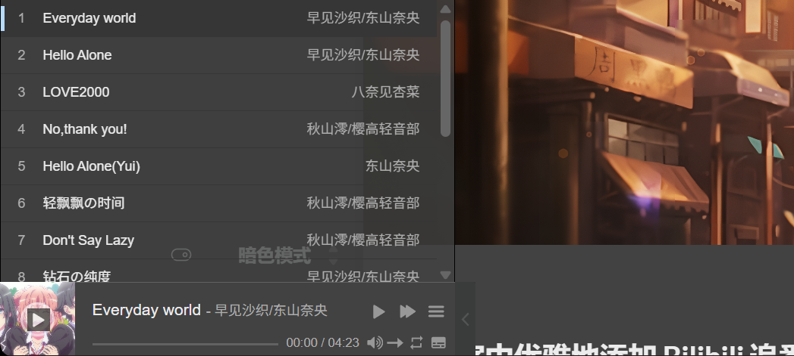

## 前言
给博客加音乐播放器这件事，乍一看似乎非常简单：引入一个播放器库，填几首歌，然后固定在页面底部就好了。

但是实际做下来会发现一个很致命的问题：只要点击站内链接，浏览器就会重新加载整个页面，底部播放器自然也会被销毁。也就是说，歌还没听几句，点进下一篇文章就断了，体验非常割裂。

因此，音乐播放器和 PJAX 其实是绑在一起的。播放器负责播放音乐，PJAX 负责让站内跳转时只替换正文区域，而不是刷新整个页面。为了让页面切换时有反馈，又加了一个顶部假进度条。最后，因为页面内容是局部替换的，评论、公式、搜索、图片灯箱等脚本还要在 PJAX 完成后重新初始化。

所以这篇文章会按这个逻辑来讲：先做播放器，再把歌单从“手动维护”改成“脚本生成”，接着引入 PJAX、顶部进度条，最后处理 PJAX 带来的后遗症。虽然看起来东西很多，但思路其实是一条线。

## 引入音乐播放器
播放器使用的是 APlayer，主要代码放在 `layouts/partials/footer/custom.html`。

首先在页面里引入 APlayer 的脚本，并放一个播放器容器：

```html
<script src="https://cdn.jsdelivr.net/npm/aplayer/dist/APlayer.min.js"></script>

<div id="aplayer"></div>
```

最开始可以直接在 APlayer 里手写 `audio` 数组，但后面歌一多，这种方式就会变得非常难维护。笔者现在的做法是：播放器不再直接写死歌单，而是读取 Hugo 的数据文件 `data/music/generated.json`。

下面这段代码位于 `layouts/partials/footer/custom.html`：

```js
const playlist = {{ .Site.Data.music.generated | default (slice) | jsonify | safeJS }};
const ap = playlist.length > 0 ? new APlayer({
    container: document.getElementById('aplayer'),
    fixed: true,
    order: 'random',
    audio: playlist,
}) : null;
```

这里有几个点需要注意。

首先，`fixed: true` 会让播放器固定在页面底部。这样无论浏览到文章哪里，都能看到播放器。

其次，`order: 'random'` 表示播放器使用随机播放顺序。它影响的是播放队列，而不是把页面上的歌单显示顺序打乱。

最后，`{{ .Site.Data.music.generated | default (slice) | jsonify | safeJS }}` 会把 `data/music/generated.json` 转成前端可用的数组。这样以后只要重新生成数据文件，播放器就会自动读取新歌单，不需要再到 `footer/custom.html` 里一个个改 `name`、`artist`、`url` 和 `cover`。



播放器样式则放在 `assets/scss/aplayer-light.scss` 和 `assets/scss/aplayer-dark.scss`。Stack 主题预留的 `assets/scss/custom.scss` 可以看作全站样式入口，因此这里把 APlayer 的明暗模式样式从这个入口引入：

```scss
@import "aplayer-light.scss";
@import "aplayer-dark.scss";
```

这样可以让播放器在亮色和暗色模式下分别使用不同样式，不至于暗色模式里突然冒出一块刺眼的白色控件。

## 生成播放器歌单
播放器真正读取的是 `data/music/generated.json`，这个文件由 `scripts/sync_music.py` 生成。完整脚本可以参考 [sync_music.py](https://github.com/elainafan/Myblog/blob/main/scripts/sync_music.py)。

最朴素的本地音乐目录可以长这样：每首歌一个目录，例如音频放在 `static/music/歌曲名/music.mp3`，封面放在 `static/music/歌曲名/cover.jpg`。

脚本会扫描 `static/music`，找到每个目录里的 `music.mp3`、`music.m4a`、`music.ogg`、`music.flac` 或 `music.wav`，再配上 `cover.jpg`、`cover.png` 等封面，最后生成 APlayer 需要的数组。

如果只是整理本地已有音乐，可以在站点根目录运行：

```powershell
python scripts\sync_music.py local
```

不过只靠本地手动放歌还是麻烦。笔者的歌单本来存在 Bilibili 收藏夹里，如果每次都自己下载音频、裁封面、改 JSON，那和手写 APlayer 数组也没有本质区别。因此后面又加了一层 Bilibili 收藏夹同步。

## 接入 Bilibili 收藏夹
Bilibili 收藏夹地址放在 `data/music/sources.json`：

```json
{
  "bilibili": {
    "favlist_url": "https://space.bilibili.com/<你的UID>/favlist?fid=<收藏夹ID>&ftype=create"
  }
}
```

同步时直接运行：

```powershell
python scripts\sync_music.py bilibili
```

脚本大致做四件事。

第一，通过 Bilibili 收藏夹 API 读取当前收藏夹里的视频列表。这里使用的是 `fid`，脚本会从收藏夹 URL 中解析出它。

如果不想把完整收藏夹链接写进配置里，也可以只在命令行传 `media_id`：

```powershell
python scripts\sync_music.py bilibili --media-id <收藏夹ID>
```

第二，对每个视频再请求一次视频详情，检查它是不是分 P 视频。普通视频会保存到 `static/music/bilibili/<BV号>/`，分 P 视频则会拆成 `static/music/bilibili/<BV号>/p01/`、`static/music/bilibili/<BV号>/p02/` 这样的目录。

第三，调用 `yt-dlp` 下载音频。Bilibili 上拿到的通常是 `music.m4a`，这里没有强制转成 `mp3`，因此不需要额外依赖 `ffmpeg`。

第四，每个音频目录都会写入一个 `info.json`，里面保存曲名、歌手、来源 BV 号、分 P 页码和原链接。最后脚本重新扫描 `static/music`，生成 `data/music/generated.json`。

如果收藏夹不是公开的，也可以额外传 Cookie：

```powershell
python scripts\sync_music.py bilibili --cookie-file bilibili.cookie.txt
```

这个 `bilibili.cookie.txt` 不应该提交到仓库里，只适合放在本地使用。

## 拆分分 P 视频
分 P 是这里最容易漏掉的地方。

比如 K-ON 歌曲合集不是一首歌，而是一个包含很多 P 的视频。如果只下载 BV 主视频，就只能拿到其中一个音频，播放器里也只会出现一个“大合集”。这显然不适合作为歌单。

因此脚本里会用 `https://api.bilibili.com/x/web-interface/view` 读取视频的 `pages` 字段。只要 `pages` 数量大于 1，就把每一 P 当成一首独立歌曲处理。比如第一 P 会保存到 `static/music/bilibili/BV1chikYJEMZ/p01/`，第二 P 会保存到 `static/music/bilibili/BV1chikYJEMZ/p02/`，每个目录里分别放自己的 `music.m4a`、`cover.jpg` 和 `info.json`。

这样春物 ED 三部曲在播放器里就会变成 `Hello Alone`、`Everyday World`、`ダイヤモンドの純度` 三首，而不是一个笼统的“春物 ED 三部曲”。

同理，K-ON 合集也会拆成 `Cagayake! GIRLS`、`Don't Say Lazy`、`ふわふわ時間`、`U&I` 等独立条目。播放器的体验会更像真正的歌单，而不是一堆视频标题。

## 整理歌名和歌手
Bilibili 视频标题通常很长，UP 主也不一定是歌曲原唱。如果直接把视频标题和 UP 主塞进播放器，最后就会变成“顶级品质试听……”“中日字幕完整版……”这种不太适合听歌的显示效果。

所以笔者又加了 `data/music/local.json`，专门用来覆盖自动抓取到的元数据：

```json
{
  "folder": "bilibili/BV1Q2421M7pf/p01",
  "name": "Hello Alone",
  "artist": "雪之下雪乃、由比滨结衣"
}
```

这里的 `folder` 对应 `static/music` 下的相对目录。同步脚本写 `info.json` 时，会优先读取 `data/music/local.json` 里的 `name` 和 `artist`。这样即使以后重新同步收藏夹，已经整理过的歌名也不会被 Bilibili 视频标题覆盖。

命名上笔者采用的规则大致是：

- 原本就是英文名的歌曲保留英文，例如 `Hacking to the Gate`、`God Knows...`。
- 有日文正式名的歌曲尽量保留日文，例如 `不可思議のカルテ`、`君色シグナル`。
- 如果标题全是假名、读起来不太直观，则使用中文翻译，例如 `想做朋友`、`明天再见`。
- 钢琴版、角色版这类特殊版本，会在歌名里标出来，例如 `Everyday World（钢琴版）`。

最后还有一个清理问题：收藏夹里删掉的视频，本地不能一直残留。脚本在 Bilibili 同步结束后会根据当前收藏夹重新计算应该存在的目录，把已经不在收藏夹里的旧音轨从 `static/music/bilibili` 里移除，再生成新的 `data/music/generated.json`。

## 保存播放状态
如果只是引入 APlayer，那么刷新页面后播放器仍然会从头开始。为了解决这个问题，脚本里用 `localStorage` 保存当前播放状态。

在页面销毁前，记录当前歌曲下标、播放时间和暂停状态：

```js
window.onbeforeunload = () => {
    const playInfo = {
        index: ap.list.index,
        currentTime: ap.audio.currentTime,
        paused: ap.paused
    };
    localStorage.setItem("playInfo", JSON.stringify(playInfo));
};
```

页面重新加载后，再把这些信息取出来：

```js
window.onload = () => {
    const playInfo = JSON.parse(localStorage.getItem("playInfo"));
    if (!playInfo) {
        return;
    }

    ap.list.switch(playInfo.index);

    setTimeout(() => {
        ap.seek(playInfo.currentTime);
        if (!playInfo.paused) {
            ap.play()
        }
    }, 500);
};
```

这里的 `setTimeout` 很重要。切换歌曲不是瞬间完成的，如果刚 `ap.list.switch` 就立刻 `ap.seek`，有时播放器还没准备好，进度就会设置失败。因此这里等 `500ms` 再恢复进度。

不过，这只能缓解刷新后的恢复问题，不能解决“每次点链接都会中断播放”的问题。要真正做到站内跳转时不断歌，就需要 PJAX。

## 为什么需要 PJAX
普通网页跳转时，浏览器会重新请求 HTML，重新解析 head 和 body，重新执行脚本。对于播放器来说，这意味着旧的 APlayer 实例会消失，新的页面再创建一个新实例。

PJAX 的思路是：拦截站内链接点击，通过 Ajax 请求新页面，然后只替换页面中的某些区域。这样整个浏览器页面没有真正刷新，底部播放器所在的部分也就不会被销毁。

在这个博客里，PJAX 代码仍然放在 `layouts/partials/footer/custom.html`。首先引入库：

```html
<script src="https://cdn.jsdelivr.net/npm/pjax/pjax.min.js"></script>
```

然后创建实例：

```js
var pjax = new Pjax({
    selectors: [
        ".main-container", ".js-Pjax", "Timer"
    ]
})
```

这里的 `selectors` 决定了 PJAX 切换页面时要替换哪些 DOM。

`.main-container` 是 Stack 主题的主体布局容器，包含正文、左右侧栏等主要内容。页面切换时，最核心的就是替换它。

`.js-Pjax` 主要用于评论脚本相关区域。因为评论是外部脚本生成的，如果不把它纳入 PJAX 的更新范围，页面切换后评论区很容易残留旧状态。

`Timer` 则和运行时间区域有关。这里需要提醒一下，选择器如果写的是标签名 `Timer`，那么它匹配的是 `<Timer>` 元素；如果目标是 class，应该写 `.Timer`。当前代码中页面里确实有 `<div class="Timer">`，因此从语义上看更合理的写法是 `.Timer`。这类小细节很容易藏 bug，写的时候要多看几眼。

## 处理 body class
Stack 主题的不同页面会给 `body` 设置不同 class，例如文章页和搜索页的 class 不完全相同。如果 PJAX 只替换 `.main-container`，而不更新 `body.className`，那么页面样式可能会串。

因此代码里覆写了 PJAX 的 `handleResponse`：

```js
pjax._handleResponse = pjax.handleResponse;

pjax.handleResponse = function (responseText, request, href, options) {
    if (request.responseText.match("<html")) {
        if (responseText) {
            let newDom = new DOMParser().parseFromString(responseText, 'text/html');
            let bodyClass = newDom.body.className;
            document.body.setAttribute("class", bodyClass)
        }
        pjax._handleResponse(responseText, request, href, options);
    } else {
        // handle non-HTML response here
    }
}
```

这段代码先把新页面的 HTML 字符串解析成 DOM，再取出新页面的 `body.className`，同步回当前页面。最后再把响应交还给 PJAX 原来的处理逻辑。

这样做之后，搜索页、文章页、普通页面之间切换时，页面级样式就不会错乱。

## 顶部假进度条
PJAX 切换页面虽然不刷新整个浏览器，但如果没有任何反馈，用户会不知道页面到底有没有在加载。因此这里又加入了一个顶部进度条。

进度条脚本放在 `assets/js/topbar.min.js`，通过 Hugo Pipes 在 `footer/custom.html` 里引入：

```go-html-template
{{ with resources.Get "js/topbar.min.js" }}
<script src={{ .Permalink }}></script>
{{ end }}
```

然后监听 PJAX 事件：

```js
document.addEventListener('pjax:send', () => {
    topbar.show();
})

document.addEventListener('pjax:complete', () => {
    topbar.hide();
})
```

所谓“假进度条”，意思是它并不真的知道资源加载到了百分之几，只是在页面请求开始时显示，请求完成时隐藏。虽然不精确，但对于博客这种轻量站点已经足够了。

有了它以后，点击链接时页面顶部会出现一条加载线，用户就知道“网页正在切换”。这个小反馈对 PJAX 很重要，否则页面不刷新反而会让人怀疑是不是点了没反应。

## PJAX重新初始化
PJAX 最大的问题是：新页面的 HTML 被替换进来了，但很多脚本不会自动重新执行。

普通刷新时，浏览器会重新加载整个页面，`window.onload`、`DOMContentLoaded` 和主题初始化逻辑都会自然执行。但 PJAX 只是把一段 DOM 替换掉，原先那些“页面加载时执行一次”的逻辑不会自动再跑。

所以在 `pjax:complete` 中，需要手动补上：

```js
document.addEventListener('pjax:complete', () => {
    let url = new URL(window.location.href);
    url.searchParams.delete('t');
    history.replaceState(null, '', url.toString());

    renderKaTeX();
    window.Stack.init();
    topbar.hide();
})
```

这里做了三件事。

第一，删除 URL 里的 `t` 参数。PJAX 有时会给请求加时间戳参数用于避免缓存，这里在切换完成后把它从地址栏里删掉，保持 URL 干净。

第二，重新渲染 KaTeX。因为新文章可能包含公式，而公式渲染脚本不会因为 PJAX 自动执行，所以需要调用 `renderKaTeX()`。

第三，重新执行 `window.Stack.init()`。Stack 主题的初始化包含菜单、图片灯箱、平滑滚动、目录 scrollspy、搜索初始化、代码块复制按钮等逻辑。PJAX 后如果不重新跑，很多交互会在第二个页面开始失效。

这一步可以说是 PJAX 改造的核心补丁。

## 修复Katex渲染
KaTeX 的原始 partial 在 `layouts/partials/article/components/math.html`。里面会引入 KaTeX，并在页面加载时执行：

```js
renderMathInElement(document.body, {
    delimiters: [
        { left: "$$", right: "$$", display: true },
        { left: "$", right: "$", display: false },
        { left: "\\(", right: "\\)", display: false },
        { left: "\\[", right: "\\]", display: true }
    ],
    ignoredClasses: ["gist"]
});
```

为了让 PJAX 后也能判断当前页面是否需要公式渲染，笔者在模板里加了一个标记：

```html
<div class="math-katex"></div>
```

然后在 `footer/custom.html` 中写了 `renderKaTeX`：

```js
async function renderKaTeX() {
    let katex = document.querySelector(".math-katex");
    if (!katex) {
        return;
    }

    while (typeof renderMathInElement !== 'function') {
        await delay(500);
    }

    renderMathInElement(document.body, {
        delimiters: [
            { left: "$$", right: "$$", display: true },
            { left: "$", right: "$", display: false },
            { left: "\\(", right: "\\)", display: false },
            { left: "\\[", right: "\\]", display: true }
        ],
        ignoredClasses: ["gist"]
    });
}
```

这里的 `while` 是为了等待 KaTeX 脚本加载完成。否则 PJAX 切换到一篇带公式的文章时，可能 `renderMathInElement` 还不存在，直接调用就会报错。

## 修复搜索初始化
搜索逻辑在 `assets/ts/search.tsx`。原本 Stack 主题的搜索脚本通常会在页面加载时初始化，但 PJAX 下这不够用。

于是笔者把搜索初始化改成一个函数：

```ts
function searchInit() {
    let search = document.querySelector('.search-result');
    if (search) {
        const searchForm = document.querySelector('.search-form') as HTMLFormElement,
            searchInput = searchForm.querySelector('input') as HTMLInputElement,
            searchResultList = document.querySelector('.search-result--list') as HTMLDivElement,
            searchResultTitle = document.querySelector('.search-result--title') as HTMLHeadingElement;

        new Search({
            form: searchForm,
            input: searchInput,
            list: searchResultList,
            resultTitle: searchResultTitle,
            resultTitleTemplate: window.searchResultTitleTemplate
        });
    }
}

export {
    searchInit
}
```

然后在 `assets/ts/main.ts` 中导入并调用：

```ts
import { searchInit } from "ts/search";

let Stack = {
    init: () => {
        menu();
        searchInit();
        new StackColorScheme(document.getElementById('dark-mode-toggle'));
    }
}
```

这样 `window.Stack.init()` 每执行一次，搜索页就有机会重新绑定搜索框事件。普通文章页没有 `.search-result`，函数会直接返回，不会影响别的页面。

## 修复评论注入
评论区也是 PJAX 的重灾区。Giscus 依赖外部脚本 `https://giscus.app/client.js`，如果页面只是局部替换，脚本不会自动重新执行。

首先在 `layouts/partials/comments/include.html` 中加一个标记：

```go-html-template
{{ if .Site.Params.comments.enabled }}
    {{ partial (printf "comments/provider/%s" .Site.Params.comments.provider) . }}
    <div class="comment"></div>
{{ end }}
```

然后在 `footer/custom.html` 中先跳过搜索页，再检测是否存在 `.comment`：

```js
function shouldSkipGiscus() {
    return document.body.classList.contains("template-search");
}

if (shouldSkipGiscus()) {
    return;
}

let comment = document.querySelector(".comment");
if (!comment) {
    return;
}
```

这里额外跳过搜索页，是因为搜索页主要用来展示结果和背景，不需要评论区占据页面空间。

如果存在，就动态创建 Giscus 脚本。这里还要根据当前主题选择 Giscus 主题，否则暗色模式下通过 PJAX 进入文章时，评论区可能仍然按亮色主题加载：

```js
function getGiscusTheme() {
    return document.documentElement.dataset.scheme === "dark"
        ? '{{- default `dark_dimmed` .darkTheme -}}'
        : '{{- default `light` .lightTheme -}}';
}

let script = document.createElement('script');
script.setAttribute('src', 'https://giscus.app/client.js');
script.setAttribute('data-repo', '{{- .repo -}}');
script.setAttribute('data-repo-id', '{{- .repoID -}}');
script.setAttribute('data-category', '{{- .category -}}');
script.setAttribute('data-category-id', '{{- .categoryID -}}');
script.setAttribute('data-theme', getGiscusTheme());
script.async = true;
```

最后在初次加载和 PJAX 完成后都执行：

```js
injectGiscusScript();

document.addEventListener('pjax:complete', function () {
    injectGiscusScript();
});
```

这样切换到新文章时，评论区会重新加载当前页面对应的 Giscus discussion。

## 修复运行时间和访问量
运行时间也需要考虑 PJAX。因为页面切换时 footer 不一定完全刷新，所以 `updateRunningDays()` 需要在初次加载和 `pjax:complete` 后都执行：

```js
updateRunningDays();

document.addEventListener('pjax:complete', function () {
    updateRunningDays();
});
```

访问量统计用的是 Vercount，脚本是：

```html
<script defer src="https://cn.vercount.one/js"></script>
```

文章信息区的浏览量标签在 `layouts/partials/article/components/details.html` 中：

```html
<div id="viewCount">
    {{ partial "helper/icon" "eye" }}
    <time class="article-time--reading">
        <span id="vercount_value_page_pv">loading... </span>次
    </time>
</div>
```

这里还有一个 `showHideView()`，用于在非文章页隐藏浏览量。这个函数同样属于“局部更新后要检查当前页面状态”的逻辑，只不过它比较轻量。

## 需要注意的问题
做完以后，整个链路大致是这样的：

1. `scripts/sync_music.py` 从 Bilibili 收藏夹和本地 `static/music` 整理音乐文件。
2. 分 P 视频会拆成多首歌，并保存到 `static/music/bilibili/<BV号>/pXX/`。
3. `data/music/local.json` 负责覆盖视频标题和 UP 主名，把它们整理成真正的歌名和歌手。
4. 脚本生成 `data/music/generated.json`，APlayer 从这个数据文件读取播放列表。
5. APlayer 固定在 footer 外层，不随着 `.main-container` 被替换。
6. 点击站内链接时，PJAX 拦截跳转，只请求新页面并替换指定区域。
7. `topbar.show()` 显示顶部进度条，给用户加载反馈。
8. PJAX 完成后，同步 `body.className`，清理 URL 参数，隐藏进度条。
9. 手动调用 `window.Stack.init()` 和 `renderKaTeX()`。
10. Giscus、搜索、代码复制、图片灯箱、目录滚动等功能重新获得初始化机会。

这里最容易踩坑的是重复初始化。比如代码块复制按钮，如果 `Stack.init()` 在同一个页面上跑很多次，就可能重复插入按钮。当前代码没有对所有组件都做非常严格的去重，因此如果之后发现某些按钮或评论重复出现，就应该在初始化前加标记位，例如给元素设置 `data-init="true"`。

另一个问题是脚本顺序。`topbar`、`Pjax`、`renderMathInElement`、`window.Stack` 都必须在使用前已经加载。这里通过把相关脚本放在 footer，并在必要处等待函数存在，基本能避免大多数时序问题。

歌单同步则要注意另一类问题：Bilibili 收藏夹是外部数据源，视频标题不一定适合作为歌名，UP 主也不一定是歌手。因此 `data/music/local.json` 最好保留下来，作为人工整理过的元数据表。这样下次重新同步收藏夹时，脚本负责抓取和下载，人工只需要维护少量歌名修正。

最后，PJAX 不是越多越好。如果某些页面包含非常特殊的第三方脚本，局部替换可能会比普通刷新更难维护。个人博客里使用 PJAX 的最大理由，还是为了让音乐播放器不断播。为了这个目标，多处理一点后遗症还是值得的。

## 小结
这套改造的出发点其实很简单：笔者想让博客底部的音乐播放器在站内跳转时不要中断。

但做着做着会发现，播放器本身只是第一步。歌单如果全靠手动维护，很快就会变得麻烦；于是需要脚本从 Bilibili 收藏夹同步音频，再把分 P 视频拆成真正的单曲，并用 `data/music/local.json` 修正歌名和歌手。

为了让播放器不断歌，又需要引入 PJAX；引入 PJAX 后，页面不再完整刷新，于是又需要顶部进度条提供反馈；页面局部替换后，KaTeX、Giscus、搜索、代码复制、图片灯箱等功能不会自动重新执行，于是还要补一轮初始化逻辑。

所以它看起来像一串功能，实际上是一条因果链：自动歌单是维护成本的补丁，播放器不断歌是体验目标，PJAX 是手段，假进度条是体验补丁，组件重初始化是代价。把这几个东西放在一篇里讲，会比单独说“如何添加音乐播放器”更接近真实的施工过程。
