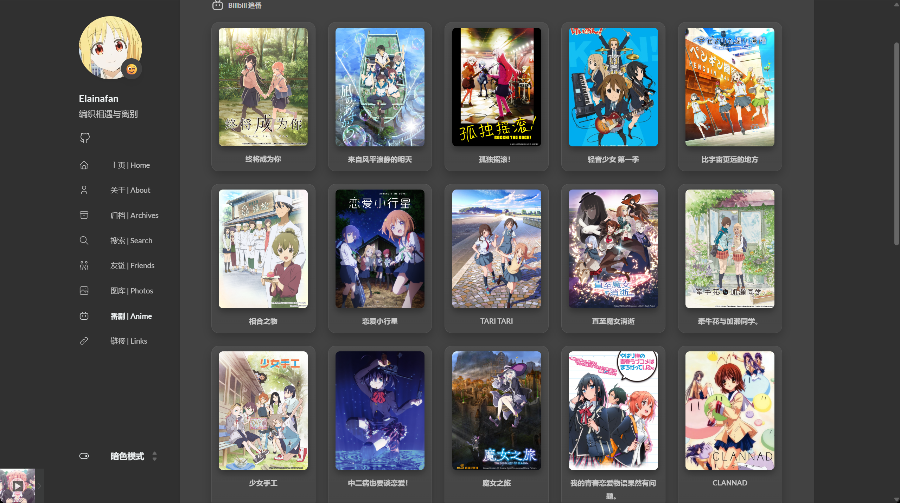

## 前言
作为一个二次元爱好者，在个人博客里拥有一面专属的「追番墙」，展示自己最近正在看或者喜欢的番剧，是一件非常有成就感的事情。通过一些简单的代码配置，可以借助 Hugo 强大的 `resources.GetRemote` 功能，在博客静态生成阶段直接拉取 Bilibili 的公开追番 API 数据，从而实现一个无需依靠前端跨域请求、加载极快且完全属于自己的优雅追番页面。

本文将以 Hugo（以 Stack 主题架构为例），介绍如何通过自定义页面布局（Layout）和短代码（Shortcode）来实现精美的 Bilibili 追番卡片墙。

## 创建专属的页面布局

为了让追番页面的排版独立于普通的博客文章，同时又不破坏主题原有的基本结构，需要为其新建一个专用的页面布局。

在博客根目录下，找到 `layouts/page/` 文件夹（如果没有则新建），并在其中创建一个名为 `bilibili.html` 的文件，填入以下代码：

```html
{{ define "body-class" }}
article-page
{{ end }}

{{ define "main" }}
{{ partial "article/article.html" . }}

{{ if not (eq .Params.comments false) }}
{{ partial "comments/include" . }}
{{ end }}

{{ partialCached "footer/footer" . }}

{{ partialCached "article/components/photoswipe" . }}
{{ end }}
```

上面的代码继承了主题的基本外壳，并为接下来插入的列表预留了空间。

## 编写获取和展示数据的 Shortcode
有了基础的页面布局后，接下来是最核心的部分——利用 Hugo 在服务端拉取B站追番数据，并通过 CSS 将其渲染成漂亮的网格卡片（带有毛玻璃特效和丝滑的悬浮动画）。

在 `layouts/shortcodes/` 目录下创建一个名为 `bangumi.html` 的文件，并在其内填入以下代码：

> **💡 注意：**
> 请务必在下面的代码中找到 `{{ $vmid := "你的B站UID" }}` 这一行，将里面的值（保留双引号）替换为你自己 B 站个人主页的真实 UID！同时请确保你的 Bilibili 账号空间中“追番追剧”对外是公开可见的，否则 API 将无法成功获取数据。

```html
<div class="article-content">
    <style>
        .bili-grid {
            display: grid;
            grid-template-columns: repeat(5, minmax(0, 1fr));
            gap: 24px;
            align-items: stretch;
        }

        .bili-card {
            display: flex;
            flex-direction: column;
            align-items: center;
            text-decoration: none;
            overflow: hidden;
            border-radius: 14px;
            padding: 10px;
            background: linear-gradient(180deg, rgba(255, 255, 255, 0.06), rgba(255, 255, 255, 0.02));
            border: 1px solid rgba(255, 255, 255, 0.08);
            box-shadow: 0 8px 18px rgba(0, 0, 0, 0.22);
            backdrop-filter: blur(6px);
            transition: transform 0.2s ease, box-shadow 0.2s ease, border-color 0.2s ease;
        }

        .bili-card:hover {
            transform: translateY(-4px);
            box-shadow: 0 12px 26px rgba(0, 0, 0, 0.3);
            border-color: rgba(255, 255, 255, 0.18);
        }

        .bili-card img {
            width: 100%;
            height: auto;
            aspect-ratio: 3 / 4;
            object-fit: cover;
            border-radius: 10px;
            box-shadow: 0 6px 14px rgba(0, 0, 0, 0.35);
        }

        .bili-card h3 {
            width: 100%;
            font-size: 1.35rem;
            margin: 12px 0 0 0;
            padding: 0;
            font-weight: 600;
            color: var(--body-text-color);
            text-align: center;
            display: -webkit-box;
            -webkit-box-orient: vertical;
            -webkit-line-clamp: 2;
            line-clamp: 2;
            overflow: hidden;
            text-overflow: ellipsis;
            border-left: none;
        }

        .bili-card h3::before {
            display: none;
        }

        @media (max-width: 1200px) {
            .bili-grid {
                grid-template-columns: repeat(4, minmax(0, 1fr));
            }
        }

        @media (max-width: 900px) {
            .bili-grid {
                grid-template-columns: repeat(3, minmax(0, 1fr));
            }
        }

        @media (max-width: 640px) {
            .bili-grid {
                grid-template-columns: repeat(2, minmax(0, 1fr));
            }
        }
    </style>
    <!-- 追番列表开始 -->
    {{ $vmid := "你的B站UID" }}
    {{ $url := printf "https://api.bilibili.com/x/space/bangumi/follow/list?type=1&follow_status=0&pn=1&ps=20&vmid=%s"
    $vmid }}

    {{ $opts := dict "headers" (dict "User-Agent" "Mozilla/5.0 (Windows NT 10.0; Win64; x64)" "Referer"
    "https://space.bilibili.com/") }}

    {{ $biliData := dict }}
    {{ $err := false }}

    {{ $res := resources.GetRemote $url $opts }}

    {{ if or (not $res) $res.Err }}
    {{ $err = true }}
    {{ if $res.Err }}
    {{ warnf "获取B站追番数据失败: %s" $res.Err }}
    {{ end }}
    {{ else }}
    {{ $biliData = $res.Content | unmarshal }}
    {{ end }}

    <div
        style="display: flex; align-items: center; gap: 8px; margin-bottom: 20px; font-size: 1.25rem; font-weight: bold; color: var(--body-text-color);">
        {{ partial "helper/icon" "bilibili" }}
        <span>Bilibili 追番</span>
    </div>

    <div class="bili-grid">
        {{ if or $err (not $biliData.data) (not $biliData.data.list) }}
        <p>无法在服务端获取到追番数据，可能是 API 限制或网络问题。</p>
        {{ else }}
        {{ range first 15 $biliData.data.list }}
        {{ $coverUrl := replace .cover "http://" "https://" }}
        <a href="{{ .url }}" target="_blank" class="bili-card">
            
            <h3>{{ .title }}</h3>
        </a>
        {{ end }}
        {{ end }}
    </div>
    <!-- 追番列表结束 -->
</div>
```

这段短代码不仅处理了响应式的网格布局，还自带了对 API 请求失败的温和降级处理（如果因网络问题请求失败会输出提示语，而不会直接导致博客渲染崩溃）。

> **关于 Bilibili 图标：**  
> 上面的代码中使用 `{{ partial "helper/icon" "bilibili" }}` 来显示一个 Bilibili 的图标。如果在生成时报错或发现图标为空白，请确保主题目录下 `assets/icons/` 中包含名为 `bilibili.svg` 的图标文件。你可以从连接下载一个 B 站的 SVG Logo，放入该目录即可。（同理，第三步的侧边栏图标也依赖于这个源文件。）

## 创建应用该布局的独立静态页

所有技术性代码都已经完成（骨架组件准备完毕），最后一步就是将这些整合到一个具体的博客页面里。

在项目根目录的 `content/page/` 下创建一个名为 `anime` 的新文件夹（代表追番页面目录），并在其中创建 `index.md`，填入以下文章头部及正文：

```yaml
---
title: "番剧 | Anime"
date: 2025-10-26
readingTime: true
layout: "bilibili"
slug: "anime"
url: "/anime/" 
menu:
    main: 
        weight: -50
        params:
            icon: bilibili

comments: true
---


```

> **⚠️ 注意：**  
> 为了防止在本文中直接渲染出追番代码块，在上面的示例代码中加入了 `/*` 和 `*/` 来转义。在实际应用和复制时，请务必去掉 `/*` 和 `*/` 这两个转义符号。

在这段 Front Matter（前言数据）中，指定了 `layout: "bilibili"`，因此该页会被 Hugo 应用第一步创建好的自建模板；而通过在正文中调用 ```` 短代码，便唤起了第二步写好的卡片组件。此外，`menu` 中的配置会自动将这个漂亮的图标挂载到了博客前端侧边栏菜单中。

## 最终效果展示

通过以上简单的步骤配置，在终端运行 `hugo server` 或提交博客重新构建时，就能一饱眼福，看到一面满是熟悉动画封面的追番墙了！由于所有抓取操作是在构建（Build）或编译时执行的特性（SSG 机制），此页面对访客呈现速度极其迅速，也完全去除了暴露给第三方的 Ajax 跨域请求的烦恼。

下面是部署后的浏览效果截图：



祝各位友友追番愉快，也希望这篇基础的教程能为你的博客增添一份属于二次元的专属浪漫！有好看的动漫欢迎推给我喔！