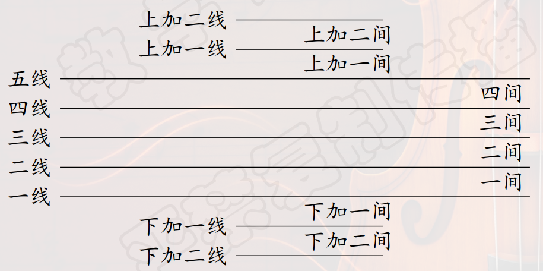
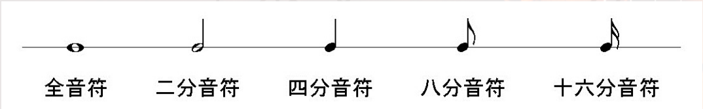
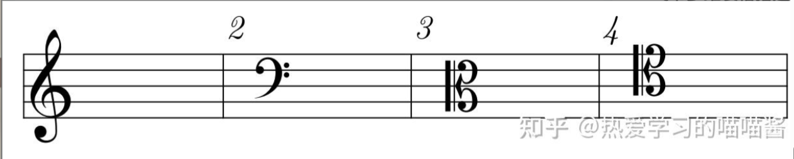
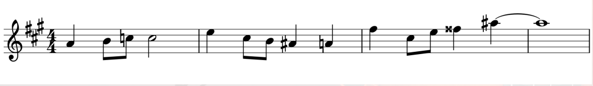

## 声音的物理属性
### 音乐的定义
- **声音**：音乐的载体。
- 由**振动**产生。
- **物体振动**引起周围空气的**疏密变化**，形成声波。
- 声波是**纵波**。
### 声音的四个物理属性
- **声音的高低**：由**振动频率**决定，对应于音乐中的**音高**。
- **声音的强弱**：由**振动幅度**决定，对应于音乐中的**力度**。
- **声音的响度**：由耳朵中鼓膜受到的**空气压强**决定的。
- **声音的持续的时间长度**：对应于音乐中的**时值**。
- **不同声音的特点**：是由其**振动波形**决定的，对应于音乐中的**音色**（timbre）。
### 音高
- 人耳能听到的**振动频率**范围为$20 \sim 20000$赫兹。
- **“音乐会音高”**：中央$C$上方的$A$定义为**440赫兹**。
- 人的听觉对于频率的感知**不是线性**的。
- 音高是一种**听觉属性**，借助它可以把声音**由低到高**排列为一个**音阶**。
### 振幅
- 振动体发出声音的**强度（客观）**由**振幅**决定。
- 人耳听到声音的**大小（主观）**由传到耳朵中的**空气压强**决定。
- 人耳对于空气压力的感觉很灵敏，$f=1000Hz$时，人耳的**听觉阈值下限**是20微帕（即$2 \times 10^{-5}Pa$）。
- **声压水平**：$L_p=20 \ \mathrm{log}_{10}(\frac{p}{p_0})$
- $p_0$是$1000Hz$时的**听觉下限阈值**，$p$是**实际声压**，这样定义的单位为**分贝**。
- 疼痛阈值：$130-140$分贝
- **备注**：换底公式重要，考试**不许带计算器**。
- 声压水平增加10倍，实际声压增大**三万多倍**。
- 人耳对于**不同频率**的声音有着**不同的听觉下限阈值**，**先下降后上升**，**中频**的比较容易听出来。
### 音色与波形
- 不同乐器演奏**同一个音高**，我们能听出来是因为有**不同的音色**。
- 不同的音色直观上表现为**不同的振动波形**，它是由各个**振动模态**中的**频率和振幅**决定的。
- **振幅包络**：A：**起音**，D：**衰减**，S：**持续（只有它指振幅，其余指时间）**，R：**释放**。
### 频谱图与泛音列
- 通常听到的声音都是**不同频率振动的叠加**。
- **频谱图**：描述声音**各个频率成分**随**时间**变化的图形。
- **横坐标**表示**时间**，**纵坐标**表示**频率**。**振幅**通常用**颜色、亮度和灰度**表示。
- **泛音列**：把各个**频率成分由低到高**排列起来的**序列**。
### 傅立叶级数
- 计算：参见高等数学A（下）
- 傅立叶分析的思想：**复杂周期函数**可以用**若干简单正余弦函数**叠加。
- 推广到物理：**复杂振动**可以由**不同频率正余弦振动**产生。
- 两种视角：
    - 把一个振动描绘成**随时间变化的图形**，显示的是振动在其**时域**上的特性。
    - 把该振动在**不同频率上的振幅**描绘出来，显示的是其在**频域**上的特性。
## 乐音体系
- 声音可以分为**乐音**和**噪音**两大类。
- 乐音：**持续有规律**的振动产生的声音。
- 噪音：**无规律、起伏不定**的振动产生的声音。
- 传统音乐主要使用**乐音**。
- 二十世纪以来，音乐家越来越重视**噪音**的应用。例如**打击乐器**，包括**固定音高**的木琴、定音鼓等，以及**无固定音高**的小军鼓、大擦等。
### 乐音体系
- **乐音体系**：音乐中所使用的、具有**固定音高**的**全体乐音**构成一个**集合**。其中的元素称作**音级**。
- **音列**：将全体**音级由低到高**排列。
- **相邻两个音级**之间相差一个**半音**，钢琴键盘上任意两个相邻的琴键相差一个半音，**隔开一个键**的两个琴键的声音相差一个**全音**。
- **音名**：每个音级有一个**名字**。
- **基本音名**有七个，$C,D,E,F,G,A,B$。
- 在每一个**八度**中，相应位置的音循环使用这**七个音名**，为了区分加**上下标**，即$C_1 \sim C_8$。
- **基本音级**：$C,D,E,F,G,A,B$。
- **变化音级**：将**基本音级**加以**升高或降低**，记号是在**基本音级字母的前面**增加**变音记号**。
    - **升号**：$\sharp$，把基本音级**升高半音**。
    - **降号**：$\flat$，把基本音级**降低半音**。
    - **重升号**：&#119082;，把基本音级**升高一个全音**。
    - **重降号**：$\flat \flat$，把基本音级**降低一个全音**。
    - **还原号**：$\natural$，把**已升高（包括重升）**或者**降低（包括重降）的音**还原为**基本音级**。
### 异名同音
- 因为有**变音记号**，一个音级可以有**不同的音名**。
- 两个不同的音名，若它们有**相同的音高**，称为**等音**。
### 唱名法
- **唱名法/阶名唱法**：给音阶中每个音级赋予**不同的音节**。
- 现在流行的**唱名**据传是由意大利音乐理论家引入的。
- 现在通常的**唱名**：$do \ re \ mi \ fa \ sol \ la \ si$，它们构成了完整的**自然音阶**。
- $mi \ fa$之间和$si \ do$之间是**半音**，其它之间是全音。
- 唱名有两种不同的用法，**固定唱名**和**首调唱名**。
- **固定唱名法**：从$do \rightarrow si$，即$C \rightarrow B$，在钢琴键盘上的位置是**固定**的。
- **首调唱名法/移动唱名法**：do可以是**任意一个音级**（包括**变化音级**），上面的规则**不变**（唱名之间的半音和全音）。
- 这也是五线谱上$D$大调的**调号**是两个升号$\sharp$的原因。
- 同理，在五线谱上，$\flat E$大调的**调号**是三个降号$\flat$。
## 记谱法
- **记谱法**：以**书面的形式**将音乐记录下来的方法。
- 比较早的乐谱：楔形文字、《礼记 $\cdot$ 投壶》
- **中国最早的乐谱**：南北朝时期《碣石调 $\cdot$ 幽兰》，这是一种**文字谱**（一句一句描述弹法）。
- 之后出现了**减字谱**（将古琴的指法与弦序等结合）。
- 目前普遍采用**五线谱**，水平表示**时间**，垂直表示**音高**，可以多加线。

### 水平方向：时间
- 用**不同的音符**表示乐音的**不同长度**，音符由**符头、符干和符尾**组成。
- 音符代表的是**相对长度**。比如假定以四分音符为一拍等等。
- **附点音符**：原来音符的**时值** $\times \frac{3}{2}$
- **休止符**：注意区分**全休止**与**二分休止**，全休止紧靠**第二条线**，二分休止紧靠**第三条线**。
- **绝对时值：速度**。
- 例如𝅘𝅥$=60$，即表示每分钟奏唱60个四分音符，1秒钟1个四分音符。
- 如果乐曲是``3/4``拍的，即以四分音符为一拍，每小节有3拍，则3秒钟要演奏一个小节。

### 垂直方向：音高
- 五线谱中，音的高低是根据**音符的符头**在五线谱上的**位置**而定的。
- 位置越**高**音越**高**，位置越**低**音越**低**。
- 某一条线代表哪个音，需要通过**谱号**来确定，常用的有**高音谱号、低音谱号和中音谱号**。
- **高音谱号/G谱号**：大圆圈位于**二线**，指明中央$C$上方纯五度的音级$G_4$的位置。
- **中音谱号/C谱号**：中心位于**三线**，指明中央$C(C_4)$的位置。
- **次中音谱号**：其余同中音谱号，中心置于**四线**。
- **低音谱号/F谱号**：冒号的中心位于**四线**，指明中央$C$下方纯五度音级$F_3$所在的位置。

### 谱表
- **谱表**：**记有谱号**的五线谱，分为**单谱表**和**联合谱表**。
- **单谱表**：高/中/次中/低音谱表等。
- **联合谱表**：用**连谱号**连接起来的谱表
- 例如，由**花括号**联结的**高音谱表**和**低音谱表**构成**大谱表**，通常用于钢琴记谱。
- **合唱谱、总谱**等都是联合谱表。
### 变音记号
- **调号**：乐谱**每一行开始**处，记在**谱号后面**的**变音记号**。
- 调号中的变音记号，在**未改变调号之前**，对乐谱中所有**同名音**，**不论哪个八度**都有效。
- **临时变音记号**：记在**音符符头前面**的**变音记号**。
    - **作用范围**：**变音记号之后**，**一小节之内**，**同高度**的音。
    - **加变音记号的音**用**延音线**连结起来到**下一小节**的继续有效。
    - **同一小节内**已升高或降低了的音**有改变**时，应**另记变音记号**。

### 简谱记法
- 用$1 \sim 7$对应$do \sim si$七个唱名。
- $0$表示**休止符**。
- 在符号**上加点**表示**升高八度**，**下加点**表示**降低八度**。
- 时值用**横线**表示，单个数字表示**四分音符**。
- 在**后面加一条横线**，时值**延长一倍**。
- 在数字**下加一条横线**，时值**缩短一半**。
- 通常采用**首调唱名法**，例如在曲谱前记$1=\flat B$。
## 音程
### 定义
- **音程**：在乐音体系中，两个音级之间的**距离**。
- **上方音/冠音**：**高**的音。
- **下方音/根音**：**低**的音。
- **旋律音程**：两个音**先后发声**。
- **和声音程**：两个音**同时发声**。
- 音程的**名称**由两个参数**共同决定**：**度数和半音数**
- **度数**：一个音级到另一个音级之间的**音名数目**，五线谱上就是两个音级包括的**线和间**的数目。
- **半音数**：音程所包含**半音的数目**。
- 例如，$D-F$称为**小三度**(其半音数为3)，$F-A$称为**大三度**(其半音数为4)。
- 因此，**度数**相同的情况下，半音的数目也可以**不同**。
### 半音数的分类
- **一度音程**：半音数为0的称为**纯一度**。
- **二度音程**：半音数为1的称为**小二度**，半音数为2的称为**大二度**。
- **三度音程**：半音数为3的称为**小三度**，半音数为4的称为**大三度**。
- **四度音程**：半音数为5的称为**纯四度**，半音数为6的称为**增四度**。增四度也称为**三全音**。
- **五度音程**：半音数为7的称为**纯五度**，半音数为6的称为**减五度**。(这里要**注意减五度和增四度**)。
- **六度音程**：半音数为8的称为**小六度**，半音数为9的称为**大六度**。
- **七度音程**：半音数为10的称为**小七度**，半音数为11的称为**大七度**。
- **八度音程**：半音数为12的称为**纯八度**。
### 自然音程与变化音程
- **自然音程**：**上述**音程。
- **变化音程**：从自然音程中，**改变半音数**。**升高根音**或者**降低冠音**，可以**减少半音数**；**降低根音**或者**升高冠音**，可以**增加半音数**。
- **大音程和纯音程**增加1个半音数，得到的是**增音程**，例如**增二度**。
- **小音程和纯音程**减少1个半音数，得到的是**减音程**，例如**减七度**。
## 协和音程与不协和音程
### 通常看法
- **协和音程**：**纯四度、纯五度、纯八度、大小三度、大小六度**。
    - **完全协和音程**：**纯音程**，即**纯四度、纯五度、纯八度**。
    - **不完全协和音程**：**大小三度、大小六度**。
- **不协和音程**：**二度、七度和其它所有增减音程**。
### 相关理论
#### 毕达哥拉斯理论
- 长度成**简单整数比**的弦能发出**和谐的声音**。
- 换言之**声音的振动频率之比**越**简单**（分数化），相应的音程越**协和**。
- 这个理论被称为**简谐比例律**。
#### 赫尔姆霍兹拍音理论
- 按照**十二平均律**，以$A_4=440Hz$为标准。
- 假设一个声音的频率为$\omega$，另一个声音为$\omega+\delta$。
- 它们的**叠加**为$\sin(2\pi(\omega+\delta)t)+\sin(2\pi \omega t)=2\cos(\pi \delta t)\sin(2\pi (\omega+\frac{\delta}{2})t)$。
- 产生了一个频率为$\omega+\frac{\delta}{2}$的声音，**音量（振幅）**受到$\cos(\pi \delta t)$的**绝对值**控制，以$\delta$为**频率**在不断变化。
- 使得人们听上去有**拍音**的感觉，**每秒钟产生的拍音数量为**$\delta$。
- 频率为$\omega_1$和$\omega_2$的两个声音叠加，**每秒钟产生的拍音数**为$\delta=|\omega_1-\omega_2|$。
- **他的观点**：两个音之间**不含拍音**的为**协和音程**，**含有拍音**的为**不协和音程**。
- **实际上**：每秒**少于6个拍音**或**多于120个拍音**的也算**协和音程**。每秒**含33个拍音**的音程**最不协和**。
- **缺陷**：相同音程，协和度在**不同音区**中会**发生变化**。因为每**升高一个八度**，拍音数量会**增加一倍**。
- **缺陷**：当两个声音都是**复音**时，情况更复杂。
### 心理学实验
- 给**没有接受音乐训练**的被试同时播放两个**不同音高**的声音，问听到一个还是两个声音。
- **更和谐的音乐**倾向于听到**一个声音**，反之**不和谐的音乐**倾向于听到**两个声音**。
- 另一个心理学实验：
  - 考虑作出判断的**反应时间**。
  - 刺激源引入**包含泛音的复音**。
  - 考虑**不同律制**的音程。
- 由于音程是否协和带有一定**主观性**，对于**不同民族、文化**的人群，难以下科学定义。
- 例如广西的民间合唱往往使用**大二度**音程，因此对他们而言其也算一个**协和**的音程。

## 声明
本笔记的部分内容来自[喵喵的学习笔记](https://zhuanlan.zhihu.com/p/719079443)，如有侵权请联系我删除。