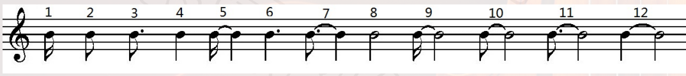
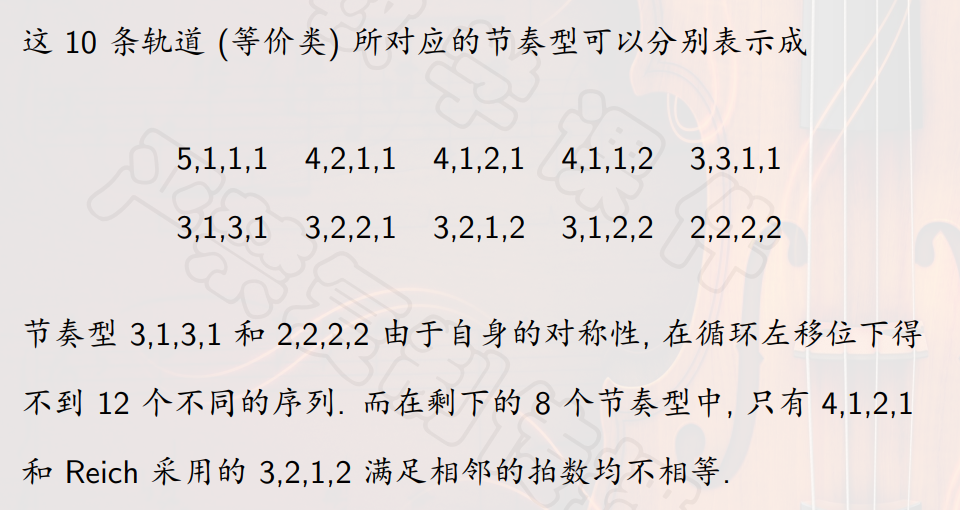

## 时值序列
### 时值序列
- 《为四件乐器而作》中，初始的时值序列为 $1,4,3,2$ 。
- 用``增值变换``相继产生新的时值序列 $4,16,12,8 / 3,12,9,6 / 2,8,6,4$
- 增值的``倍数``恰好等于``时值序列``本身 $1,4,3,2$
- 勋伯格的``十二音技术``是对音列作``移调、倒影、逆行``以及``逆行倒影``变换形成的。
- 后人发展其思想，进一步把音列与``时值序列、力度、音区、音色``等``序列化的元素``有机结合，形成``整体序列主义``。

### 计算时值序列
- ``任意``选定一个音类作为``零点``，给每个音列中的第 $i$ 项赋予一个数 $d_i$ ，它的值等于第 $i$ 项与零点之间相差的``半音数``。
- 例如，取 $F$ 作为零点，初始音列为 $0,1,4,9,5,8,3,10,2,11,6,7$
- 它们对应的 $d_i$ 分别为 $0,1,4,9,5,8,3,10,2,11,6,7$
- ``移调音列``和``倒影音列``都可以相应求出。
- 对于每个音列，按照上述方法都可以求出一个相应的时值序列 $(d_0,d_1,\ldots,d_{11}),0 \leq d_i \leq 11$
- 假定以``十六分音符``为时值单位 $1$ ，则有如下对应

- 再用``初始音列`` $P_0$ 加上时值序列，得到一段``旋律``。
- 例如，《为十二件乐器而作》第一乐章中，12间乐器平行地演奏各自的音列，一共4次。
- 表中出现的48个音列具有极强的规律性，共有6个移调音列和6个倒影音列，每个音列在表中恰出现两次，每次都有相应的逆行音列 $R_i$ 和 $RI_{j}$ 与其成对出现。
## Clapping Music
- ``相移``：即正弦曲线的``相位差``，例如对 $y=sin \ x$ ， $y=sin(x+\frac{\pi}{6})$ 是其一个相移。
- 通过循环左移，造成。
- 假设恰有4拍休止符，且休止符``不能连续出现``，那么有多少种可能的节奏型？
- 考虑分配``第一拍是不是休止符``的情况，共 $C_{8}^{4}+C_{7}^{3}=105$ 种。
- 但是其中可能有相同的，因此考虑``项链计数``。
- ``旋转等价``：定义上述105个项链构成一个集合，定义其上变换，对于任意一条项链， $\sigma$ 表示把 $X$ 按照``逆时针方向``旋转30度，它是一个12阶的``循环群``。
- 可以定义一个``等价关系``，即两条项链可以通过旋转若干个30度达到相等。
- 对于群中的元素 $g \in G$ ，记 $g$ 的``不动点集合``为 $fix(g)=\{\alpha \in \Omega | g(\alpha)= \alpha \}$
- ``Burnside引理``：设 $G$ 是集合 $\Omega$ 上的一个``置换群``，共有 $t$ 条``轨道``，则有 $t=\frac{1}{|G|}\sum_{g \in G}|fix(g)|$
- 群作用的两个定理，即从``不动点集合``出发求``轨道数``，或从``稳定化子``出发求``轨道长度``。
- 可以使用置换的``轮换分解``表示，该部分详见《离散数学》课程。
- 需要保持8颗绿色珠子在的位置整体不变，同时4颗红色珠子整体不变。
- 因此，$\sigma,\sigma^{11},\sigma^{2},\sigma^{10},\sigma^{4},\sigma^{8}$ 都没有不动点。
- 同时， $\e$ 有105个不动点， $\sigma^3$ 和 $\sigma^{9}$ 有3个不动点。
- 而， $\sigma^6$ 有9个不动点。
- 因此 $t=10$ 个轨道，可以对应以下节奏型。

## 序列主义 VS 简约主义
- Reich的音乐风格属于``简约主义``。
- 简约主义：采用``简单的和声语言``重复``短小的音乐动机``，使用``最少的音乐材料``达到尽可能``大的效果``。
- 音乐是时间的艺术，一段旋律转瞬即逝，需要反复呈现、不断强调，以给听众留下深刻印象。
- 因此，``重复原则``成为音乐发展的一项特殊的美学原则。
- 有音乐家认为，一系列事件需要有足够的``内在冗余``对抗由于注意力不集中等而产生的错误。
- 由此看来，``实验音乐``往往是一套有待研究的关系，``而非有待聆听的音乐``，音乐几乎无法从``听觉上``进行核查和矫正。
- 为间歇性聆听创作音乐的方法应该是提供足够的冗余，这是越来越多的当代作曲家，例如简约主义者在做的事情。
- 他们写作的音乐不仅具有冗余性，而且其冗余性持续不断，甚至富有侵略性。
- 从历史发展的角度来看，音乐本身就是一个不断发展、不断更新的过程，成熟的艺术恰恰是建立在必然到自由的基础上的。
- 有两种音乐家，一种是发明语言的，一种是打包语言的。
- 例如《镜中镜》跟《指环王2》中的插曲，就体现了这一点，后者还利用了泛三和弦。

## 数学和音乐
- 由于数和形都是抽象的产物，因此数学是抽象的。
- 数学不是自然科学，因为科学理论必须是能够被证伪的。
- 音乐也有抽象性，音高的概念是连续频谱中的离散点，也是抽象的产物。
- 音乐是抽象的艺术，不具备造型性和语义性。
- 造型性是可见的，具有空间占位，相对固定。
- 音乐要把内在的东西表达出来，但是在这种客观存在中仍然是主体性的。
- 对于语义性，语义是单词、短语、符号、图形等代表的含义。
- 数学是高度形式化的，它研究经过抽象的、抽取掉了具体内容的形式。
- 音乐也是形式化的，所有艺术都追求形式和内容的统一，而只有音乐实现了完美结合，音乐的内容就是乐音的运动形式。
- 数学跟音乐都有独特的符号系统。
- 它们都有不同的内在逻辑跟发展路径。