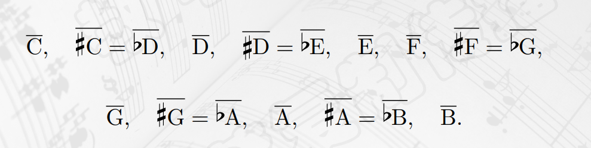
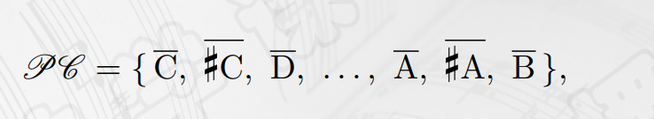
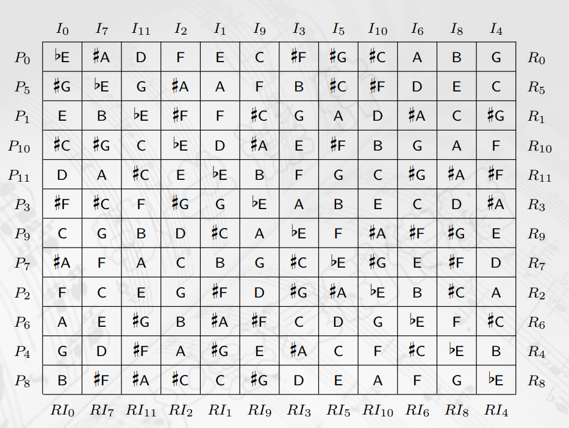
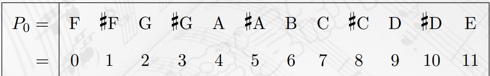

## 旋律中的对称、群论
- 许多不同音高、不同时值的音符组合起来构成``旋律``，是音乐三大要素之一。
- ``重复原则``是音乐发展的一项特殊美学原则。
- 旋律在一次次重复中不断``变化、发展``。
- 变化旋律最简单的方法是``移动它们的音高``，即``移调``。
- 贝多芬 $c$ 小调第五交响曲第一乐章开始的"命运"主题，第三四小节相比第一二小节降低了二度移调。
- 南泥湾也是，15、16小节把前两个小节旋律严格降低一个纯五度。
- ``严格移调``：把一段旋律中``每个音级``升高或者降低``相同半音数``。
- ``调性移调``：``适当调整``升高或降低的半音数，使得``移调后得到的各个音级``仍然在``调式音阶``中。
- 对于音级 $C,E,G$ 做升高四个半音的严格移调，得到 $E,\sharp G,B$ 
- 如果这三个音级 $C,E,B$ 属于 $C$ 大调音阶，对其做相应的调性移调，得到的结果应为 $E,G,B$ 。
- 如果这三个音级属于 $F$ 大调音阶，对其做相应的调性移调，得到的结果应为 $E,G \flat B$ 。
- 将五线谱看作坐标系，横轴代表时间，纵轴代表音高，``移调变换``相当于``沿着纵轴方向``对旋律进行``平移``。
- 按照``横轴方向``对旋律进行变换，改变其``时间顺序``，关于某条垂线作旋律线的对称，称为``逆行``。
- 利用莫比乌斯带，在第一声部正向演奏时，第二声部逆向演奏，形成完整乐曲。
- 关于``水平方向旋律对称``，称为``倒影``。
- 选取``不同水平直线``作对称轴，得到``不同的倒影``。
- 勃拉姆斯第一交响曲的第三乐章主题就应用了倒影，并且计算相邻音级相差的倒影数后发现其为``严格倒影``，即``保持音程的度数和性质不变``，并且``完全保留原旋律的节奏``。
- 移调、逆行、倒影都可以看成是对一段旋律做的某种``对称变换``，而对称是美的重要来源。
- ``传统音乐``大多属于``调性音乐``，其中不同音级地位和作用不同，且``总有一个主音``，``其他音``与``主音``之间``形成一定关系``，这种关系限制了严格移调和倒影变换。
- 不过，这种情况到20世纪发生了很大变化，例如巴托克《小宇宙》和安东韦伯恩的一些作品。
- 贝多芬的作品，是古典主义和浪漫主义的交汇，其去世后古典主义差不多就灭绝了。
- 波兰作曲家``肖邦``，在 $e$ 小调前奏曲中采用``半音化``。
- 他力求从大小调调性体系中解放出来，最初运用了``以全音阶为基础``的"中立调性"，同时``消除同音异名的区别``，提倡``同时采用或混用两种调性``，从而使调性的解释放宽了，也致力于``利用一切可用的声音源泉``。
- ``印象主义``的技巧特点是``忽视过去认为是结构性的因素``，``重视乐器的色彩变幻和和声的新颖刺激``，``印象主义的和声``是``浪漫主义主调音乐解体的最后阶段``。
- 奥地利作曲家``勋伯格``在其音乐创作中逐步建立和发展了``十二音技术``，是作曲家有意识地采用数学变换（群论）的思想进行音乐创作的探索实践。
## 从乐音体系到音类空间
- 假设乐音体系由八个八度和 $C_8$ 构成， $M=\{C_0,\ldots,B_0,C_1,\ldots,B_7,C_8\}$
- 可以把这 $97$ 个音级跟 $0 \sim 96$ 对应，例如 $48$ 代表中央 $C$ 。
- 根据这个对应，给定整数 $n \in Z$ ，将升高 $n$ 个半音的移调变换记作 $T_n$ ，则 $T_n(x)=x+n$ 
- 注意降低的移调变换和恒等变换。
- 数学上一个变换是某个集合到自身的映射，``移调变换``是``乐音体系到自身``的映射，因此变换后的结果仍然应该是一个音级。
- 但是，乐音按照八度关系循环，即进行``同余意义下加法``。
- 二元关系和有序对/笛卡尔积、等价关系、等价类的概念与性质，见《离散数学》课程。
- ``协和音程``具有``自反性``、``对称性``，但``不满足传递性``。
- 设 $M$ 是``乐音体系``的集合，称其中的两个音级具有``八度关系``，当且仅当其``相等或者相差若干个八度``，八度关系是 $M$ 上的一个``等价关系``。
- 给定一个等价关系，就得到集合中全部元素的一个``分类``。
- 乐音体系中根据八度关系形成的等价类称为音类，按照十二平均律，八度关系将所有的音级分成12个音类，如下

- 把12个音类放在一起，构成一个集合，称为``音类空间``。

- 数学上，可以视为模12同余意义下的关系，接着对应模12同余类的并集合。
- ``音类圆周``，即``音类把直线上的音级变成圆``。
- 因此，音类空间可以与 $Z_{12}$ 一一对应。
## 音乐变换群
- 于是，可以给出移调变换的严格定义，也就是模 $12$ 意义下 $T_{n}(x)=x+n$
- 音类的这种数字表达式更容易计算。
- 易知，$T_{7}$ 与 $T_{-5}$ 意义相同。
- 即本质上``只有12个移调变换``。
- 可以看作``变换的复合``， $T_i * T_j$ 表示先进行 $T_j$ 再进行 $T_i$ ，注意与《离散数学》中的区别。
- ``变换的复合``在移调变换之间``定义了一个运算``，形成了一个``代数结构``。
- 它满足``结合律``，有``单位元``，且``有逆元``（对移调运算而言）。 
- 那么，它是一个``群``，将群中运算称为乘法，将 $a$ 的逆元称为 $a^{-1}$ ，``包含元素个数``称为这个群的``阶``。
- 若满足``交换律``，则称为``交换群``或者 $Abel$ 群。
- ``循环群``，将 $T_1$ 记为``生成元``，由``一个元素生成的元``称为``循环群``。
- 例如，``移调变换``就是一个 $12$ 阶的``循环群``。
- 同时有，``移调变换群``与模 $12$ ``加法群``是``同构``的。
- 用符号 $I$ 表示``中央`` $C$ ``不变的倒影变换``。
- 可以得出``倒影变换``的计算公式 $I(x)=-x$ 在模 $12$ 的意义下。
- ``复合变换`` $T * I$ ，可以得到 $T*I(x)=1-x$ ，由 $T^{k} * I(x)=I * T^{-k}(x)$
- 可以将倒影变换与12个移调变换得到12个不同的变换，可以得出``包含12个移调``和``12个倒影``的更大的群。
- 则``移调变换群``是这个大群的``子群``。
- ``正四边形的二面体群``，可以得到``顺时针旋转``的 $r_{0},r_{90},r_{180},r_{270}$ 和``关于对称轴/两条对角线``的``四个反射``。
- 将它们合成一个群，称为``二面体群``，记作 $D_8$ 。
- 则上述更大群``同构于正12边形的变换群``，即 $D_{24}$
- 不过， $D_{2n},n \geq 3$ ``不是交换群``。
- 亦可以用``置换和轮换表达式``表示，具体见《离散数学》课程。
- ``逆行变换``： $R(x_1,x_2,\ldots,x_k)=x_k,x_{k-1},\ldots,x_1$
- 将逆行变换添进更大群，得到一个``再大的群``，称为``音乐变换群``。可以证明这个群的阶为48，其结构是一个``直积``。
- 即其``同构于`` $D_{24} \times Z_{2}$
- 其中元素形如， $T^{i},T^{i} * I,T^{i} * R,T^{i} * I * R$
- 群论的概念始于伽罗瓦，后续柯西、凯莱等人的论文再提出，十九世纪五十年代之前的音乐家不会知道群论。
- 李斯特的《匈牙利狂想曲第二号》就应用了群论的技巧。
## 十二音技术
- 十二音技术的出发点是``十二音序列``，一个``音列``是这12个音类的一个``排列``。
- 例如勋伯格的钢琴协奏曲，其基本音列为 $\flat E,\flat B,D,F,E,C, \sharp F,\flat A,\flat D,A,B,G$
- 以音列中``第一个音类为起点``，令其对应于 $0$ ，则其可以表示为 $Z_{12}$ 的``一个排列``，上述音列可以写为 $0,7,11,2,1,9,3,5,10,6,8,4$
- 给定一个音列，对其进行``各种变换``可以得到一系列``新的音列``。
- ``作为出发点的音列``称为``初始音列``，记作 $P_0$ ，例如对其进行移调变换，上升 $n$ 个半音得到的为 $P_n$ 。
- 共有12个移调音列，即 $P_0,P_1,\ldots,P_{11}$ 。
- 对 $P_n$ 作``关于其第一个音类的倒影变换``，得到一个``倒影音列``，记作 $I_n$ 。
- 对 $P_n$ 作``逆行变换``，得到一个``逆行音列`` $R_n$ 。
- 对 $I_n$ 作``逆行变换``，就得到``逆行倒影音列`` $RI_n$ 。
- 从初始音列 $P_0$ 出发，通过移调、倒影和逆行倒影变换，可以得到 $48$ 个音列，它们组成一个``音列矩阵``，是 $12 \times 12$ 的方阵。

- 音列中元素代表的是``音类``，在乐曲中``具体使用哪个八度音符``是由``作曲家自己决定``的。
- 可以在勋伯格《钢琴组曲》，罗忠镕《涉江采芙蓉》等见到。
- 但是，由于音列有``对称性``，从一个初始音列出发可以得到48个音列，但是其中可能有``相等的``。
- 例如 $P_0$ 是如下所示的全半音音阶，则只能得到24个互异的音列。

- 变换产生子集合，记 $|\Omega|$ 为``全体音列组成的集合``。
- 设 $\Omega$ 是一个``有限集合``， $G$ 是由 $\Omega$ 到自身的``若干可逆变换``构成的``群``， $\forall \alpha \in \Omega,$ 定义 $\Omega$ 的子集合 $Orb(\alpha)=\\{\beta \in \Omega | \exists g \in G, G(\alpha)=\beta \\}$
- 称为群 $G$ 的包含 $\alpha$ 的``轨道``。
- 从某个初始音列出发得到的48个音列就是``音乐变换群``的包含 $P_0$ 的轨道。
- 若存在 $g \not ={h} \in G$ ，使得 $g(P_0)=h(P_0)$ 则有 $h^{-1} * g(P_0)=P_0$ ，且 $h^{-1} * g \not ={e}$ ，即存在群中``非恒等变换``，保持 $P_0$ ``不动``。
- 对于 $\alpha \in \Omega$ ，记群 $G$ 的子集合 $G_{\alpha}=\\{g \in G| g(\alpha)=\alpha \\}$ ，称为 $\alpha$ 的``稳定化子``，它是一个``子群``。
- ``轨道长度``和``稳定化子的阶``之间有以下关系， $|Orb(\alpha)|=\frac{|G|}{|G_{\alpha}|}$
- 而 $|G|=48$ ，因此只需考虑 $|G_{\alpha}|$
- 定理：给定 $P_0=0,a_1,a_2,\ldots,a_{11}$ ，存在 $k,1 \leq k \leq 11,I_k=R_0$ 的``充要条件``为 $a_{11}+0 \equiv a_1+a_{10} \equiv \ldots a_{5}+a_{6} (\mathrm{mod} \ 12),k$ 为奇数。
- 满足这个定理的音列有 $(12)!! \times 6=276480$ 个，也不多。
- 勋伯格《小夜曲》第五乐章就满足上述定理。
- 定理：给定 $P_0=0,a_1,a_2,\ldots,a_{11}$ ，存在 $k,1 \leq k \leq 11,P_0=R_k$ 的``充要条件``是 $k=6,a_{6} \equiv a_5+6,a_7 \equiv a_4+6, \ldots, a_{11} \equiv 6 (\mathrm{mod} \ 12)$
- 满足这个定理的音列共有 $(12)!!=46080$ 个。
- 韦伯恩《交响曲》满足这个定理。 
- 因此，可以得出，具有对称性的音列只占全部音列的 $\frac{1}{1485}$ ，非常稀少。
- 现代音乐具有一些社会功能，例如勋伯格的音乐，让人和音乐结合在一起。
 