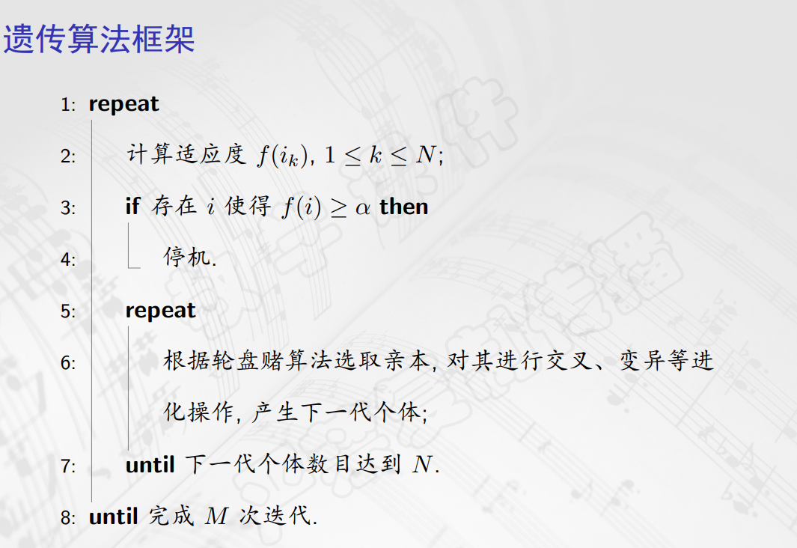
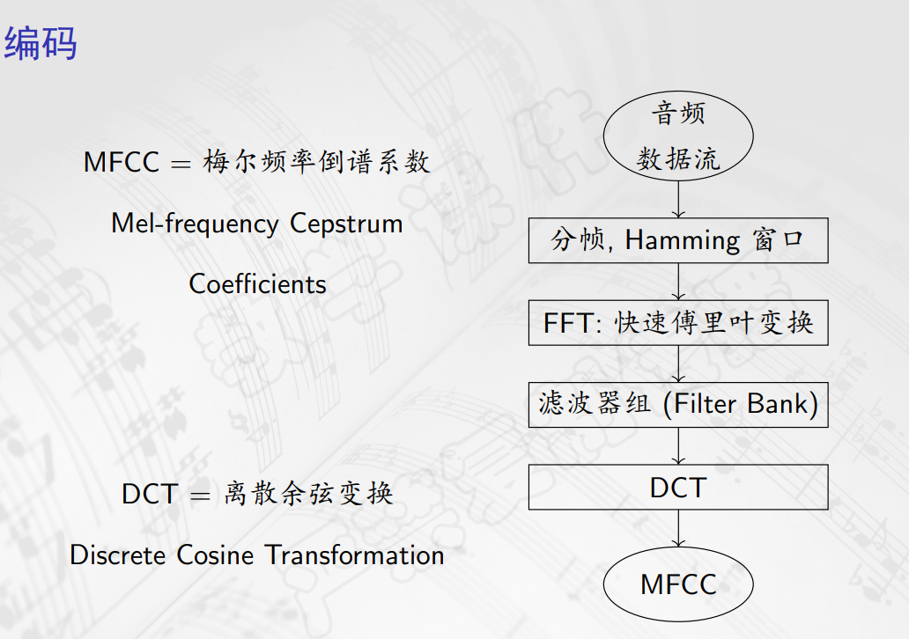
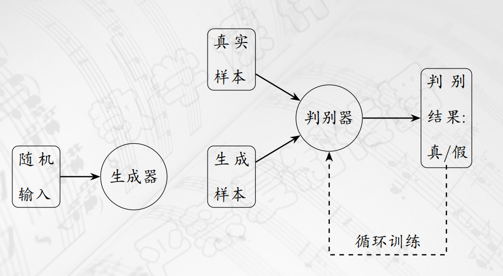
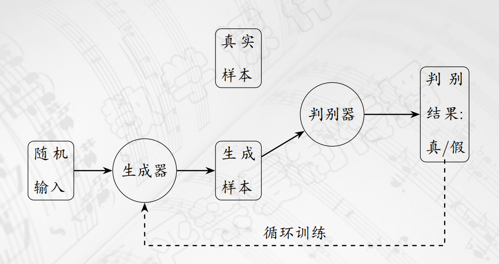

## 随机作曲
- 1757年，克恩伯格提出了音乐骰子游戏。
- 即预先准备好一系列音乐片段，演奏时通过掷骰子确定使用哪个片段。
- 片段经过精心设计，可以顺畅衔接。
- 以小步舞曲为例，通常采用 $A \rightarrow B \rightarrow A$ 的曲式，每个部分包含``8个小节``，每个小节有``6种可能性``，那么一共有 $6^{16}$ 种不同乐曲。
- ``随机变量``和``概率分布``的概念，在《高中数学选择性必修三》和《信息学中的概率统计》课程中均有涉及，此处不再赘述。
- Illiac组曲是美国作曲家和化学家借助Illiac计算机完成的弦乐四重奏，采用了包含两个半八度、31个音级的集合，计算机产生均匀分布的随机数完成创作。
## 马尔科夫链
- 可以把音乐看成是一个``随机过程``。
- 假设 $\{\xi_t \}$ 是一个``离散随机变量``的序列，每个随机变量都有相同的取值范围 $\Omega$ ，这个随机变量的序列构成一个``随机过程``。
- 将 $\Omega$ 称为 $\xi_t$ 的``状态空间``。
- 条件概率的概念也有涉及，不再赘述。
- 设 $\{\xi_t \}$ 是一个随机过程， $\Omega$ 是一个状态空间。若 $\forall n \in N^{+}$ 和 $n+2$ 个状态 $k_0,k_1,\ldots,k_n,k_{n+1} \in \Omega$ ，条件概率总满足下述关系 $P(\xi_{n+1}=k_{n+1}| \xi_0=k_0,\ldots,\xi_n=k_n)=P(\xi_{n+1}=k_{n+1} | \xi_n=k_n)$ 
- 就称这个随机过程具有``马尔科夫性质``，具有马尔科夫性质的随机过程称为``马尔科夫链``。
- 也称为``无记忆性``。
- 一个马尔科夫链称为``时间齐次的``，若 $\forall x,y \in \Omega,$ 相应的条件概率不随时间变化，即 $\forall t>0,P(\xi_{t+1}=y | \xi_t=x)=P(\xi_{t}=y | \xi_{t-1}=x)$ 
- 此时可以使用一个矩阵刻画其行为。
- 设状态空间 $\Omega$ 包含 $n$ 个元素， $\forall k_i,k_j \in \Omega$ ，记条件概率 $P(\xi_{t+1}=k_j|\xi_t=k_i)=p_{ij}$ ，则其为状态 $\xi_t=k_i$ 到 $\xi_{t+1}=k_j$ 的``转移概率``，并且形成这个马尔科夫链的``转移概率矩阵``。
- 转移概率矩阵的``每一行元素之和都等于1``，给定当前状态，就能知道下一个状态的概率分布，即第 $i$ 行。
- 也就是给定 $\Omega$ 和 $P$ ，从 $\xi_0=k_0$ 出发，可以根据下一个概率分布随机选定，于是循环往复，就可以得到一段随机旋律了。
- 例如，在《鸿雁》中，总共出现 $8$ 个音级，假定只考虑音高，不区分相同音高但是时值不同的音符，就可以得到状态空间了。
- ``高阶马尔科夫链``，就是一个状态只与过去的 $m$ 个状态有关，称相应的随机过程是一个 $m$ 阶的马尔科夫链。
## 遗传算法
- ``遗传算法``是模拟生物中的遗传、变异和自然选择过程的一种``搜索全局最优解``的方法。
- 出发点是由若干``个体``组成的``种群``，例如由若干乐曲片段组成的种群。
- 遗传算法要对这些个体进行``交叉、变异``等操作，使它们进化产生下一代种群。
- 根据音乐本身的性质要求事先设定``适应度函数``，用以衡量进化结果。
- 不断迭代，直到``产生需要的进化结果``或者``达到预设的迭代次数``。
- ``音级``：假定需要考虑的乐音体系包括 $n$ 个音级，分别用 $1,2,\ldots,n$ 表示，用 $0$ 表示休止符。
- ``时值``：假定乐曲中时值最短的是十六分音符，则每一个音级编号代表一个十六分音符。
- ``延长记号``：用 $n+1$ 代表延长一个十六分音符的时值。
- 假设每一个个体由两小节构成，``交叉``即``交换两个个体的基因片段``，产生两个新的个体。
- ``变异``即``随机改变``一个个体的某一点基因，产生一个新的个体。
- ``复制``，事先给定一个阈值，适应度高于该阈值的个体直接进入下一代。
- 针对作曲的特殊变异：``移调、倒影、逆行``
- 进化操作中``交叉和变异``各自所占比例预先给定。
- ``适应度函数``：对于每一个可能个体 $i$ ，定义一个评判其"好坏"的值，算法根据每个个体的适应度来选取产生下一代的亲本。
- 产生适应度函数：
  - 根据音乐本身规律，如协和。
  - 根据统计结果给出各项的理想数值。
  - 人机交互
  - 机器学习
- 个体选取：``轮盘赌算法``
- 设当前种群共有 $N$ 个个体 $i_1,i_2,\ldots,i_N,1 \leq k \leq N$ ，则个体 $i_l$ 被选取称为亲本的概率为 $\frac{f(i_l)}{\sum\limits_{i=1}^{k} f(i_k)}$
- 给定种群中个体数目 $N$ ，``适应度阈值`` $\alpha$ 和``迭代次数`` $M$ ，随机生成初始种群，使用以下算法迭代。

## 音乐信息检索
- 音乐信息检索/MIR
- 音乐流派分类，可以使用人工智能技术自动识别，即``机器学习``。
- 机器学习的概念，此处不予赘述。

- 编码就是``压缩和降维``的过程。
- 监督学习
  - 回归分析
  - 神经网络
  - 支持向量机
- 无监督学习
  - 聚类分析
  - 关联分析
- 通常将学习样本分为两部分，``训练集``和``测试集``，有时候还要选出一部分作为``验证集``。

## 生成式人工智能
- 生成式人工智能的任务是通过学习真实世界中对象，进而可以产生出新的对象，也就是``具备泛化能力``。
- 自然语言、图像、音乐等具有一定随机性，但也有很强的规律性，符合某个未知的概率分布。
- 其任务是通过学习观察到的样本，建立其真实世界中特定对象概率分布的近似模型，接着从这个近似的概率分布中产生新样本，也就是``创作``。
- 在一幅有意义的图像或者画作中，像素值是由一定关联和约束的，但是无法清晰、明确地描述，也就是隐性知识，否则完全随机的可能是一幅噪声图像。
- 例如，可以把一段音乐编码为高维空间中的一个点。
- 可以使用``Diffusion``模型，也就是不断去除噪声。
- 每个``噪声预测器``，预测出哪些是噪声，加以去除。
- 正向的过程是，用完整图像一步步加上噪声。
- 然后再用这个形式训练噪声预测器，就形成``Diffusion``模型。
- 也可以使用生成对抗网络，即``GAN``，它的原理大致如下：

- ``Transformer``模型：传统``RNN``难以捕捉长距离依赖关系，且难并行化。
- 其核心为``自注意力机制``，为输入序列中每个位置分配一个权重，然后将这些加权的位置向量作为输出。
- 注意力权重的计算涉及向量的点乘和矩阵乘法，其中权重通过训练得出，对于每个``token``都可以单独进行，向量和矩阵运算可以由GPU并行完成。