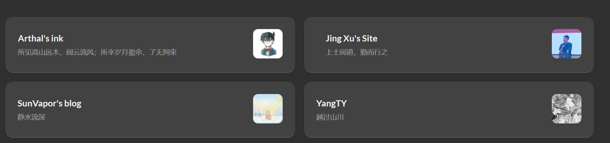
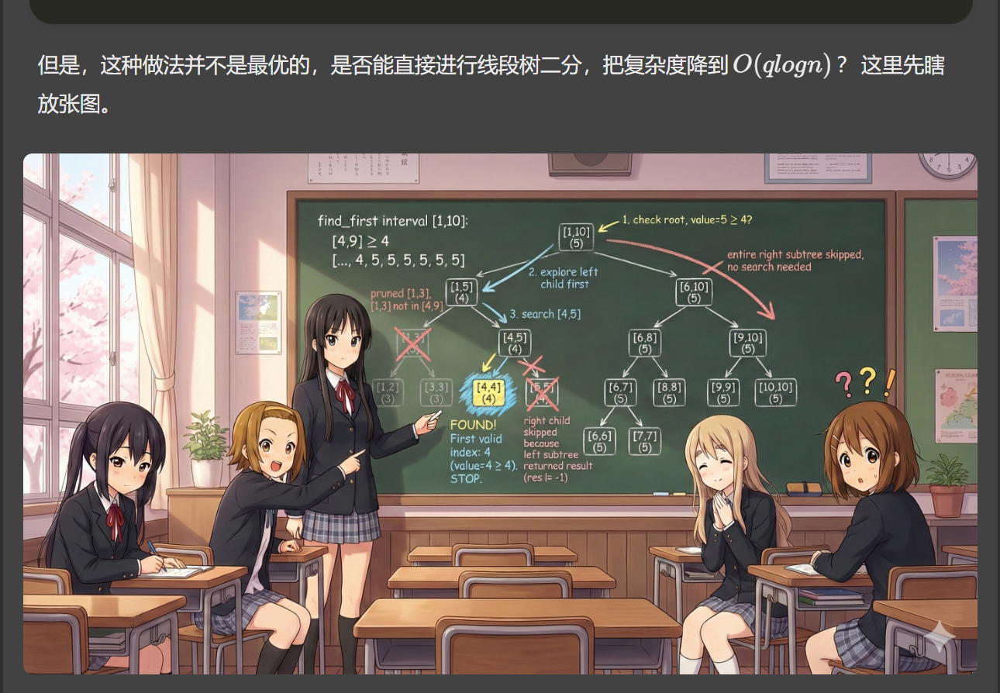

## 前言
之前写过一篇在博客里添加 Bangumi 追番页面的文章，那篇文章主要讲的是一个独立功能：如何通过 `layouts/page/bilibili.html` 和 `layouts/shortcodes/bangumi.html` 做出一面 Bangumi 收藏墙。

这一篇则整理博客里更零散、更基础的美化工作。笔者现在用的是 Hugo `v0.131.0` 和 Stack 主题 `v3.26.0`，为了弄清楚每个地方到底改了什么，这次把原版 Hugo 和 Stack 主题源码也放到了本地，再对比 `Blog/elainafan` 里的覆盖文件来看。

Hugo 的主题覆盖机制其实很适合个人博客装修：主题文件放在 `themes/hugo-theme-stack`，而站点根目录下的 `layouts`、`assets`、`static` 会优先于主题生效。也就是说，如果在博客根目录里放一个 `layouts/partials/footer/footer.html`，它就会覆盖 Stack 主题里同名的 footer partial。

因此，本文的核心思路就是：不直接修改主题源码，而是在博客目录里按需覆盖。这样以后升级主题时，只需要重点检查这些覆盖文件，维护范围会更清楚一些。

## 全局卡片圆角
先看 `assets/scss/custom.scss` 里的全局变量。Stack 主题大量使用 CSS 变量控制卡片圆角、间距、字号和颜色，因此很多效果不需要到处改类名，只要重写变量即可。这段加在 `assets/scss/custom.scss` 中：

```scss
:root {
  --main-top-padding: 30px;
  --card-border-radius: 25px;
  --tag-border-radius: 8px;
  --section-separation: 40px;
  --article-font-size: 1.8rem;
  --code-background-color: #f8f8f8;
  --code-text-color: #e96900;

  &[data-scheme="dark"] {
    --code-background-color: #ff6d1b17;
    --code-text-color: #e96900;
  }
}
```

这里最明显的是 `--card-border-radius` 和 `--section-separation`。前者决定卡片圆角，后者决定页面块之间的距离。Stack 主题本身是卡片式布局，所以这两个变量一改，全站气质就会跟着变。

同一组变量里还调整了行内代码的背景色和前景色。写 CS、算法和建站笔记时，行内代码会非常多，如果默认样式太淡，阅读起来会有点糊；如果太亮，又会抢正文。所以这里给亮色和暗色分别配置了更稳定的行内代码颜色。

## 友链归档双栏
首页、友链和归档页的卡片是 Stack 主题最显眼的部分。笔者的主要改动仍然集中在 `assets/scss/custom.scss`。

在桌面端把紧凑文章列表改成两列，这段加在 `assets/scss/custom.scss` 中：

```scss
@media (min-width: 1024px) {
  .article-list--compact {
    display: grid;
    grid-template-columns: 1fr 1fr;
    background: none;
    box-shadow: none;
    gap: 1rem;

    article {
      background: var(--card-background);
      border: none;
      box-shadow: var(--shadow-l2);
      margin-bottom: 8px;
      margin-right: 8px;
      border-radius: 16px;
    }
  }
}
```

原来的紧凑列表是一列到底，比较稳，但是内容多了以后会显得很长。改成两列后，归档页的信息密度会高一些。友链和链接页面使用的也是这一类 compact 列表结构，因此这个样式同样会让友链卡片变成多列显示。需要注意的是，`.article-list--compact` 原本自己带背景和阴影，如果直接改成 grid，会出现一个大背景包着小卡片的感觉，所以这里把外层背景去掉，再给每个 `article` 单独加回卡片样式。

## 封面与分类页比例
然后是封面图高度。相关代码同样加在 `assets/scss/custom.scss` 中：

```scss
.article-list article .article-image img {
  width: 100%;
  height: 150px;
  object-fit: cover;

  @include respond(md) {
    height: 200px;
  }

  @include respond(xl) {
    height: 305px;
  }
}
```

这里用 `object-fit: cover` 保证封面图不会被压扁。高度则根据屏幕尺寸逐步增加，使宽屏下的文章卡片更舒展。

分类页还有一个容易被忽略的地方：Stack 主题的分类页顶部会用 `.section-card` 显示分类封面、文章数量、分类名和描述。默认样式在桌面端还算正常，但到了手机端，如果封面图和文字仍然挤在同一行，就很容易出现文字被压成竖排、图片比例也不舒服的问题。

因此笔者把分类页头图在手机端改成上下结构，图片固定为 `16:9`；到了桌面端再恢复成左右结构，让图片占据更大的横向空间。这段也加在 `assets/scss/custom.scss` 中：

```scss
.section-card {
  align-items: stretch;
  flex-direction: column;
  gap: 0;
  overflow: hidden;
  padding: 0;

  .section-image {
    width: 100%;
    aspect-ratio: 16 / 9;
    overflow: hidden;

    img {
      display: block;
      width: 100% !important;
      height: 100% !important;
      object-fit: cover !important;
    }
  }

  .section-details {
    min-width: 0;
    border-left: 0;
    border-top: 1px solid rgba(255, 255, 255, .18);
    padding: 18px 20px 20px;
  }

  .section-count,
  .section-term,
  .section-description {
    word-break: break-word;
  }

  @include respond(md) {
    align-items: center;
    flex-direction: row;
    gap: 20px;
    padding: var(--small-card-padding);

    .section-image {
      flex: 0 0 58%;
      max-width: 58%;
    }

    .section-details {
      border-top: 0;
      border-left: 5px solid rgba(255, 255, 255, .85);
      padding: 0 0 0 15px;
    }
  }

  @include respond(xl) {
    .section-image {
      flex-basis: 62%;
      max-width: 62%;
    }
  }
}
```

同一类问题还会出现在归档页、分类页的子分类横卡上。原版 Stack 的 tile 卡片更偏固定尺寸，手机端容易溢出或需要横向滚动。这里把 `.subsection-list` 里的 tile 改成响应式网格：手机端一列，平板以上两列，宽屏三列。相关代码同样加在 `assets/scss/custom.scss` 中：

```scss
.subsection-list {
  overflow-x: visible;

  .article-list--tile {
    display: grid;
    grid-template-columns: 1fr;
    gap: 18px;
    overflow: visible;

    article {
      width: 100%;
      height: auto;
      aspect-ratio: 16 / 9;
      margin-right: 0;
    }
  }

  @include respond(md) {
    .article-list--tile {
      grid-template-columns: repeat(2, minmax(0, 1fr));

      article {
        aspect-ratio: 5 / 3;
      }
    }
  }

  @include respond(xl) {
    .article-list--tile {
      grid-template-columns: repeat(3, minmax(0, 1fr));
    }
  }
}
```

这样处理以后，首页文章封面、分类页头图和子分类横卡各自有自己的比例：普通文章列表按高度控制，分类头图按 `16:9` 控制，子分类横卡则在手机端优先保证完整横图，桌面端再提高信息密度。

## 卡片悬浮动画
接下来是卡片悬浮动画，这段加在 `assets/scss/custom.scss` 中：

```scss
.article-list article {
  transition: transform 0.6s ease;
}

.article-list article:hover {
  transform: scale(1.05);
}
```

归档页的 tile 卡片和 compact 卡片也分别加了缩放和右移动画。这个改动本质上只是给卡片一点反馈，不涉及 Hugo 模板。动画幅度不宜过大，不然鼠标扫过页面时会显得很晃。



## 首页三栏布局
三栏布局的宽度调整也在 `custom.scss` 中。Stack 的主体容器是 `.container.main-container`，它里面有左侧栏、右侧栏和正文区域。

相关代码加在 `assets/scss/custom.scss` 中：

```scss
.container {
  &.extended {
    @include respond(md) {
      max-width: 1024px;
      --left-sidebar-max-width: 25%;
      --right-sidebar-max-width: 22% !important;
    }

    @include respond(lg) {
      max-width: 1280px;
      --left-sidebar-max-width: 20%;
      --right-sidebar-max-width: 30%;
    }

    @include respond(xl) {
      max-width: 1453px;
      --left-sidebar-max-width: 15%;
      --right-sidebar-max-width: 25%;
    }
  }
}
```

这部分主要解决的是宽屏下正文和侧边栏的比例。默认 Stack 的布局已经够用，但如果文章里有比较多代码块、公式或表格，正文区域太窄就会很痛苦。因此这里稍微放宽了整体容器，并重新分配左右侧栏宽度。

## 菜单卡片化
菜单栏也做了圆角和阴影处理，这段加在 `assets/scss/custom.scss` 中：

```scss
.menu {
  background-color: var(--card-background);
  box-shadow: var(--shadow-l2);
  border-radius: 10px;
  padding: 30px 30px;
}
```

移动端展开菜单时，这个样式会让菜单更像一个独立卡片，而不是一块硬邦邦的列表。到了桌面端，主题会恢复透明背景和正常布局。


## 站内随机漫游
左侧菜单里还加了一个 `随机 | Random` 入口，用来在站内文章之间随机跳转。这个功能本身不复杂，但有一个需要额外注意的点：站内有些文章是加密的，随机入口不能为了方便跳转就把文章内容提前暴露出来。

因此这里的做法是，在 `layouts/partials/sidebar/left.html` 里只生成一个很轻量的文章池，里面只保留文章标题和链接：

```go-html-template
{{- $randomPosts := slice -}}
{{- $mainSections := .Site.Params.mainSections | default (slice "post") -}}
{{- range .Site.RegularPages -}}
    {{- if and (in $mainSections .Section) (ne .Params.hidden true) (ne (.Params.encrypt | default false) true) -}}
        {{- $randomPosts = $randomPosts | append (dict "title" .Title "url" .RelPermalink) -}}
    {{- end -}}
{{- end -}}
```

这里用 `.Site.Params.mainSections` 限制随机范围，默认只抽 `post` 下面的正式文章；同时过滤掉 `hidden: true` 和 `encrypt: true` 的页面，避免把系列文章里的隐藏子页或加密文章放进随机池。随机漫游本身不渲染正文，但既然左侧菜单会把标题和链接写进页面，最稳妥的做法还是直接不让加密文章参与随机抽取。

菜单项本身仍然放在 Stack 的主菜单结构里，这样可以直接继承左侧菜单的图标、间距和暗色模式样式：

```go-html-template
<li>
    <a href='{{ "/archives/" | relLangURL }}' data-random-post>
        {{ partial "helper/icon" "infinity" }}
        <span>随机 | Random</span>
    </a>
</li>
```

文章池则放在 `application/json` 类型的脚本标签里。这里需要用 `safeJS`，否则 Hugo 在脚本语境里可能会把 JSON 数组再包成一个字符串，前端解析时就会多一层。

```go-html-template
<script type="application/json" id="random-posts-data">{{ . | jsonify | safeJS }}</script>
```

最后在 `assets/ts/main.ts` 里绑定点击事件，从文章池里随机取一篇并跳转即可。为了避免在当前文章原地打转，脚本会优先排除当前页面；如果站内只有一篇文章，再退回原始文章池。这样功能比较轻，不需要后端，也不会影响原来的加密逻辑。

## 自定义背景图
背景图参考的是 [Hugo Stack 主题装修笔记](https://letere-gzj.github.io/hugo-stack/p/hugo/custom-background/) 里的做法：把图片作为 Hugo 的资源读取出来，再给 `body` 设置背景。笔者这里稍微改了一下，没有在模板里写死具体文件名，而是读取 `assets/background/` 下的第一张图片。这样之后想换背景时，只需要替换这个目录里的图片，不需要再改模板。

这段加在 `layouts/partials/footer/custom.html` 中：

```go-html-template
{{ $backgroundImages := resources.Match "background/*.{jpg,jpeg,png,webp,avif}" }}
{{ with $backgroundImages }}
{{ with index . 0 }}
<style>
    body {
        background:
            linear-gradient(rgba(245, 245, 250, 0.72), rgba(245, 245, 250, 0.72)),
            url({{ .Permalink }}) no-repeat center top;
        background-size: cover;
        background-attachment: fixed;
    }

    [data-scheme="dark"] body {
        background:
            linear-gradient(rgba(48, 48, 48, 0.62), rgba(48, 48, 48, 0.62)),
            url({{ .Permalink }}) no-repeat center top;
        background-size: cover;
        background-attachment: fixed;
    }
</style>
{{ end }}
{{ end }}
```

这里的 `background-size: cover` 用来让背景铺满屏幕，`background-attachment: fixed` 则让背景在页面滚动时保持固定。前面的 `linear-gradient` 是一层遮罩：亮色模式下用偏白的遮罩压低背景存在感，暗色模式下用偏黑的遮罩降低亮部干扰。因为博客主体区域本身还有卡片背景，所以背景图主要出现在页面两侧和卡片之间的空隙里，不会直接压到正文阅读。


## 头像旋转
头像旋转是一个很简单的小动画，这段加在 `assets/scss/custom.scss` 中：

```scss
.sidebar header .site-avatar .site-logo {
  transition: transform 1.65s ease-in-out;
}

.sidebar header .site-avatar .site-logo:hover {
  transform: rotate(360deg);
}
```

它没有什么技术难度，但非常适合个人博客。鼠标挪上去时头像转一圈，属于那种“平时没用，但是看到了会有点开心”的小装饰。

## 正文图片圆角
文章图片则统一加了圆角，这段加在 `assets/scss/custom.scss` 中：

```scss
.article-page .main-article .article-content {
  img {
    max-width: 96% !important;
    height: auto !important;
    border-radius: 8px;
  }
}
```

这里的 `max-width: 96%` 是为了让图片不要完全贴满正文宽度，尤其是带阴影或圆角时，留一点余地会舒服很多。

## 静态图片放大查看
这里还遇到过一个比较隐蔽的问题：普通文章里的图片一般和 Markdown 文件放在同一个 Page Bundle 下，比如 `content/post/某篇文章/1.png`。这种图片会被 Hugo 的 Markdown image render hook 识别为页面资源，于是自动拿到宽高，并加上 `gallery-image`，最后交给 Stack 主题的 PhotoSwipe 处理。

但有些拆成多个子页面的长期更新文章，比如 `content/post/二次元修炼日记！/cf-1072.md`，图片不一定适合继续放在原来的文章目录里。笔者把共用图片放到了 `static/images/anime-diary/`，然后在文章中用 `` 引用。这样图片能显示，但一开始不会像普通文章图片那样进入图库，也就不能居中和点击放大。

原因在 `layouts/_default/_markup/render-image.html`。原来的逻辑只有在 `.Page.Resources.GetMatch` 找到图片资源时，才会设置 `gallery-image`。所以需要把以 `/` 开头、不是外链、不是 SVG 的本地静态图片也纳入图库：

```go-html-template
{{- $notSVG := ne (lower (path.Ext .Destination)) ".svg" -}}
{{- $isExternal := or (strings.HasPrefix .Destination "http://") (strings.HasPrefix .Destination "https://") -}}
{{- $isProtocolRelative := strings.HasPrefix .Destination "//" -}}
{{- $isStaticImage := and (strings.HasPrefix .Destination "/") (not $isExternal) (not $isProtocolRelative) $notSVG -}}
```

接着在同一个文件里保留原来的 Page Bundle 处理逻辑，并给静态本地图补上 `gallery-image`：

```go-html-template
{{- if $image -}}
    {{- $Permalink = $image.RelPermalink -}}

    {{- if $notSVG -}}
        {{- $Width = $image.Width -}}
        {{- $Height = $image.Height -}}
        {{- $galleryImage = true -}}
    {{- end -}}
{{- else if $isStaticImage -}}
    {{- $galleryImage = true -}}
{{- end -}}
```

不过这样还不够。Page Bundle 图片有 Hugo 提前写好的 `width` 和 `height`，但 `static` 里的图片没有。PhotoSwipe 打开图片时需要宽高，如果直接读空值，就容易出现缩放不正常的问题。因此还要改 `assets/ts/gallery.ts`，给图片尺寸加一个兜底：

```ts
private static imageDimensions(img: HTMLImageElement) {
    const width = parseInt(img.getAttribute('width') || ''),
        height = parseInt(img.getAttribute('height') || ''),
        rect = img.getBoundingClientRect();

    return {
        w: width || img.naturalWidth || Math.round(rect.width) || 1200,
        h: height || img.naturalHeight || Math.round(rect.height) || 675
    };
}
```

然后在点击图片打开 PhotoSwipe 前，再用当前图片重新刷新一次尺寸：

```ts
const img = item.el.querySelector('img');
if (img) {
    const dimensions = StackGallery.imageDimensions(img);
    const link = item.el.querySelector('a');
    item.w = dimensions.w;
    item.h = dimensions.h;
    item.src = link?.href || img.src;
    item.msrc = img.getAttribute('data-thumb') || img.src;
}
```

这样处理后，`/images/anime-diary/4.png` 这种从 `static` 目录来的图片，也能和普通文章图片一样被包进 `figure.gallery-image`，在正文中居中显示，并且点击后进入 PhotoSwipe 放大查看。

后来接入 PJAX 之后，这里又遇到过一次类似但原因不同的问题：直接打开文章时图片可以放大，但从首页或归档页无刷新切进文章后，正文图片只会像普通链接一样跳转，PhotoSwipe 预览没有生效。

这时 `render-image.html` 其实已经正常工作了，生成出来的图片也有 `gallery-image`、`width` 和 `height`。真正的问题在于 PhotoSwipe 的根节点和外部脚本原本放在文章页面的 `main` 区域里，例如 `layouts/_default/single.html` 末尾：

```go-html-template
{{ partialCached "article/components/photoswipe" . }}
```

但 PJAX 只替换页面中的 `.main-container`、`.js-Pjax` 和 `Timer`。新页面里的普通 HTML 会被换进来，脚本标签却不会像整页刷新那样重新执行。于是图片本身进入了图库结构，但 PhotoSwipe 依赖和根节点在 PJAX 切页场景下不够稳定。

解决办法是把 PhotoSwipe 挪到全站 footer，让它和播放器、PJAX 初始化一样，成为页面常驻部分。也就是在 `layouts/partials/footer/include.html` 中加入：

```go-html-template
{{ partialCached "footer/components/script.html" . }}
{{ partialCached "footer/components/custom-font.html" . }}
{{ partialCached "article/components/photoswipe" . }}
{{ partial "footer/custom.html" . }}
```

然后把 `layouts/_default/single.html`、`layouts/photo/single.html`、`layouts/page/bilibili.html` 里原本单独插入的 `article/components/photoswipe` 去掉，避免同一个页面生成多份 `.pswp`。这样不管是直接打开文章，还是通过 PJAX 从别的页面切进文章，PhotoSwipe 的 DOM 和脚本都已经存在，`window.Stack.init()` 重新扫描 `.article-content` 时就能正常给正文图片绑定预览事件。

## 文章更新记录
建站类文章经常会在发布后继续修补。比如这篇文章一开始只是整理 Stack 主题美化，后来又陆续补了静态图片放大、图库瀑布流、PJAX 下 PhotoSwipe 的处理。如果只改正文，读者很难知道哪些内容是后来补上的，笔者自己过一段时间也容易忘。

所以这里加了一个很轻量的更新记录组件。文章 frontmatter 中可以写：

```yaml
updates:
    - date: 2026-05-24
      content: 增加文章更新记录组件，并在首页卡片显示最近更新日期。
    - date: 2026-05-24
      content: 补充 PJAX 场景下 PhotoSwipe 需要常驻 footer 的处理。
```

真正的渲染逻辑放在 `layouts/partials/article/components/updates.html`。它会读取 `.Params.updates`，如果文章没有配置这个字段，就什么都不显示：

```go-html-template
{{- with .Params.updates -}}
<section class="article-updates" aria-labelledby="article-updates-title">
    <div class="article-updates__header">
        {{ partial "helper/icon" "clock" }}
        <h2 id="article-updates-title">更新记录</h2>
    </div>
    <ol class="article-updates__list">
        {{- range . -}}
            <li class="article-updates__item">
                <time datetime="{{ .date }}">{{ time.Format "2006-01-02" (time .date) }}</time>
                <div>{{ .content | markdownify }}</div>
            </li>
        {{- end -}}
    </ol>
</section>
{{- end -}}
```

组件入口加在 `layouts/partials/article/article.html`，放在正文之后、系列导航之前：

```go-html-template
{{ partial "article/components/content" . }}

{{ partial "article/components/updates" . }}

{{ partial "article/components/series-navigation" . }}
```

这样读者读完正文后，就能直接看到这篇文章后续修过什么。对于普通随笔来说可以不写 `updates`，但教程、Lab、长期维护页面就很适合保留这类记录。

同时，首页文章卡片也可以显示最近更新。本站的首页使用 `layouts/partials/article-list/default.html` 渲染文章卡片，因此可以在卡片的 `article-time` 中增加一项：

```go-html-template
{{ with .Params.updates }}
    {{ with index . 0 }}
        <div class="article-time--updated">
            {{ partial "helper/icon" "infinity" }}
            <time datetime="{{ time.Format "2006-01-02" (time .date) }}">
                更新 {{ time.Format "2006-01-02" (time .date) }}
            </time>
        </div>
    {{ end }}
{{ end }}
```

这样最近修过的文章会在首页卡片里显示一个“更新 YYYY-MM-DD”。它不会替代发布日期，只是告诉读者：这篇文章后来又被维护过。

## 全站时间线和最近活动
单篇文章的 `updates` 解决的是“这篇文章后来改过什么”，但博客本身还有很多别的动态：文章发布、Codeforces 复盘、友链朋友圈、Bangumi 收藏变化。这些东西分散在不同页面里，单独看都没问题，但如果想快速回顾最近整个站点发生了什么，就还需要一个更集中的入口。

因此笔者又加了一个全站时间线。数据汇总逻辑放在 `layouts/partials/data/timeline-events.html`，它会把不同来源统一整理成一组 `events`，最后按时间倒序返回：

```go-html-template
{{- $events := slice -}}
{{- $mainSections := $site.Params.mainSections | default (slice "post") -}}
{{- $publicPosts := where $site.RegularPages "Type" "in" $mainSections -}}
{{- $publicPosts = where $publicPosts "Params.hidden" "!=" true -}}

{{- range $page := $publicPosts -}}
    {{- if not ($page.Params.encrypt | default false) -}}
        {{- $events = $events | append (dict
            "date" $page.Date
            "type" "article"
            "label" "文章"
            "title" $page.Title
            "url" $page.RelPermalink
        ) -}}
    {{- end -}}
{{- end -}}

{{- return (sort $events "date" "desc") -}}
```

这里最重要的仍然是过滤：普通文章只取 `mainSections` 中的公开页面，并且跳过 `hidden: true` 和 `encrypt: true`。这样隐藏子页、加密文章不会因为时间线而被额外摊开。至于 Codeforces、友链和 Bangumi，本来就是公开数据文件里的内容，时间线只负责把它们和文章事件放到同一条流里。

完整页面放在 `content/page/timeline/index.md` 和 `layouts/page/timeline.html`。不过左侧菜单已经比较拥挤，所以这个页面只作为隐藏入口存在：

```yaml
title: "时间线 | Timeline"
layout: "timeline"
url: "/timeline/"
hidden: true
comments: false
```

页面本身会展示文章发布、文章更新、比赛记录、友链动态和 Bangumi 收藏，并用不同颜色区分类型。这样需要完整回看时，可以直接打开 `/timeline/`；平时不需要它占据左侧导航。

后来也试过做一个更轻量的“站点最近活动”组件，并把它放进独立的 `更新 | Updates` 页面。但实际用下来，这个页面承担的事情有点尴尬：单篇文章内部已经有 `updates`，完整动态又有 `/timeline/`，再额外给它一个页面和左侧入口，维护成本反而变高。

因此现在的处理更克制：删掉独立的 Updates 页面，只保留两层能力。单篇文章的修改记录仍然写在 frontmatter `updates` 中，并渲染在文章末尾；跨文章、比赛、友链、Bangumi 的全站动态则继续由隐藏的 `/timeline/` 承担。这样左侧导航不会增加负担，也不会让“更新记录”变成一个必须单独维护的栏目。

## 系列文章导航
像 `看番与加睡的小猪日常`、`二次元修炼日记！` 这种长期更新的文章，主页面负责做目录，具体内容则拆成多个 `hidden: true` 的子页面。这样归档页不会被一堆子页面刷屏，但读者点进某个子页面之后，如果只能靠浏览器返回键切换上下篇，就会有点割裂。

因此笔者给隐藏子页面加了一个自动系列导航：只要当前文章是 `hidden: true`，并且同目录下还有其他隐藏文章，就在正文下方生成“上一篇 / 返回系列 / 下一篇”。模板入口加在 `layouts/partials/article/article.html` 中：

```go-html-template
{{ partial "article/components/series-navigation" . }}
```

真正的导航逻辑放在 `layouts/partials/article/components/series-navigation.html`。它会遍历 `.Site.RegularPages`，找出和当前页面 `.File.Dir` 相同的页面；其中 `main.md` 被当作系列主页，`hidden: true` 的页面被当作系列子页面：

```go-html-template
{{- range .Site.RegularPages -}}
    {{- if and .File (eq .File.Dir $current.File.Dir) -}}
        {{- if eq .File.BaseFileName "main" -}}
            {{- $indexPage = . -}}
        {{- end -}}
        {{- if .Params.hidden -}}
            {{- $siblings = $siblings | append . -}}
        {{- end -}}
    {{- end -}}
{{- end -}}
```

这里没有直接按文件名排序，而是给子页面补了一个 `seriesOrder` 字段。比如 `content/post/二次元修炼日记！/cf-1072.md` 的 frontmatter 中会有：

```yaml
seriesOrder: 1
```

这样做的好处是顺序由文章自己控制。`1400.md`、`1500.md` 这种文件名本来就好排，但 Codeforces 复盘里会混入 `edu-187.md`，如果只按文件名排序，就会和主页面里的整理顺序不一致。补上 `seriesOrder` 后，模板只需要：

```go-html-template
{{- $siblings = sort $siblings "Params.seriesOrder" "asc" -}}
```

最后是样式，仍然加在 `assets/scss/custom.scss` 中。移动端显示为一列，桌面端显示为三列：

```scss
.series-navigation {
  display: grid;
  grid-template-columns: 1fr;
  gap: 14px;
  margin: 28px 0 8px;

  @include respond(md) {
    grid-template-columns: repeat(3, minmax(0, 1fr));
  }
}
```

为了让导航看起来像正文的一部分，而不是突兀地插入三个普通链接，单个按钮使用了卡片背景、阴影和轻微上浮效果：

```scss
.series-nav-card {
  display: flex;
  flex-direction: column;
  justify-content: center;
  min-height: 88px;
  padding: 16px 18px;
  border-radius: 18px;
  background: var(--card-background);
  box-shadow: var(--shadow-l1);
  transition: transform .25s ease, box-shadow .25s ease;
}
```

这样拆分后的长期文章就比较顺手了：主页面仍然负责汇总，子页面保持隐藏，读者进入某篇复盘或某个难度段后，也可以直接在系列内部前后跳转。

## 系列入口收束和样式拆分
后来也尝试过做一个独立的 `/series/` 总览页，把课程笔记、Lab 记录、建站日志和长期复盘整理成系列卡片。这个页面本身能用，但和 `归档 | Archives`、文章分类、右侧年份归档放在一起后，左侧入口会显得越来越满。实际使用下来，笔者还是更倾向于保留朴素的归档页，让长期系列回到文章内部和具体面板里。

因此现在删掉了独立的 `content/page/series/index.md`、`layouts/page/series.html` 和 `data/series.yaml`。保留下来的有两类东西：

- 文章内部的系列导航，也就是进入某个长期目录后，底部仍然可以前后跳转；
- 具体的比赛面板，比如 `/series/codeforces/`、`/series/atcoder/` 和 `/series/xcpc/`，它们仍然作为专题工具页存在。

这个调整不会影响加密文章：文章内系列导航仍然按页面本身的 `hidden`、`encrypt` 和目录关系工作；搜索索引和 RSS 里对加密文章的保护也继续保留。换句话说，被删掉的只是“所有系列的总览入口”，不是各个系列本身。

顺手也把 `assets/scss/custom.scss` 拆了一下。之前所有自定义样式都堆在一个接近两千行的文件里，改的时候很容易在滚动中迷路。现在 `custom.scss` 只保留入口：

```scss
@import "aplayer-light.scss";
@import "aplayer-dark.scss";

@import "custom/base";
@import "custom/layout";
@import "custom/archives-home";
@import "custom/code";
@import "custom/article-extras";
@import "custom/friend-circle";
@import "custom/timeline-contests";
```

真正的样式分别放到 `assets/scss/custom/_base.scss`、`_layout.scss`、`_code.scss`、`_friend-circle.scss` 这些 partial 里。这个拆分不改变页面外观，只是把“全局基础样式”“文章增强”“友链朋友圈”“时间线和比赛面板”分开，后面想改某一块时不用再翻完整个 `custom.scss`。

## 引用块和长链接换行
引用块也改了样式，这段加在 `assets/scss/custom.scss` 中：

```scss
.article-content {
  blockquote {
    border-left: 6px solid #358b9a1f !important;
    background: #3a97431f;
  }
}
```

原主题的引用块比较克制，这里稍微加了一点背景色，让引用和正文更容易区分。因为博客里有不少“注意”“声明”“提示”一类内容，这个改动还是比较常用的。

同一类正文阅读体验里还处理了长链接和行内代码换行。它们容易撑破移动端，所以在 `assets/scss/custom.scss` 中加了：

```scss
a {
  word-break: break-all;
}

code {
  word-break: break-all;
}
```

这个属于不显眼但很救命的改动。写建站教程和 Lab 笔记时，经常会出现很长的 URL、路径或命令，如果不处理，手机端会直接横向溢出。



## 代码块容器样式
代码块的基础样式仍然在 `assets/scss/custom.scss` 中完成。先改 `.highlight`，这段加在 `assets/scss/custom.scss` 中：

```scss
.highlight {
  max-width: 102% !important;
  background-color: var(--pre-background-color);
  padding: var(--card-padding);
  position: relative;
  border-radius: 20px;
  margin-left: -7px !important;
  margin-right: -12px;
  box-shadow: var(--shadow-l1) !important;
}
```

这里调整了宽度、圆角、阴影和左右边距。因为代码块经常比普通段落更需要横向空间，所以稍微让它往两边伸一点。

然后是亮色模式下的配色，这段同样加在 `assets/scss/custom.scss` 中：

```scss
[data-scheme="light"] .article-content .highlight {
  background-color: #fff9f3;
}

[data-scheme="light"] .chroma {
  color: #ff6f00;
  background-color: #fff9f3cc;
}
```

这会让亮色模式下的代码块偏暖一点，不至于和正文卡片完全糊在一起。

## macOS 风格代码块
拟 macOS 顶栏也是在 `assets/scss/custom.scss` 里加的：

```scss
.article-content {
  .highlight:before {
    content: '';
    display: block;
    background: url(/code-header.svg);
    height: 32px;
    width: 100%;
    background-size: 57px;
    background-repeat: no-repeat;
    margin-bottom: 5px;
    background-position: -1px 2px;
  }
}
```

这里用到的图标文件是 `static/code-header.svg`。Hugo 会把 `static` 下的文件原样复制到站点根目录，所以 CSS 里可以直接写 `url(/code-header.svg)`。

## 代码块复制按钮
复制按钮则不是 SCSS 完成的，而是在 `assets/ts/main.ts` 中给每个代码块动态追加按钮。这段加在 `assets/ts/main.ts` 中：

```ts
const highlights = document.querySelectorAll('.article-content div.highlight');
const copyText = `Copy`,
    copiedText = `Copied!`;

highlights.forEach(highlight => {
    const copyButton = document.createElement('button');
    copyButton.innerHTML = copyText;
    copyButton.classList.add('copyCodeButton');
    highlight.appendChild(copyButton);

    const codeBlock = highlight.querySelector('code[data-lang]');
    if (!codeBlock) return;

    copyButton.addEventListener('click', () => {
        navigator.clipboard.writeText(codeBlock.textContent)
            .then(() => {
                copyButton.textContent = copiedText;
                setTimeout(() => {
                    copyButton.textContent = copyText;
                }, 1000);
            });
    });
});
```

它的思路很直接：页面加载后找到代码块，插入按钮，点击后把代码内容写入剪贴板。按钮的显示隐藏则由 `.highlight:hover .copyCodeButton` 控制。


## 长代码块折叠
后来写 Lab 和建站教程时，代码块经常会一下子占掉很长一段页面。完整代码当然需要保留，但如果默认全部展开，读者其实很难快速扫到后面的解释。

因此笔者把代码块增强逻辑整理到了 `assets/ts/main.ts` 的 `setupCodeBlocks()` 中：复制按钮和长代码块折叠都在这里处理。为了避免 PJAX 后重复插入按钮，每个代码块初始化后会打上 `data-enhanced` 标记：

```ts
const LONG_CODE_LINE_THRESHOLD = 80;

function setupCodeBlocks() {
    const highlights = document.querySelectorAll('.article-content div.highlight') as NodeListOf<HTMLElement>;

    highlights.forEach(highlight => {
        if (highlight.dataset.enhanced === 'true') return;
        highlight.dataset.enhanced = 'true';

        const codeBlock = highlight.querySelector('code[data-lang]') as HTMLElement;
        if (!codeBlock) return;

        const lineCount = highlight.querySelectorAll('.lnt').length || (codeBlock.textContent || '').split('\n').length;
        if (lineCount <= LONG_CODE_LINE_THRESHOLD) return;

        highlight.classList.add('is-collapsible', 'is-collapsed');
    });
}
```

这里优先通过 Chroma 生成的 `.lnt` 行号来统计行数。如果没有行号，就退回到按换行符计算。超过 80 行的代码块默认折叠，并在底部加一个按钮：

```ts
const expandButton = document.createElement('button');
expandButton.type = 'button';
expandButton.className = 'codeFoldButton';
expandButton.textContent = `展开完整代码（${lineCount} 行）`;
highlight.appendChild(expandButton);

expandButton.addEventListener('click', () => {
    const collapsed = highlight.classList.toggle('is-collapsed');
    expandButton.textContent = collapsed ? `展开完整代码（${lineCount} 行）` : '收起代码';
});
```

样式上则给折叠状态设置一个最大高度，并在底部加一层渐变遮罩。这段加在 `assets/scss/custom.scss` 中：

```scss
.article-content {
  .highlight.is-collapsed {
    max-height: 520px;
  }

  .highlight.is-collapsed::after {
    content: '';
    position: absolute;
    right: 0;
    bottom: 0;
    left: 0;
    height: 120px;
    pointer-events: none;
    background: linear-gradient(180deg, rgba(0, 0, 0, 0), var(--card-background) 72%);
  }
}
```

这样短代码块仍然保持原样，长代码块则先露出开头和结构，读者需要时再展开。对 Lab 文章和长脚本教程会友好很多。

## 文章阅读进度条
阅读进度条也是在 `assets/ts/main.ts` 中处理。它不需要写进模板里，而是由脚本在文章页动态创建：

```ts
function setupReadingProgress() {
    const existing = document.querySelector('.reading-progress') as HTMLElement;
    const article = document.querySelector('.article-page .main-article') as HTMLElement;
    const content = document.querySelector('.article-content') as HTMLElement;

    if (!article || !content) {
        existing?.remove();
        window.removeEventListener('scroll', updateReadingProgress);
        window.removeEventListener('resize', updateReadingProgress);
        return;
    }

    const bar = existing || document.createElement('div');
    bar.className = 'reading-progress';
    bar.setAttribute('aria-hidden', 'true');
    if (!existing) document.body.appendChild(bar);
}
```

注意这里要处理非文章页：如果从文章页通过 PJAX 切到首页或搜索页，就把进度条移除，并解绑滚动监听。否则顶部会残留一条已经没有意义的进度条。

真正计算进度时，参考的是 `.article-content` 的位置和高度：

```ts
function updateReadingProgress() {
    const bar = document.querySelector('.reading-progress') as HTMLElement;
    const content = document.querySelector('.article-content') as HTMLElement;
    if (!bar || !content) return;

    const rect = content.getBoundingClientRect();
    const scrollTop = window.scrollY || document.documentElement.scrollTop;
    const start = scrollTop + rect.top;
    const total = Math.max(content.scrollHeight - window.innerHeight * 0.55, 1);
    const current = Math.min(Math.max(scrollTop - start, 0), total);

    bar.style.transform = `scaleX(${current / total})`;
}
```

样式则很轻，只是一条固定在顶部的细线：

```scss
.reading-progress {
  position: fixed;
  top: 0;
  left: 0;
  z-index: 2000;
  width: 100%;
  height: 3px;
  transform: scaleX(0);
  transform-origin: left center;
  background: var(--accent-color);
  pointer-events: none;
}
```

这个功能不改变文章结构，但读长文时会比较有方向感。尤其是 CS Lab、建站教程和算法长文，读者能直观看到自己大概读到哪里了。

## 记录博客运行时间
页脚覆盖文件是 `layouts/partials/footer/footer.html`。这里主要加了两类信息：博客运行时间，以及文章数量和总字数。

运行时间的 HTML 结构加在 `layouts/partials/footer/footer.html` 中：

```html
<section class="running-time">
本博客已稳定运行
<span id="runningdays" class="running-days"></span>
</section>
```

真正计算时间的脚本不在 footer 模板里，而是在 `layouts/partials/footer/custom.html` 中。脚本设置起始日期为 `2025-6-23`，然后用当前时间减去起始时间，算出天、小时和分钟。这段加在 `layouts/partials/footer/custom.html` 中：

```js
function updateRunningDays() {
    let s1 = '2025-6-23';
    s1 = new Date(s1.replace(/-/g, "/"));
    let s2 = new Date();
    let timeDifference = s2.getTime() - s1.getTime();

    let days = Math.floor(timeDifference / (1000 * 60 * 60 * 24));
    let hours = Math.floor((timeDifference % (1000 * 60 * 60 * 24)) / (1000 * 60 * 60));
    let minutes = Math.floor((timeDifference % (1000 * 60 * 60)) / (1000 * 60));

    let result = days + "天" + hours + "小时" + minutes + "分钟";
    const elem = document.getElementById('runningdays');
    if (elem) elem.innerHTML = result;
}
```

## 记录文章数量和总字数
总字数统计则完全由 Hugo 模板完成，这段加在 `layouts/partials/footer/footer.html` 中：

```go-html-template
{{$scratch := newScratch}}
{{ range (where .Site.Pages "Kind" "page" )}}
    {{$scratch.Add "total" .WordCount}}
{{ end }}
发表了{{ len (where .Site.RegularPages "Section" "post") }}篇文章 · 
总计{{ div ($scratch.Get "total") 1000.0 | lang.FormatNumber 2 }}k字
```

这里用 `newScratch` 临时累加所有页面的 `.WordCount`，再统计 `post` 分区下的文章数量。Hugo 模板语法看起来比较奇怪，但做这种静态统计非常方便。

对应样式在 `assets/scss/partials/footer.scss` 中，额外给 `.totalcount` 和 `.running-time` 做了颜色、字号和间距调整。


## 记录文章访问量
访问量显示改在 `layouts/partials/article/components/details.html`。文章日期和阅读时间后面，额外插入这段：

```html
<div id="viewCount">
    {{ partial "helper/icon" "eye" }}
    <time class="article-time--reading">
        <span id="vercount_value_page_pv">loading... </span>次
    </time>
</div>
```

这里用到了 `assets/icons/eye.svg`，统计脚本则在 `layouts/partials/footer/custom.html` 中引入：

```html
<script defer src="https://cn.vercount.one/js"></script>
```

因为首页和列表页也会复用文章卡片结构，所以脚本里还写了一个 `showHideView`，当当前页面不是文章页时，就把浏览量隐藏。

## 文章加密功能
文章加密改在 `layouts/partials/article/components/content.html`。如果 frontmatter 中设置 `encrypt: true`，就先显示一个加密入口卡片，并把正文放在隐藏的 `#post-content` 中。这段加在 `layouts/partials/article/components/content.html` 中：

```go-html-template
{{ if .Params.encrypt }}
<div id="encrypt-box" class="encrypt-box" data-lock-state="idle">
    <div class="encrypt-box__body">
        <p class="encrypt-box__eyebrow">SECRET NOTE</p>
        <h2>才、才不是谁都能看的笔记呢！</h2>
        <p class="encrypt-box__hint">输入暗号的话……也不是不能让你看一下。</p>
        <div class="encrypt-box__form">
            <input type="password" id="pwd" aria-label="输入暗号">
            <button type="button" onclick="unlockEncryptedPost()" aria-label="确认暗号">♡</button>
        </div>
        <p id="encrypt-message" class="encrypt-box__message" role="status"></p>
    </div>
</div>

<div id="post-content" style="display:none;">
    {{ .Content | replaceRE "(<table>(?:.|\n)+?</table>)" (printf "<div class=\"table-wrapper\">${1}</div>") | safeHTML }}
</div>
{{ else }}
{{ .Content | safeHTML }}
{{ end }}
```

对应的 `unlockEncryptedPost` 函数在 `layouts/partials/footer/custom.html`。早期版本是直接用明文密码比较，这样源码里能看到密码，不太优雅。现在改成通过 Web Crypto 的 PBKDF2 派生摘要，再和预先写好的摘要比较；匹配成功后隐藏输入框并显示正文，失败时只在卡片内提示“哼，暗号不对哦……再认真试一次啦！”，不再弹出浏览器原生弹窗。另外脚本常驻 footer，这样 PJAX 跳到加密文章时也能正常工作。

```js
async function derivePostPassword(password) {
    const encoder = new TextEncoder();
    const key = await crypto.subtle.importKey(
        "raw",
        encoder.encode(password),
        "PBKDF2",
        false,
        ["deriveBits"]
    );
    const buffer = await crypto.subtle.deriveBits(
        {
            name: "PBKDF2",
            salt: encoder.encode("站点自定义 salt"),
            iterations: 180000,
            hash: "SHA-256"
        },
        key,
        256
    );
    return Array.from(new Uint8Array(buffer))
        .map(byte => byte.toString(16).padStart(2, "0"))
        .join("");
}

window.unlockEncryptedPost = async function () {
    const pwd = document.getElementById("pwd").value;
    const box = document.getElementById("encrypt-box");
    const content = document.getElementById("post-content");
    const digest = await derivePostPassword(pwd);

    if (digest === "预先计算好的 PBKDF2 摘要") {
        box.style.display = "none";
        content.style.display = "block";
    } else {
        box.classList.add("encrypt-box--error");
    }
};

document.addEventListener("keydown", e => {
    if (e.key === "Enter" && document.getElementById("pwd")) {
        window.unlockEncryptedPost();
    }
});
```

解锁卡片、英梨梨贴纸背景和错误抖动动画放在 `assets/scss/custom/_article-extras.scss`，贴纸图片放在 `static/images/eriri-lock.png`。需要注意的是，这仍然更接近静态站里的阅读门禁，而不是构建产物级别的正文密文。这里已经通过 RSS 和搜索模板避免加密文章正文被索引，同时不再把明文密码直接写进脚本；如果之后希望连生成后的 HTML 中也不出现正文，就需要在 Hugo 构建前增加一层内容加密脚本，把正文预先转成密文再交给前端解开。

## 表格横向滚动
表格滚动也是在 `layouts/partials/article/components/content.html` 中处理的，这段加在同一个文件里：

```go-html-template
{{ .Content | replaceRE "(<table>(?:.|\n)+?</table>)" (printf "<div class=\"table-wrapper\">${1}</div>") | safeHTML }}
```

这段会把文章里的 `<table>` 自动包进 `.table-wrapper`，方便在窄屏幕上横向滚动。对于 Codeforces 日志、课程表格、评分记录这类内容来说，这个改动非常实用。


## 搜索隐藏页过滤
搜索页面的模板是 `layouts/page/search.html`，搜索数据由 `layouts/page/search.json` 生成。

`layouts/page/search.json` 里有一个很关键的过滤，这段加在 `layouts/page/search.json` 中：

```go-html-template
{{- $pages := where .Site.RegularPages "Type" "in" .Site.Params.mainSections -}}
{{- $notHidden := where .Site.RegularPages "Params.hidden" "!=" true -}}
{{- $filtered := ($pages | intersect $notHidden) -}}
```

也就是说，只有 `post` 主分区里的文章会进入搜索，而且 `hidden: true` 的页面会被过滤掉。这样像 `1400.md`、`1600.md` 这类长期记录的隐藏子页面，就不会在搜索结果里单独刷屏。

前端搜索逻辑在 `assets/ts/search.tsx`。它会读取搜索 JSON，把标题和正文转成纯文本，然后根据关键词生成带 `<mark>` 的预览片段。这个功能原本就是 Stack 主题的一部分，笔者这里主要是为了配合 PJAX，把初始化函数改成可被 `Stack.init()` 调用的形式。详细部分会放到播放器与 PJAX 那篇里讲。

## 外链新窗口打开
外链新窗口打开则在 `layouts/_default/_markup/render-link.html` 中完成，这段加在这个文件里：

```go-html-template
<a class="link" href="{{ .Destination | safeURL }}" {{ with .Title}} title="{{ . }}"
    {{ end }}{{ if strings.HasPrefix .Destination "http" }} target="_blank" rel="noopener"
    {{ end }}>{{ .Text | safeHTML }}</a>
```

核心是判断 `.Destination` 是否以 `http` 开头。如果是外链，就加上 `target="_blank"` 和 `rel="noopener"`。这样读文章时点外部资料，不会直接离开当前博客页面。

## 自定义图标
自定义图标放在 `assets/icons` 下，例如 `assets/icons/bilibili.svg`、`assets/icons/photo.svg`、`assets/icons/eye.svg`、`assets/icons/left.svg`、`assets/icons/right.svg`。Stack 主题本身通过 `partial "helper/icon"` 读取图标，因此只要放进这个目录，就能在菜单或模板里使用。

例如图库页 `content/page/photo/index.md` 中写了这段 frontmatter，这段写在 `content/page/photo/index.md` 中：

```yaml
menu:
    main:
        weight: -50
        params:
            icon: photo
```

Hugo 渲染菜单时就会去找 `assets/icons/photo.svg`。

## 图库入口和瀑布流
图库页使用的是 `layouts/photo/single.html`。图片资源放在 `assets/waifus`，模板里通过这段收集图片，这段加在 `layouts/photo/single.html` 中：

```go-html-template
{{- $imgs := resources.Match "waifus/*.{jpg,jpeg,png,webp}" -}}
```

和最早的轮播写法不同，后来的版本没有再把图片写进 `data-images` 交给前端预加载，而是直接在模板里生成瀑布流。每张图用 Hugo 的 `Fit` 生成缩略图，`a` 标签仍然指向原图，这段加在 `layouts/photo/single.html` 中：

```go-html-template
{{- range $i, $img := $imgs -}}
    {{- $thumb := $img.Fit "640x900 q82" -}}
    <figure class="gallery-image photo-tile">
        <a href="{{ $img.RelPermalink }}" target="_blank" rel="noopener">
            
        </a>
    </figure>
{{- end -}}
```

这样页面首屏加载的是缩略图，点击时 PhotoSwipe 打开的是原图，既保留欣赏大图的体验，也不会让页面一开始就把所有原图压上来。为了让 PhotoSwipe 读取 `a` 标签里的原图地址，`assets/ts/gallery.ts` 中点击前刷新图片信息时也改成优先读取链接：

```ts
const link = item.el.querySelector('a');
item.src = link?.href || img.src;
item.msrc = img.getAttribute('data-thumb') || img.src;
```

瀑布流样式直接写在 `layouts/photo/single.html` 里。桌面端三列，窄一点时两列，手机端一列；图片保持原比例，不强行裁切：

```css
.photo-gallery-content .gallery.photo-masonry {
    display: block;
    column-count: 3;
    column-gap: 16px;
}

@media (max-width: 900px) {
    .photo-gallery-content .gallery.photo-masonry {
        column-count: 2;
    }
}

@media (max-width: 520px) {
    .photo-gallery-content .gallery.photo-masonry {
        column-count: 1;
    }
}
```

图片导入也没有再手动一张张改文件名。笔者加了 `scripts/import_photos.py`，先从公开 SFW 图源拉候选图，再做尺寸、比例、格式、重复图过滤，最后统一转成 WebP 放入 `assets/waifus`。正式页面只读取本地目录，不在前端运行时请求 API，因此图库质量可以通过本地筛选控制，构建时也更稳定。

为了让图库不像普通列表那样很快见底，后面又在 `layouts/photo/single.html` 里加了一段前端循环逻辑。它不是重新请求图片，也不是一次性复制很多节点，而是把首屏已有的图片节点当成模板，快滚到底时再小批量补一段：

```js
for (let i = originalFigures.length - 1; i > 0; i--) {
    const j = Math.floor(Math.random() * (i + 1));
    [originalFigures[i], originalFigures[j]] = [originalFigures[j], originalFigures[i]];
}

const batchSize = Math.min(24, total);
const threshold = Math.max(1400, window.innerHeight * 1.25);
let cursor = 17;

function appendLoopBatch() {
    const fragment = document.createDocumentFragment();

    for (let i = 0; i < batchSize; i++) {
        const index = cursor % total;
        const clone = originals[index].cloneNode(true);
        clone.dataset.originalIndex = String(index);
        fragment.appendChild(clone);
        cursor += 17;
    }

    gallery.appendChild(fragment);
}
```

开头的 Fisher-Yates shuffle 会先把原始图片顺序打乱，因此每次打开图库页时，首屏看到的图片都不一样。后面的 `17` 和当前图库数量互质，所以补出来的顺序也会错开，不会变成“最后一张后面马上又接第一张”的硬拼接。性能上也要注意：克隆图点击放大时不重新扫描整条瀑布流，而是通过 `data-original-index` 映射回原始图片列表。这样滚动时只增加少量 DOM，PhotoSwipe 仍然只维护原始图库的数据，页面会轻很多。

这部分其实已经有点接近单独功能页了。它和追番页一样，都是通过“自定义 layout + 页面 frontmatter”实现的，只不过追番页的数据来自 Bangumi API 和本地缓存，图库页的数据来自本地 `assets/waifus`。


## 小结
这样整理下来，博客美化大致可以分成三层。

第一层是 `assets/scss/custom.scss` 里的纯样式补丁，比如卡片圆角、页面宽度、头像旋转、图片圆角、引用块颜色、代码块样式和 hover 动画。

第二层是 `layouts` 下的模板覆盖，比如自定义背景、页脚统计、访问量、文章加密、表格滚动、搜索过滤、外链新窗口和图库页面。

第三层是少量前端脚本增强，比如代码复制按钮、图库瀑布流等。

至于 APlayer、PJAX、顶部进度条、Giscus 重载、KaTeX 重渲染这些功能，表面上也是“美化”，但它们实际上都围绕“页面切换时不要刷新播放器”这个目标展开，牵一发而动全身。因此笔者会把它们单独整理成下一篇文章，不然混在这里就又会变成标题满天飞的小缝合怪了。
