## 调式和音阶
- 若干音级围绕着一个``有稳定感的中心音级``，按照一定的``音程关系``组织在一起构成的乐音称为``调式``。
- 调式中具有稳定感的``中心音级``称为``主音``。
- ``自然大调``是由``两个相同的四声音阶``结合而成，每个四声音阶的四个音级之间分别构成``大二度``、``大二度``、``小二度``音程，而两个四声音阶中间相隔``大二度``。
- 以下是以 $C$ 为主音的自然大调音阶。

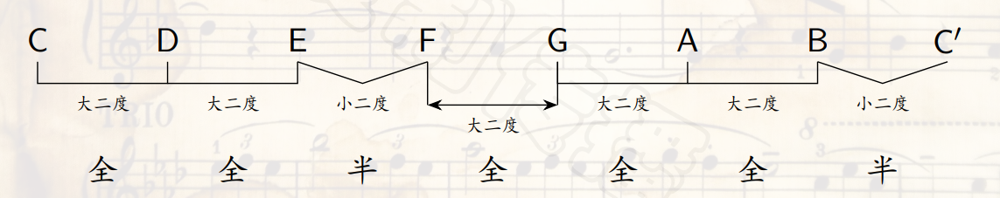

- 自然大调中，七个音都有名字，如下

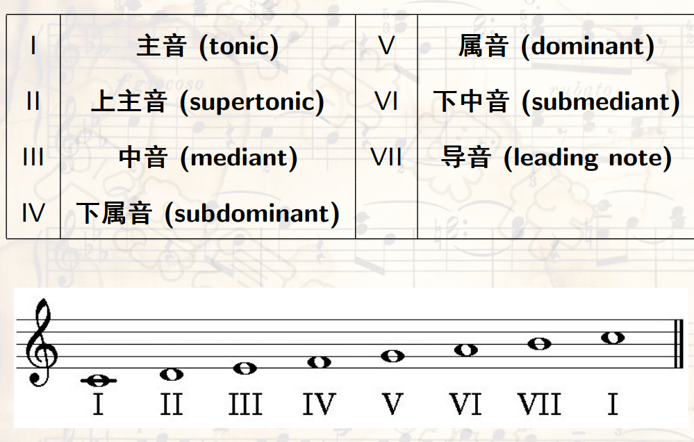

- ``自然小调``是由两个不同的四声音阶结合而成，中间相隔``大二度``。
- 两个四声音阶的四个音级之间的音程分别为``大二度、小二度、大二度``和``小二度、大二度、大二度``。
- 以下是以 $A$ 为主音的自然小调音阶：

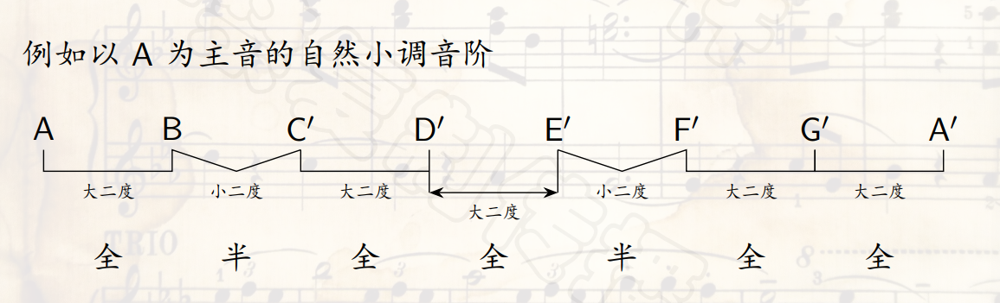

- ``自然小调``中，将 $VII$ 级导音``升高半音``，得到``和声小调``。
- 以下是以 $a$ 为主音的和声小调音阶

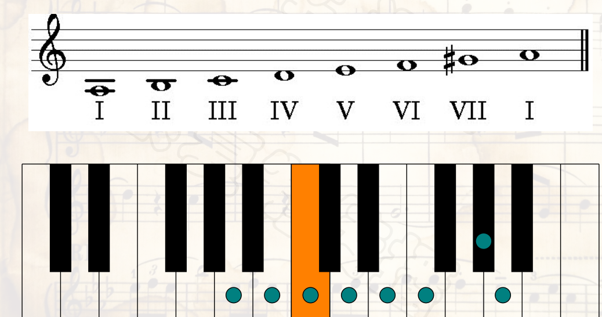

- ``和声小调``的第 $VI,VII$ 级之间构成一个``增二度音程``，将 $VI$ 也升高半音，得到``旋律小调``。
- 以下是以 $a$ 为主音的旋律小调

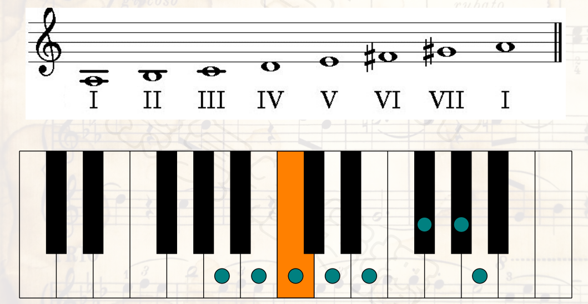

- 旋律小调的``下``行需要``恢复上行时升高``的 $VI$ 和 $VII$ 音，即与``自然小调``的``下行音阶``相同。
- 调式音阶从``主调``开始，``主音``可以位于``任何一个音级``。
- 例如可以以音级 $G$ 为主音的自然大调，也可以得到 $F$ 大调音阶。
- 按照``五度循环``的规律一次考虑以 $C,G,D,A,E,B,\sharp F,\sharp C$ 为主音的自然大调音阶，则在相邻的两个音阶中，除了一个音级需要升高半音，其他的音级都相同，因此按照上述次序生成的``大调音阶``，``后一个``比``前一个``都恰好增``加一个升号``。

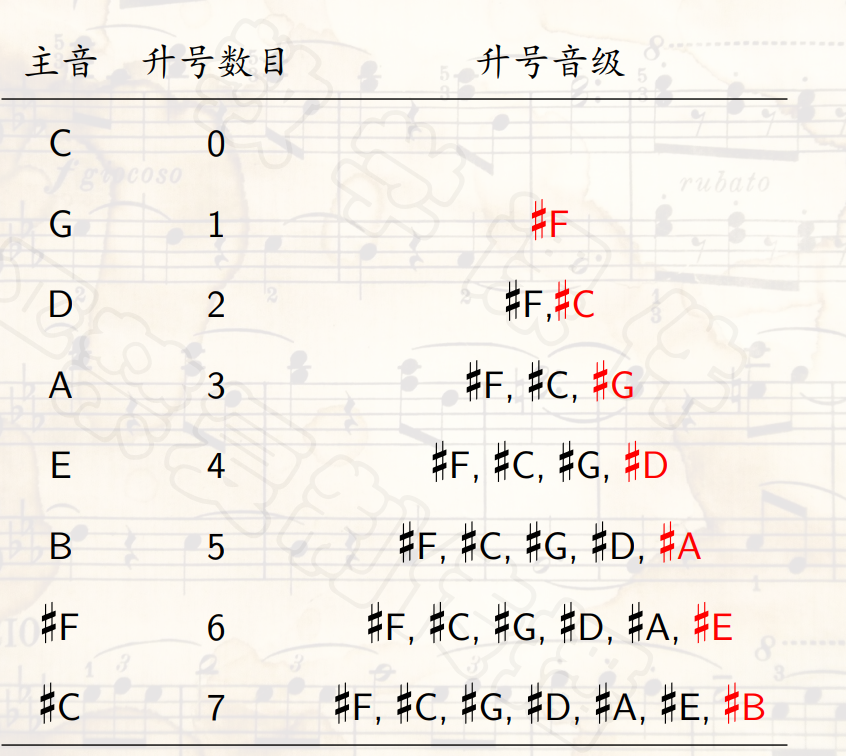

- 类似地，按照``反方向的五度循环``依次考虑以 $C,F,\flat B,\flat E,\flat A,\flat D,\flat G ,\flat C$ 为主音的``自然大调音阶``，则在相邻的两个音阶中，除了一个音级需要降低半音，其他的音级都相同，因此按照上述次序生成的``大调音阶``，``后一个``比``前一个``恰好增加``一个降号``。

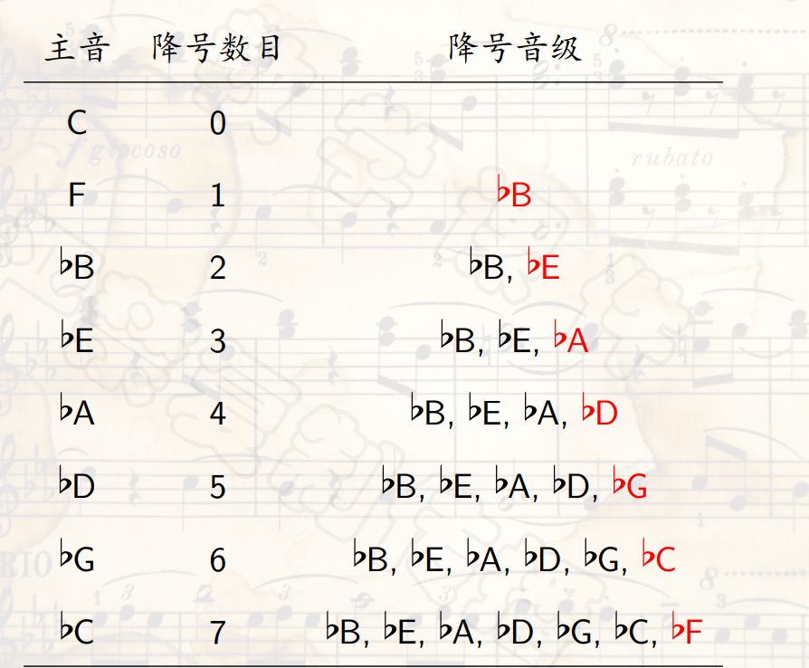

- 根据调式将``需要升高或者降低``的``变音记号``统一写在``五线谱谱号的右边``，称为``调号``。

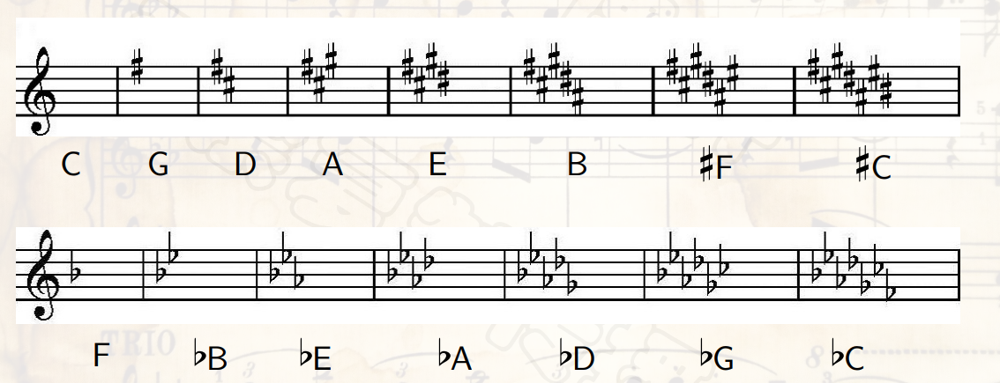

- B大调和 $\flat C$ 大调的音阶上，各个音级都是``等音的``。在按照``十二平均律``的键盘乐器上，这两个调的音阶在键盘上的位置是完全一样的，只不过是在五线谱上标记为不同的音名。
- 像这样的两个调称为``等音调``，在 $15$ 个``自然大调``中有``三对等音调``，即 $B$ 和 $\flat C$ ， $\sharp F$ 和 $\flat G$ ， $\sharp C$ 和 $\flat D$ 。
- 以 $A$ 为主音的``自然小调``，其音阶都由``基本音级``构成，没有变化音级，无需使用升降号，与 $C$ 大调相同。
- 每个``大调``都对应一个``与其调号相同``的``小调``，每个``小调``都对应一个``与其调号相同``的``大调``，称为``关系大小调``。``大调主音``通常用``大写字母``标注，``小调主音``通常用``小写字母``标注。
- 因此 $\flat E$ 大调和 $c$ 小调是``关系大小调``， $G$ 大调和 $e$ 小调也是``关系大小调``。
- 具有``相同主音的大小调``称为``平行大小调``，例如 $\flat E$ 大调和 $\sharp e$ 小调是平行大小调。

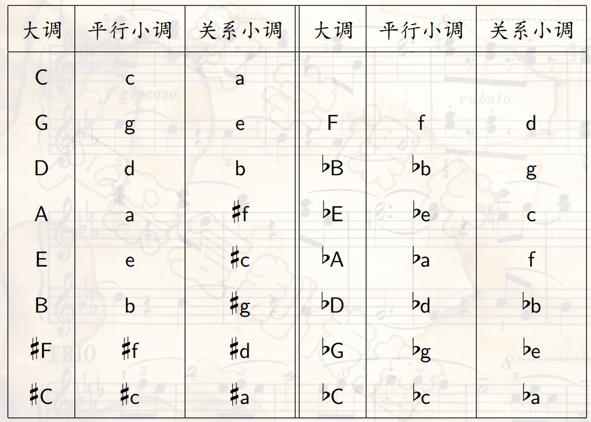

- 把24个大小调看做一个``家族``，成员之间的关系有远近之分，每一个调式都有5个``近关系调``，如下。

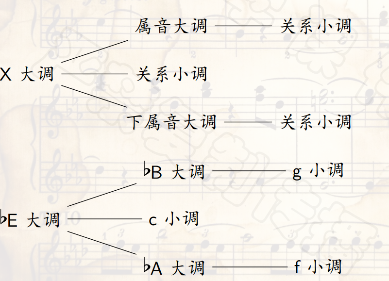

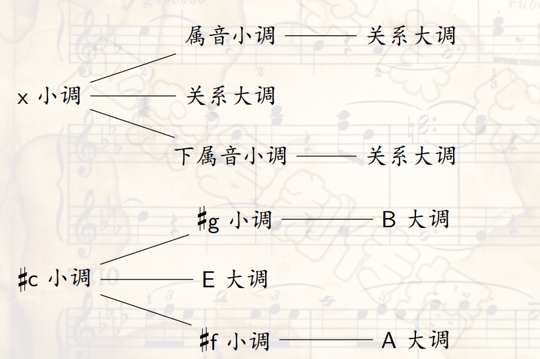
## 和弦
- ``三个或者三个以上``不同音高的乐音，按照``一定音程关系``结合起来，称为``和弦``。
- ``和声学``是研究``和弦的构成、连接``及其``在音乐作品中具体应用``的理论，是``主调音乐``的基础。
- 传统和弦按照``三度叠置原则``构建，构建出的``三个音``构成的和弦称为``三和弦``。
- 三和弦按三度音程排列时，下面的音称为``根音``，中间的音与根音成``三度``关系，称为``三音``，最上面的音与根音成``五度``关系，称为``五音``，也称为``冠音``。
- 叠置的两个三度音程可以分别为``大三度``和``小三度``，从而得到四种三和弦
- ``大三和弦``：上面大三度，下面小三度
- ``小三和弦``：上面小三度，下面大三度
- ``减三和弦``：都是小三度
- ``增三和弦``：都是大三度
- 大三和弦、小三和弦是``协和和弦``，因为三个音之间的音程都是``协和音程``。
- 增三和弦、减三和弦是``不协和和弦``，因为之间的音程有``不协和音程``。
- 在``三和弦``上面叠加一个``七度音``得到``七和弦``，根据七和弦包含的三和弦类别以及根音上方七度音的音程关系，一共有``七种``不同的七和弦。

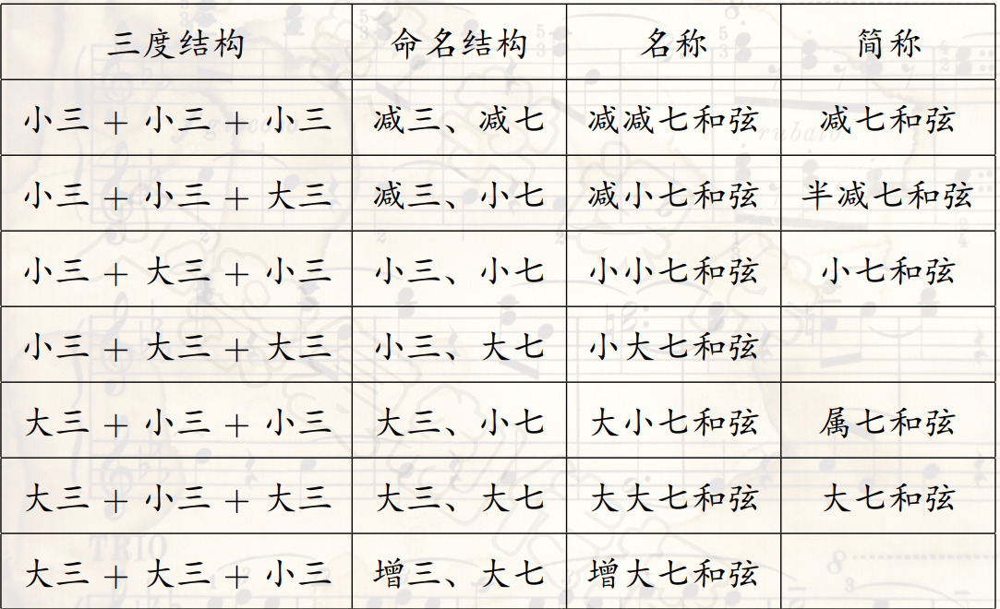

- 传统和弦根据``三度叠置``原则构建的，因此``增三和弦``和``减减七和弦``，需要``重升号``和``重降号``。
- 在实际应用中，以``根音``为``低音``的和弦被称为``原位和弦``，以三音、五音或者七音为低音的和弦被称为``转位和弦``。
- 三和弦有两种转位
  - ``三音``作为``低音``，``第一转位``，也称作``六和弦``，因为这时其低音和高音相差六度。
  - ``五音``作为``低音``，``第二转位``，也称作``四六和弦``，因为这时其低音和中音、高音分别相差四度和六度。

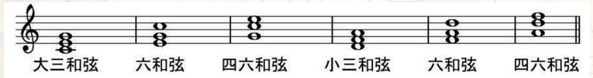

- ``七和弦转位``，除了根音作为低音，还有三种转位
  - ``三音``为``低音``，``第一转位``，也称为``五六和弦``。
  - ``五音``为``低音``，``第二转位``，也称为``三四和弦``。
  - ``七音``为``低音``，``第三转位``，也称为``二和弦``。

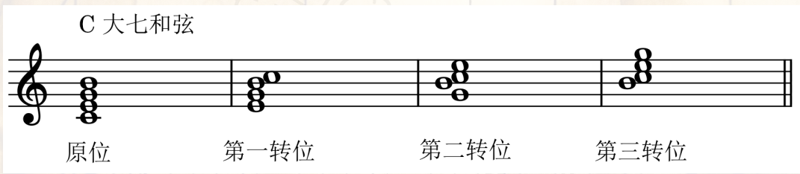

- 和弦的应用：《黄河大合唱》
- 使用了大三和弦、小三和弦、大三和弦第二转位、小七和弦第一转位、属七和弦第一转位

## 调式音阶中的和弦
- 在``调式音阶``上，以``任意音级``作``根音``都可以构造``和弦``。
- 用``罗马数字``表示``和弦的根音在调式音阶中的级数``，``大小写``区分``和弦的结构``、``根音到三音为大三度音程``的用``大写字母``，``根音到三音为小三度音程``的用``小写字母``。
- 用上标 $^{o}$ 和 $^{+}$ 分别表示``减三和弦``和``增三和弦``，``大小三和弦不加上标``。
- 用下标 $_{6}$ 和 $_{\substack{6 \\ 4}}$ 分别表示三和弦的``第一转位``和``第二转位``。
- ``调性和声``中的``每一个和弦``都有``不同的调性功能``。
- 在调式的 $I$ (主音) 、$IV$ (下属音) 、 $V$ (属音)音级上构成的和弦分别称为``主和弦(I)``、``下属和弦(IV)``和``属和弦(V)``，它们统称为``正和弦``。
- ``主和弦(I)``具有``稳定性``，给人以``结束、完成``感觉，``乐曲开头``也常用``主和弦``，强调音乐的调性特征。
- ``属和弦(V)``有``不稳定性``，给人以进行到一半、尚未结束的感觉。
- 乐曲中常用``属七和弦`` $V_7=\{G,B,D,F\}$ 其中的 $B-F$ 音程是减五度(三全音)，进一步加强``不稳定感``。
- ``下属和弦(IV)``有``连接和过渡``作用，从主和弦出发，或者连接到属和弦。
- ``一定和声范围内``的和弦称为``和声进行``，它体现和弦之间的相互关系。
- 正和弦之间连接进行的三种基本方式
  - ``正格进行``：I $\rightarrow$ V $\rightarrow$ I
  - ``变格进行``：I $\rightarrow$ IV $\rightarrow$ I
  - ``复式进行``：I $\rightarrow$ IV $\rightarrow$ V $\rightarrow$ I
- 功能和弦分类

- 和声是音乐中最重要三个基本要素之一，和声进行的规律是一个逐步演化的历史过程。
- 大调式的和弦进行

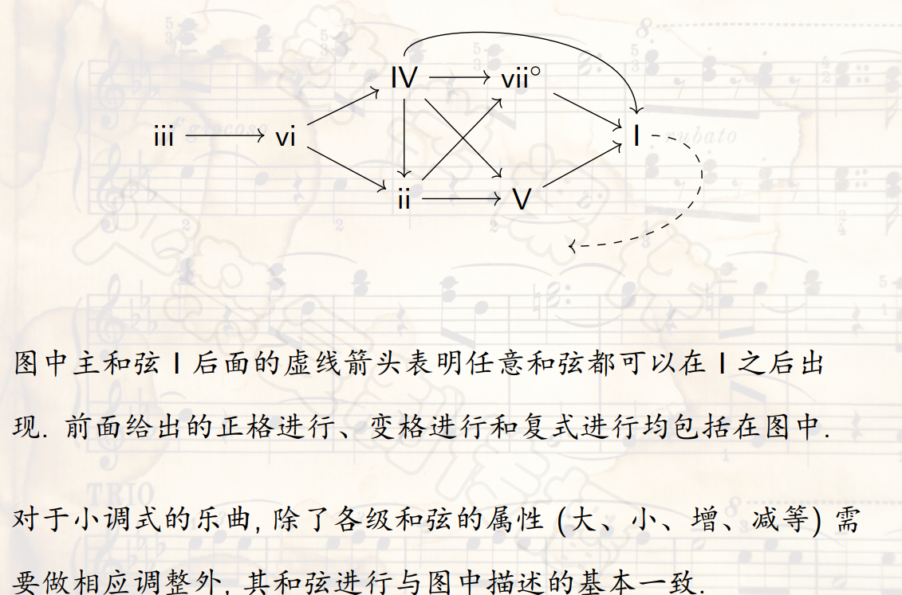

- 进一步的例子有， $a$ 小调的四季歌， $D$ 大调的菊次郎的夏天。
- 从``不协和的和弦``出发，连接到``协和和弦``或者``较为协和的和弦``，这样的和弦进行称为``解决``。
- 在``调性音乐``中，所有和弦进行最终都要``解决到主和弦I``。
- 特里斯坦和弦：突破传统调性音乐中和弦功能束缚，强调和弦本身的声音效果，而非传统和声功能。

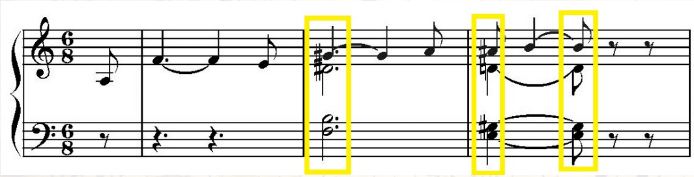

- 蓝调：由美国黑人音乐发展而来，标准布鲁斯有12小节，分为三个乐句，它的基本和声进行如下

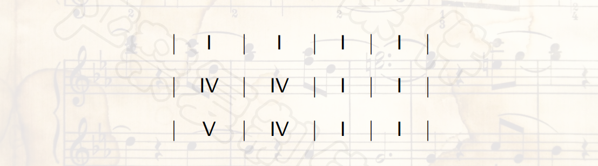

- 其中的各级和弦可以是三和弦/七和弦/转位。
- 布鲁斯通常是多次反复吟唱的，便于和声连接，常常将最后一小节的和弦变成 $V$ ，以便返回到第一小节的主和弦 $I$ ，即

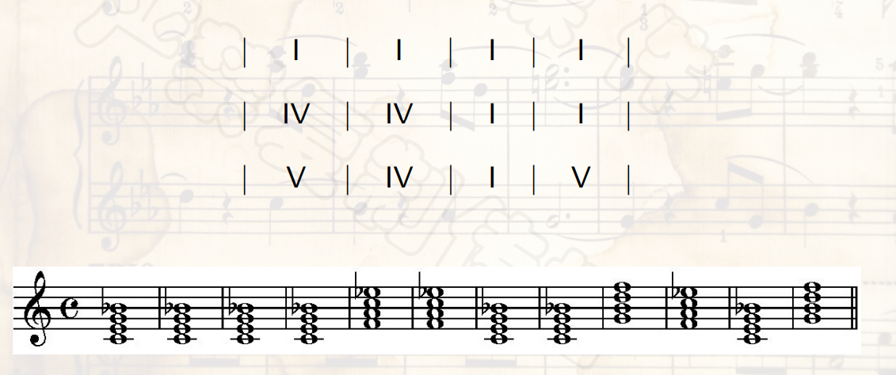
