## 从音类集合到集合类
- 以特里斯坦和弦 $\\{F,B, \sharp D, \sharp G \\}$ 为标志，瓦格纳``突破了传统和弦的调性功能``，强调和弦本身的声音效果和色彩，进而``消解了调式音阶对于和弦使用的束缚``。
- 勋伯格《钢琴组曲》中《加沃特组曲》就包含音类 $\\{\flat D,E,F,G\\}$
- **音类集合**：由若干音类构成的集合，简称``pc集``。
- 包含 $n$ 个音类的pc集称为 ``n元pc集``，因为``音类空间只有12个音类``，因此 $0 \leq n \leq 12$ ，``任意pc集``都可以看成``音类空间的子集合``。
- 根据对应关系，也可以将pc集对应于``模12集合的子集``。
- 音类集合中元素是``音类``，不是构成传统和弦的音级，元素**无须满足三度叠置原则**。
- 从``音类集合角度``看，``音阶也是pc集``。
- $5$ 元pc集 $\\{\sharp F,\sharp G,\sharp A,\sharp C,\sharp D \\}$ 对应于``五声音阶``。
- $6$ 元pc集 $\\{C,D,E,\sharp F,\sharp G,\sharp A\\}$ 对应于``全音音阶``。
- $12$ 元pc集 $\\{C,\sharp C,D,\sharp D,E,F,\sharp F,G,\sharp G,A,\sharp A,B\\}$ 对应于``半音音阶``。
- 一个 $n$ 元pc集可以表示为``音类圆周``上的内接 $n$ 边形。
- 对于任意两个``音类``，定义它们之间``距离``为``音类圆周``上从 $X$ 出发，到达 $Y$ 经过的``最少音类数``。
- 对于任意两个``不同音类``， $1 \leq d \leq 6$ 。
- 一个 $n$ 元pc集，作为一个 $n$ 边形，``顶点连线``分别构成其``边和对角线``。
- 定义其``距离向量`` $\delta=(d_1,d_2,\ldots,d_6),d_i$ 表示距离为 $i$ 的``顶点数目``。
- 距离向量给出了一个pc集中``所有音类对之间的距离``，描述了其``全部音程含量``，在很大程度上刻画了该pc集对应的乐音组合的``声音效果``。
- 总结一下，目前达到了``音级->音类->音类集合``的抽象层次。
- pc集是``无序集合``，为了便于比较和识别不同pc集，根据``紧凑原则``对每个pc集规定一个``标准表达式``，称为其``标准序``或者``标准形``。
- 由组合恒等式可以推出，一共有 $2^{12}=4096$ 个pc集。
- 同时，由 $220$ 个三元pc集。
- 如果一个pc集经过``某些音乐上的变换``得到另一个pc集，那么这两个pc集在``音效、色彩``等方面会具有``一定相似性``。
- ``移调变换``可以作用在``音类集合``上，对于某个pc集作``移调变换``，可以得到``12个pc集``，对应12个大三和弦。
- 即，对于``任意两个大三和弦``，``总可以``找到某个``移调变换``使其相等。
- 也就是，``12个大三和弦``属于``同一条轨道``，可以把其归为``同一个类``。
- ``倒影变换``也可以作用在``音类集合``上，它把``大三和弦``变为``小三和弦``。
- 同时 $T * I$ 把``大三和弦``变为``另一个小三和弦``。
- 进而， $T^{i} * I$ 变换可以把 $\\{C,E,G\\}$ 变成某个与小三和弦对应的pc集。
- 任意给定``两个大三和弦``或``小三和弦``，必``存在群中变换使其相等``，从而``24个大小三和弦属于同一条轨道``，归为``同一个类``。
- 举一个具体例子：

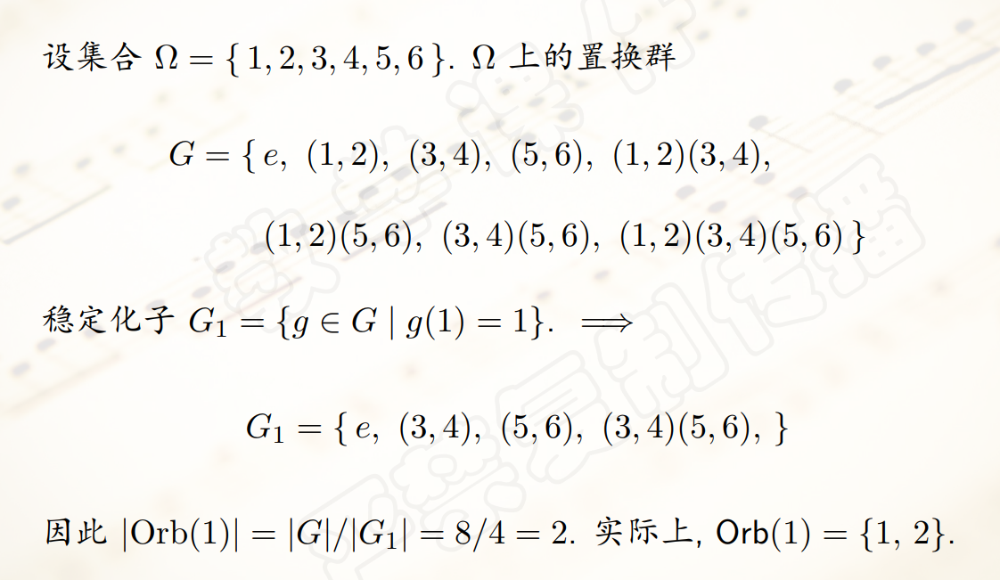

- 在群 $\langle T,I \rangle$ 的作用下,pc即按照其轨道被分为若干``等价类``，``一个pc集的等价类``被称为一个``集合类``。
- 例如，220个3元pc集被分为12个等价类，形成``12个集合类``，其中``24大小三和弦``对应的pc集属于``同一个等价类/轨道``。
- 按照一定方法在每个集合类中取``一个pc集``作为``代表``，得到``音类集合表``，集合类代表的``标准序``称为这个集合类的``原型``。
- 艾伦-福特给每个集合类起了一个名字，k-x， $k$ 是pc集代表的``音类数目``， $x$ 是``序号``。
- 例如，``增减三和弦``对应的音类集合为 $3-12$ 和 $3-10$ 。
- 同时，``减七和弦``对应的音类集合为 $4-28$ 。
- 另外，``属七和弦``和``半减七和弦``对应的音类集合为 $4-27$ 。
- ``全音程和弦``：``距离向量``为 $(1,1,1,1,1,1)$ ，一共有 $4$ 个音类。
- 例如， $\\{B,C,D,\sharp F\\},\\{C,\sharp C,E,\sharp F\\}$ 都是``全音程和弦``。
- 全音程和弦构成``不满足三度叠置原则``，它``不是传统七和弦``。
- 在``调性音乐``中，只有极特殊的情况才会出现，但是在``无调性音乐``中，全音程和弦有重要地位。
- 定理：在群 $\langle T,I \rangle$ 作用下，只有``两类互不等价的全音程和弦``， 即 $4-Z29$ 和 $4-Z15$ ，如下

- 定理：``移调变换``和``倒影变换不改变pc集的距离向量``，从而``同一个集合类``中的pc集具有``相同距离向量``。
- 但是，``具有相同距离向量的两个pc集``可能``分属不同集合类``，例如两种全音程和弦。
- 于是，构成``音级->音类->音类集合->集合类``的抽象层次。
- 在任何一个特定的音乐语境中，只有``少数子集合``具有``音乐上的意义``。
- 如果pc集 $A$ 的``音类都包含``在pc集 $B$ 中，称其为``字面上子集合``；若 $A$ 在``某个变换下的像``是 $B$ 子集合，称其为``抽象的子集合``。
## 和弦连接与黎曼变换
- ``协和三和弦``，由``24个大小三和弦``对应的pc集构成的``集合类``，其为 $3-11$ ，距离向量 $\delta=(0,0,1,1,1,0)$
- 为了简化符号，``省略表示等价类的上划线记号``，大写 $X$ 表示以 $X$ 为**根音的大三和弦**，小写 $x$ 表示以 $x$ 为**根音的小三和弦**。
- ``具有相同根音``的``大小三和弦``称为``平行的大小三和弦``。
- 定义``平行变换`` $P$ ，把任意一个三和弦变成``与之平行的三和弦``，它把``小三和弦的三音升高半音``，把``大三和弦的三音降低半音``。
- 称大三和弦 $C$ 和小三和弦 $a$ 是``关系三和弦``，大三和弦 $\sharp F / \flat G$ 和小三和弦 $\sharp d / \flat e$ 也是关系三和弦。
- 定义``关系变换`` $R$ ，把任意一个三和弦变成``其关系三和弦``。
- ``导音变换`` $L$ ：把``大三和弦的根音降低一个半音``，把``小三和弦的冠音升高一个半音``。
- 这三个变换统称为``黎曼变换``。
- 以下是它们的几何解释：

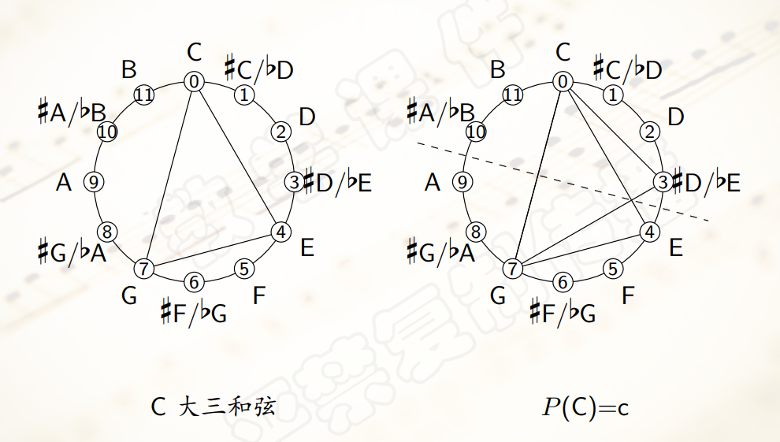

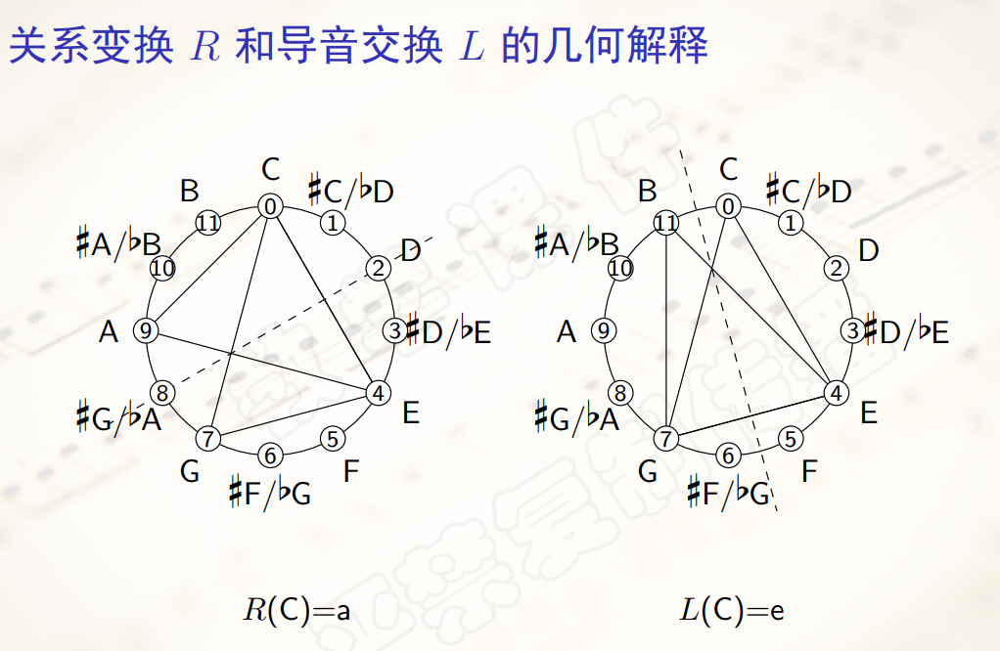

- 从几何上看，这三个对称都``只改变三角形的一个顶点``，保持``另外两个顶点不动``。
- 从音乐上看，这三个变换都``只改变三和弦中的一个音类``，保持``其他两个音类不变``，从而变换前后的和弦``共享一个音程``。
- ``平行变换``只``改变和弦的三音``，保持``纯五度音程``不变。
- ``关系变换``保持``大三度音程``不变。
- ``导音变换``保持``小三度音程``不变。
- 《贝多芬第九交响曲第二乐章》即是很好的实例。
## 音网
- 欧拉最早意识到声音不只是线性的，可以在二维上拓展形成``音网``。
- 从大三和弦 $C$ 出发，用 $P,R,L$ 依次作用，可以得到一个``循环``。
- 从大三和弦 $E$ 出发也是相同的。
- 以``任意一个音类为根音``，可以构造一个``大三和弦``，一共有12个大三和弦，从任意一个大三和弦出发，构造 $P,R,L$ 循环，可以得到``12个互不相同的循环``，对应``12个正六边形``。
- 将这些正六边形按照其``公共边``重合起来，得到一个网状的图，称为``音网``。

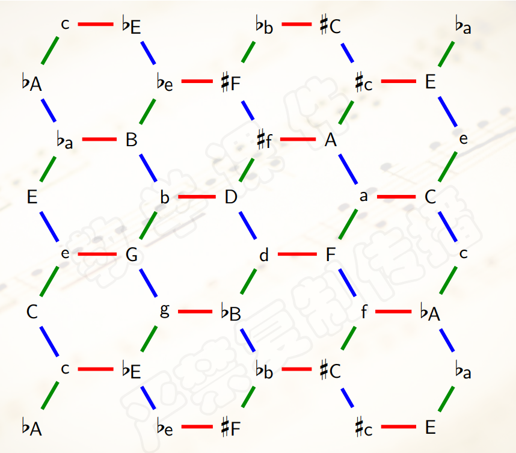 

- 用正六边形对应的``6个三和弦``共同包含的这个``唯一的音类``作为这个六边形的``标号``，于是把音网表示为``若干带标号的正六边形``构成的图形。

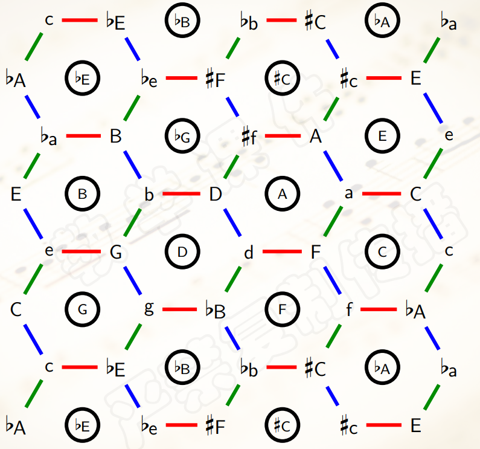

- 同时，音网中``两个六边形是否相邻``，在某种程度上反映了``这两个六边形的标号所构成的音程是否协和``。
- 然后，由于每个六边形都有标号，把它们连起来，可以得到音网的``对偶图``。

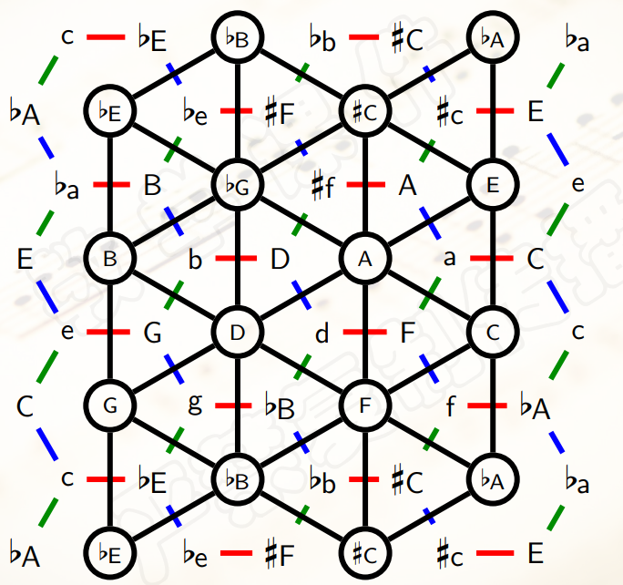

- 进而可以得到对偶音网中三角形的表示形式：

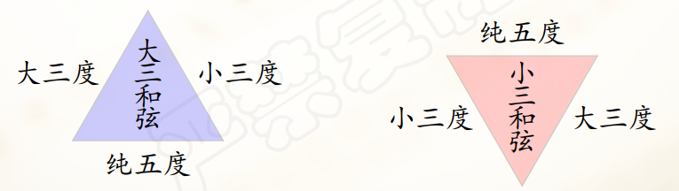

- 在``十二平均律体系``内，音网实际上``并不是无限延展的``，而是在水平和垂直两个方向出现``周期性的重复``。在几何上，这样的一个具有``双周期``的图形构成一个``环面``。
- 下面是``和弦``在音网上的表示：

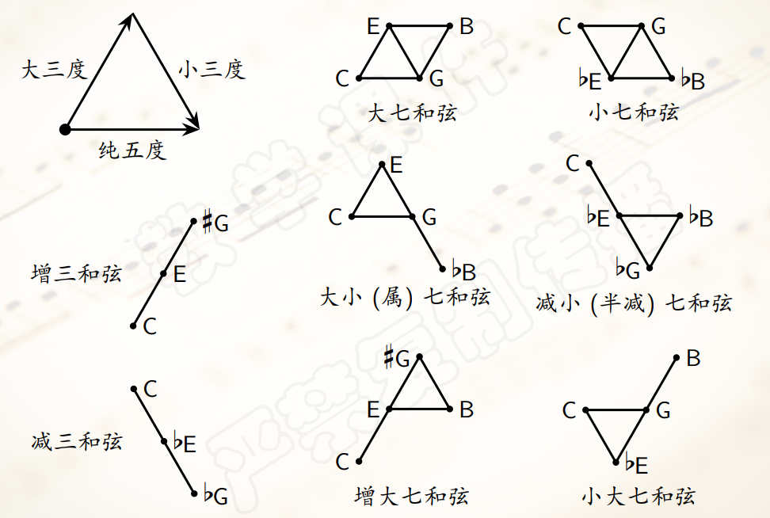

- 同时，音网上还可以找出``音阶``：

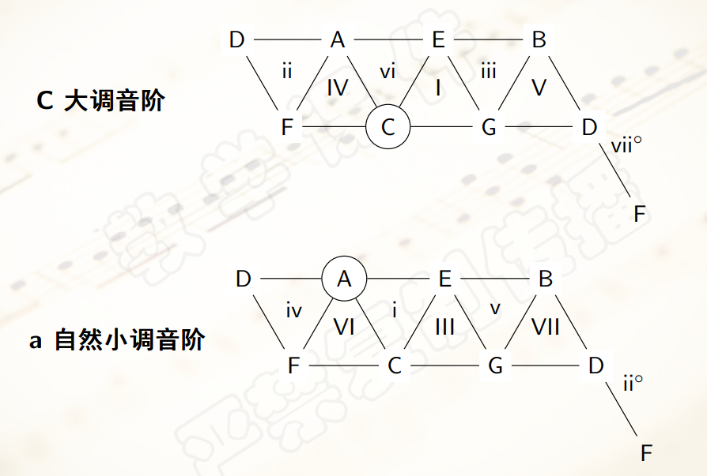
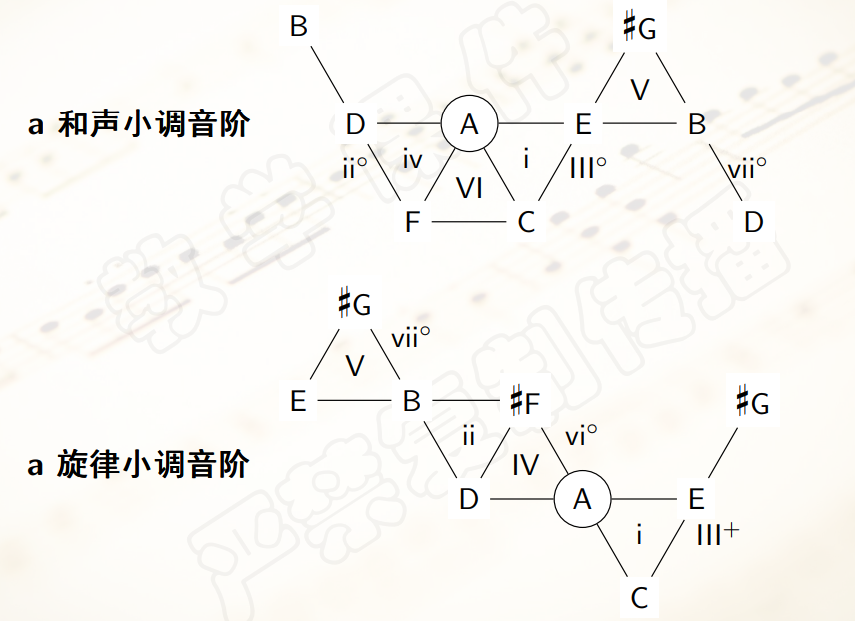
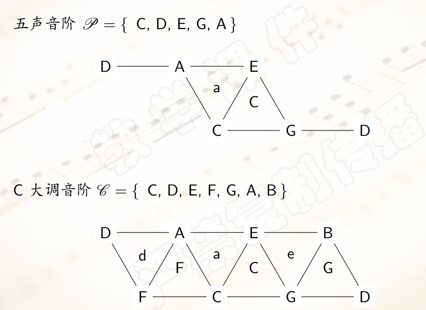

- 钢琴曲《梦》就很完美地体现了这一点。

## 新黎曼群
- 黎曼三变换仍然建立在``调性音乐``的理论基础上，后来的音乐理论家将这三个变换纳入音乐变换理论框架，形成了``新黎曼理论``。
- ``大小三和弦集合``上的``三变换``形成了一个群，称为``新黎曼群``。
- 其同构于 $24$ 阶二面体群 $D_{24}$ 。
- 同时， $R$ 和 $L$ 可以生成 $P$ 。
- 新黎曼群的变换涵盖了传统的``和声进行``。
- 设 $G$ 是一个群， 子集合 $S \subset G$ 是 $G$ 的一个``生成元集合``， $S$ 上的一个``字``是一个形如 $s_1^{\epsilon_1} * s_2^{\epsilon_2} \ldots s_k^{\epsilon_k}$ 的表达式，其中 $s_i \in S,\epsilon_i = \pm 1,1 \leq i \leq k$
- 在新黎曼群中， $S=\\{P,R,L\\}$ 是一个``生成元集合``， $R * P * R * L * R$ 等都是 $S$ 上的``字``。
- 给定``新黎曼群``中一个字，从音网中某个三和弦出发，用这个字中的``变换``依次作用到三和弦上，得到三和弦的一个``序列``，在音网上相应地形成一条``从这个三和弦出发的路径``。 
- ``新黎曼群``中的元素 $L*R$ 是 $12$ 阶的。
- 因此上述和弦序列可以继续延长，直到遍历 $24$ 个大小三和弦后最终回到出发点 $C$ 。
- 由此也可以推出 $\langle L,R \rangle$ 同构于 $D_{24}$
- ``环面``上的``音网图``包含一个``哈密顿回路``，说明可以从``一个三和弦``出发，通过一系列变换，使得 $24$ 个大小三和弦``每个都恰好出现一次``，由于每个新黎曼变换都``只把三和弦中的某一个音级变换半音``，因此可以``平滑遍历``全部大小三和弦。